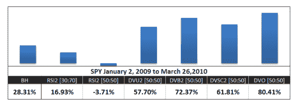
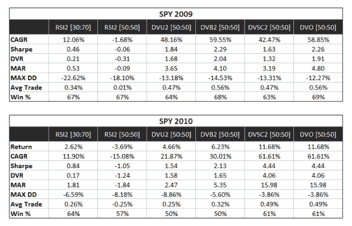

<!--yml
category: 未分类
date: 2024-05-12 18:33:03
-->

# Iron Chef Battle Oscillator –RSI2 and DV (SPY) | CSSA

> 来源：[https://cssanalytics.wordpress.com/2010/03/29/iron-chef-battle-oscillator-rsi2-and-dv-spy/#0001-01-01](https://cssanalytics.wordpress.com/2010/03/29/iron-chef-battle-oscillator-rsi2-and-dv-spy/#0001-01-01)

In case some of you missed the announcement, we just realeased [DV Indicators for Amibroker](http://www.dvindicators.com/indicator/oscillators-and-mean-reversion-indicators/). The first package released contains mean-reversion/oscillators with several new indicators. The standard DVO, DVB (DV Bounded),  DVSC (DV-Supercharged), DVI (DV Intermediate Oscillator) and DVDS (Super-Smoothed Double Stochastic) and a few others are also in the same package.

The recent market period has been largely a momentum market, so I think its a good to time to highlight how the DV bunch have fared in the onslaught versus the RSI2 using the SPY. Note that this is not a response to the good analysis done by Michael at MarketSci [http://marketsci.wordpress.com/2010/03/22/roundup-the-best-2-day-indicator/](http://marketsci.wordpress.com/2010/03/22/roundup-the-best-2-day-indicator/) which is an attempt to quantify which indicator is the most reliable from a consistency standpoint at **extreme levels** on the ^GSPC or S&P500 index over a long period of time. That particular post was directed more towards trading funds as the S&P500 index is not tradeable.  The only two instruments that are tradeable for most traders are the SPY and e-mini S&P500 contract.  Rather this post is more about what is working right now in the midst of what is arguably a much less favorable market for short-term trading and mean-reversion. The tables below show a brief summary of the frictionless returns to trading the RSI2 using 50/50 and 30/70 levels for entry and exit as well as the different DV variants using the median for the entry exit threshold. All indicators were traded both long and short. The numbers speak for themselves—RSI2 has been taken to the cleaners in relative and absolute terms whether the benchmark is buy and hold or the different DV variants. All DV variants beat buy and hold by a large margin. The king of the DV oscillators the DVO shows the best performance. Note that the original DV2 was privately conceived in a virtually identical form in mid 2008 as a tool for my own pairs trading, ***so this is effectively all out of sample performance***! (MarketSci was kind enough to bring DV2 to the attention of the public in mid 2009).  

