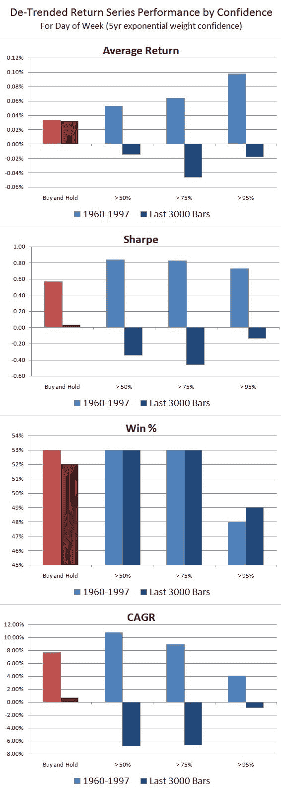
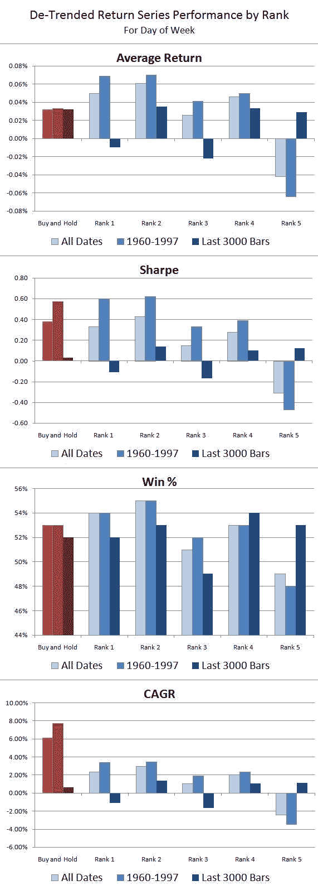
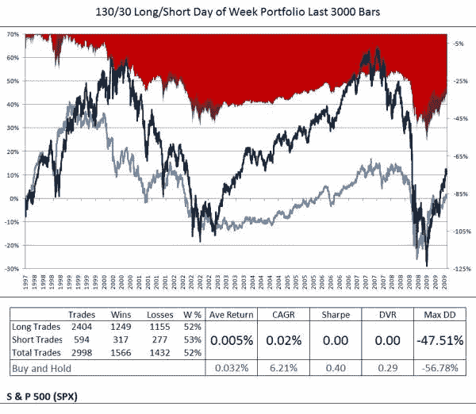

<!--yml
category: 未分类
date: 2024-05-12 18:47:03
-->

# Is the Day of the Week Phenomenon Tradeable? It Was For A Long Time But Not Any More! | CSSA

> 来源：[https://cssanalytics.wordpress.com/2009/09/29/is-the-day-of-the-week-phenomenon-tradeable-it-was-for-a-long-time-but-not-any-more/#0001-01-01](https://cssanalytics.wordpress.com/2009/09/29/is-the-day-of-the-week-phenomenon-tradeable-it-was-for-a-long-time-but-not-any-more/#0001-01-01)

So to continue with our little time machine experiment, i fed the Day of Week data into the learning algorithm to see whether it should be traded or not. Result? I got a bright red light–which means that Day of Week effect is completely un-tradeable-(ie not even worth going short the strategy). I tracked back the different “lights” and discovered that  1998 was the last year  it was considered worth trading.  Without digging too deep into methodology,  the Adaptive Time Machine takes “de-trended” data–which means that it looks at daily returns (or whatever interval is being investigated) net of the average yearly return so that it does not mistake trend effects for the specific strategy that we are testing. In addition, a separate learning algorithm detects changes in the equity curve of the strategy itself—similar to what a human would do: 1) seeing whether or not performance is accelerating/decelerating 2) seeing whether or not performance is becoming erratic. Of course, this filter makes judicious use of statistics, but the concept is the same.

As you can see in the data presented below, the Day of Week strategy was in fact tradeable for a long time prior to the last 3000 bars. However when we take a look at various confidence filters, there appears to be little or no relationship in the last 3000 bars between confidence and average daily return. If anything, performance has actually been negative when confidence was high that a given day was positive—-partly this may have something to do with the mean-reversion effect that set in this decade and the new mean reversion “weekend effect”.  For a great post and background reading check out  [http://marketsci.wordpress.com/2008/10/07/weekend-vs-weekday-follow-through-does-friday%e2%80%99s-sentiment-carry-over-to-monday/](http://marketsci.wordpress.com/2008/10/07/weekend-vs-weekday-follow-through-does-friday%e2%80%99s-sentiment-carry-over-to-monday/) Although it is clear that nothing inherent in the ranking of a given day of the week includes any information about the previous day’s return any more than the other days. However, if that was the predominant reason, we might see a clear reversal or a greater linearity of effect to the downside. Obviously a great deal of noise has been introduced in recent years into daily returns, and part of this in my opinion is the creeping onset of increased market efficiency. The second set of charts show the use of a ranking methodology to identify day of week effects and also to create trading strategies. De-trended data was also used for these examples. Ranking each day of the week using a statistic called the DVR (Sharpe ratio x equity curve R-squared), there was a distinct–although not perfect–relationship between the rank and the average daily return out of sample prior to 1997\. It is now a little clearer to see the randomness of the day of week effect in the last 3000 bars both in absolute and risk-adjusted returns. Even clearer is comparison of the equity curves of two long/short day of week portfolios both prior to and after 1997\. So to answer at least one question: Is the Day of the Week  phenomenon tradeable—not any more! So, the lesson is—always keep an open mind, but also make sure to dig deeper into strategy analysis and it is critical to adapt and revisit your analysis as time goes on.

123

123

