<!--yml
category: 未分类
date: 2024-05-17 23:29:36
-->

# LSMC: Need for fast and accurate Generalized Least Squares – HPC-QuantLib

> 来源：[https://hpcquantlib.wordpress.com/2016/02/13/lsmc-need-for-fast-and-accurate-generalized-least-squares/#0001-01-01](https://hpcquantlib.wordpress.com/2016/02/13/lsmc-need-for-fast-and-accurate-generalized-least-squares/#0001-01-01)

Update 21.02.2016: Added values for QR decomposition with pivoting and QuantLib performance improvements.

Least Squares Monte Carlo simulations spend a significant amount of the total computation time on the generalized least squares especially if the problem itself has a high dimensional state.  Preferred techniques to solve the normal equations are the QR decomposition

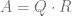

where 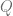 is orthogonal and 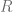 is upper triangular or the singular value decomposition (SVD)

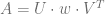

where 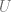 is column-orthogonal, 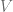  is an orthogonal matrix and 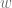 is a positive semi-definite diagonal matrix. The Cholesky Factorization

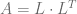

where 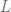 is a lower triangular is the fasted method but often numerically unstable. The author in [1] summaries all methods and also outlines the computational efforts involved for 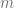 observations and 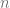 parameters as

*   Chlolesky Factorization: costs 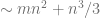 flops
*   QR decomposition: costs 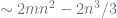 flops
*   Singular value decomposition: costs 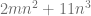 flops

For LSMC simulations we have 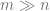 and therefore the QR decomposition has no computational advantages over the SVD.  Since a QR decomposition without column pivoting has numerical problems if 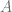 is rank-deficient, the singular value decomposition is often the method of choice for LSMC simulations.

All three decomposition methods are available in [QuantLib](http://quantlib.org/index.shtml), in [LAPACK](http://www.netlib.org/lapack/) (with or without optimized [OpenBLAS](http://www.openblas.net/) library) and in Intel’s [MKL](https://software.intel.com/en-us/intel-mkl) library. A standard Swing option valuation via LSMC should serve as a test bed to measure the performance of the QR decomposition with and without column pivoting and of the SVD algorithm. For LAPACK and MKL the methods dgels and dgesvd have been used to implement the SVD and the QR decomposition without pivoting whereas QR with pivoting is based on dgeqp3, dormqr and dtrsm.  In order to keep results comparable the single thread performance was measured in all cases. The reference prices are calculated via finite difference methods and all LSMC implementations have led to the same price in line with the reference price. The current QR implementation in QuantLib 1.7 has a performance issue if the number of rows is much larger than the number of columns. For these tests an [improved](https://github.com/lballabio/QuantLib/pull/54/files) version of QuantLib’s QR decomposition has been used.

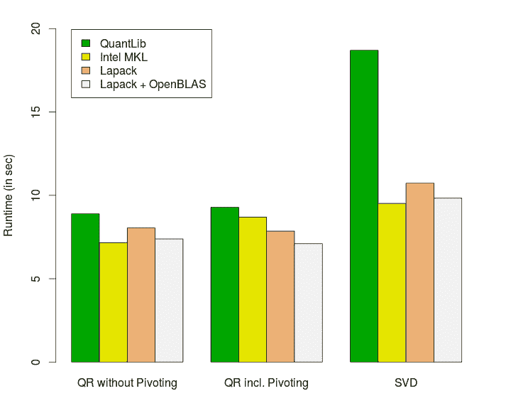

As expected MKL is often the fasted library but the difference between MKL and  LAPACK plus OpenBLAS is small.

[1] Do Q Lee, 2012, [Numerically Efficient Methods for Solving Least Squares Problems](http://math.uchicago.edu/~may/REU2012/REUPapers/Lee.pdf)