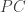

<!--yml
category: 未分类
date: 2024-05-18 13:48:06
-->

# Lag Dynamics with Autocopulas | Quantivity

> 来源：[https://quantivity.wordpress.com/2011/10/16/lag-dynamics-with-autocopulas/#0001-01-01](https://quantivity.wordpress.com/2011/10/16/lag-dynamics-with-autocopulas/#0001-01-01)

[Rakonczai *et al.* (2010)](http://bit.ly/qRAQsw) introduced *autocopulas* to describe the *lag self-dependence* structure of a time series. Autocopulas are superior to [autocorrelation](http://en.wikipedia.org/wiki/Autocorrelation) for the same reasons as [copulas](http://en.wikipedia.org/wiki/Copula_%28probability_theory%29) are superior to dependence point statistics (*e.g.* [correlation](http://en.wikipedia.org/wiki/Correlation_and_dependence)). Readers unfamiliar with copulas are encouraged to review [Empirical Copulas and Hedge Basis Risk](https://quantivity.wordpress.com/2011/10/10/empirical-copulas-and-proxy-cross-hedge-basis-risk). Generalizing this notion to arbitrary time series provides an insightful tool for *analyzing and visualizing lag dynamics for both individual securities and baskets*.

Autocopulas are potentially applicable to all sorts of fun problems in portfolio and risk management, exemplified in this post by considering their applicability to the continuing series on [proxy / cross hedging](https://quantivity.wordpress.com/2011/10/02/proxy-cross-hedging). Further application to generating alpha is fairly straightforward, although left an exercise for readers.

To begin, generalizing autocopulas—as defined by Rakonczai *et al.*—is necessary to support *arbitrary* time series (*i.e.* eliminating stationarity assumption), in doing so introducing explicit dependence on :

**Definition 1.** Given a time series  and set of lags , the *autocopula*  is defined as the copula on the  dimensional random vector .

**Definition 2.** The *l-lag autocopula*  is the autocopula with lag .

In other words, an autocopula is the *empirical* copula composed of one or more lags of the *same* data series, such as longitudinal returns for an individual equity. From this definition, we can define the stationary versions from Rakonczai *et al.*, suitably relaxing dependency on :

**Definition 3.** A *stationary autocopula* is an autocopula whose time series  is stationary.

**Definition 4.** A *stationary l-lag autocopula* is an l-lag autocopula whose time series  is stationary.

Given these definitions, autocopulas can now be applied to [proxy / cross hedging](https://quantivity.wordpress.com/2011/10/02/proxy-cross-hedging).

**Individual Autocopulas**

The following plots illustrate fitted empirical student-t autocopula densities for the daily returns of CRM with lags of 1 day, 2 days, 1 week, and 1 month:

[](https://quantivity.wordpress.com/wp-content/uploads/2011/10/autocopula-crm.png)

These plots illustrate an interesting result: strong self-dependence of *conditional* returns extends over all periods in the tails (in all four corners), with weak dependence outside the tails. In other words, likelihood of large absolute returns is high when preceded by a large absolute return—thus, exhibiting large-magnitude temporal volatility clustering. As Gappy [commented](https://quantivity.wordpress.com/2011/10/16/lag-dynamics-with-autocopulas/#comments), recall the *unconditional* returns are heavy tailed—as exhibited by the fitted t marginals with low df in the [previous post](https://quantivity.wordpress.com/2011/10/10/empirical-copulas-and-proxy-cross-hedge-basis-risk).

Peakedness decreasing with increasing lag indicates dependence decay over time, meaning probability of large absolute returns decrease over time *conditional* on the previous occurrence of large absolute return (absolute due to peakedness in all four corners). Thus, not only does CRM have long tails, but its tail exhibit *decaying temporal tail dependence* (and thus, also, potentially self-similar volatility). Thanks to Gappy for absolute returns interpretation.

Compare graphical intuition from above autocopulas versus autocorrelation (ACF) and partial autocorrelation (PACF) functions for *absolute returns* of CRM, which exhibit similar temporal dependence, yet do so via a pointwise dependence statistic providing minimal graphical intuition:

[](https://quantivity.wordpress.com/wp-content/uploads/2011/10/autocor-crm-abs.png)

In contrast with *non-absolute* returns, which exhibit no such dependence:

[](https://quantivity.wordpress.com/wp-content/uploads/2011/10/autocor-crm.png)

Autocopulas for QQQ with same lags:

[](https://quantivity.wordpress.com/wp-content/uploads/2011/10/autocopula-qqq.png)

Indicating that QQQ exhibits similar decaying temporal tail dependence, although the temporal decay is dramatically smaller for QQQ versus CRM—as the density remains strong peaked across all lags.

**Proxy Autocopulas**

Given autocopulas of the individual securities, question is how to apply this methodology to support intuition about inter-temporal dependence of both assets in proxy hedging. Two approaches seem immediately obvious: excess returns and difference in autocopulas.

First, consider the *excess autocopula*  which is the autocopula of the *excess returns*, defined as the linear difference in (non-log) returns between individual security  and market index :

    

The following illustrates the excess autocopula for CRM and QQQ:

[](https://quantivity.wordpress.com/wp-content/uploads/2011/10/autocopula-excess.png)

Which illustrates quite different results than above autocopulas of individual securities, on the *conditional* returns:

*   **Asymmetric tail dependence**: lag-1 dependence in tails is strongly asymmetric, indicating temporal dependence is stronger for the tail of inversely correlated returns
*   **Rapid asymmetric tail decay**: tail asymmetry decays by lag-2, indicating rapid decay
*   **Rapid dependence decay**: temporal dependence decays rapidly, with comparatively minimal peakedness within one week (*i.e.* lag-5)

Compare this insight with ACF / PACF for *excess absolute returns*, which exhibit similar behavior as excess autocopula, but do so using only pointwise dependence:

[](https://quantivity.wordpress.com/wp-content/uploads/2011/10/autocor-proxy-abs.png)

Finally, a second approach to evaluating autocopula dynamics for proxy hedging is the *proxy autocopula* , which is *arithmetic difference of two autocopula densities*  and :

    

The proxy autocopulas for CRM/QQQ, with same lags as above, are plotted below:

[](https://quantivity.wordpress.com/wp-content/uploads/2011/10/autocopula-proxy-lag1.png)

Illustrating lag-1 CRM autocopula has significantly less tail temporal dependence, while having slightly more non-tail temporal dependence. Further, the tail dependence is highly asymmetric with stronger bias to inversely correlated returns. In other words, that suggests inverse return bounces are followed by reversals.

The lag-2 exhibits similar dynamics, although the asymmetric tail dependence is inverted, biased in favor of directly correlated returns.

[](https://quantivity.wordpress.com/wp-content/uploads/2011/10/autocopula-proxy-lag-2.png)

Lag-5 exhibits similar dynamics as lag-2:

[](https://quantivity.wordpress.com/wp-content/uploads/2011/10/autocopula-proxy-lag-5.png)

Finally, tail dependence becomes symmetric by lag-22, but otherwise exhibits similar dynamics as lower lags:

[](https://quantivity.wordpress.com/wp-content/uploads/2011/10/autocopula-proxy-lag-22.png)

Collectively, the above proxy autocopulas clearly visualize the self-dependence of proxy absolute returns with strongly decaying temporal tail dependence.

* * *

R code to generate the above autocopula lag dynamic analysis:

```

exploreProxyAutoCopula <- function(p)
{
  # Visualize autocopulas for two proxy instruments and excess.
  #
  # Args:
  #     p: matrix of daily instrument price data, including valid colnames
  #
  # Returns: none

  pROC <- ROC(p, type="discrete", na.pad=FALSE)
  cnames <- colnames(pROC)

  exploreMultiAutoCopula(coredata(pROC[,1]))
  exploreMultiAutoCopula(coredata(pROC[,2]))

  excess <- pROC[,1]-pROC[,2]
  colnames(excess) <- c(paste(cnames[1],"-",cnames[2]))
  exploreMultiAutoCopula(coredata(excess))  # excess returns

  absReturns <- abs(pROC[,1])
  absExcess <- abs(excess)
  acf2(absReturns,max.lag=30)
  acf2(absExcess,max.lag=30)

  plotCopulaDiff(fitAutoCopula(coredata(pROC[,1]),1), fitAutoCopula(coredata(pROC[,2]),1), xlab="", ylab="", zlab="Density Diff", main="Lag-1 Proxy Autocopula")

  plotCopulaDiff(fitAutoCopula(coredata(pROC[,1]),2), fitAutoCopula(coredata(pROC[,2]),2), xlab="", ylab="", zlab="Density Diff", main="Lag-2 Proxy Autocopula")

  plotCopulaDiff(fitAutoCopula(coredata(pROC[,1]),5), fitAutoCopula(coredata(pROC[,2]),5), xlab="", ylab="", zlab="Density Diff", main="Lag-5 Proxy Autocopula")

  plotCopulaDiff(fitAutoCopula(coredata(pROC[,1]),22), fitAutoCopula(coredata(pROC[,2]),22), xlab="", ylab="", zlab="Density Diff", main="Lag-22 Proxy Autocopula")
}

plotCopulaDiff <- function(c1, c2, n = 51, theta = 35, phi = 25, expand = 0.618, ...)
{
  # Plot difference in copula perspective for two copulas

  xis <- yis <- seq(0, 1, len = n)
  grids <- as.matrix(expand.grid(xis, yis))
  funDiff <- dcopula(c1, grids) - dcopula(c2, grids)
  zmat <- matrix(funDiff, n, n)
  persp(xis, yis, zmat, theta = theta, phi = phi, expand = expand, ...)
}

exploreMultiAutoCopula <- function(vec)
{
  # Visualize lag-1, lag-2, lag-5, and lag-22 autocopulas for a vector of 
  # data.
  #
  # Args:
  #   vec: vector of data
  #
  # Returns: empirically fitted copulas

  oldpar <- par(mfrow=c(2,2))
  cnames <- colnames(vec)

  lag1Copula <- fitAutoCopula(vec,1)
  lag2Copula <- fitAutoCopula(vec,2)
  lag5Copula <- fitAutoCopula(vec,5)
  lag22Copula <- fitAutoCopula(vec,22)

  persp(lag1Copula, dcopula, main="Lag-1 Autocopula", xlab=cnames[1], ylab="lag-1", zlab="Density", expand=1)
  persp(lag2Copula, dcopula, main="Lag-2 Autocopula", xlab=cnames[1], ylab="lag-2", zlab="Density", expand=1)
  persp(lag5Copula, dcopula, main="Lag-5 Autocopula", xlab=cnames[1], ylab="lag-5", zlab="Density", expand=1)
  persp(lag22Copula, dcopula, main="Lag-22 Autocopula", xlab=cnames[1], ylab="lag-22", zlab="Density", expand=1)

  par(oldpar)

  return (list(lag1=lag1Copula, lag2=lag2Copula, lag5=lag5Copula, lag22=lag22Copula))
}

fitAutoCopula <- function(vec, lag=1)
{
  # Analyze auto copula for a vector of data, with given lag.
  #
  # Args:
  #   vec: vector of data
  #   lag: order of lag, default to 1
  #
  # Returns: list of copula fit and empirical copula

  lagV <- lag(vec, k=lag)
  lagV <- lagV[(lag+1):nrow(lagV)]

  lagged <- cbind(vec[1:(nrow(vec)-1)],lagV)
  colnames(lagged) <- c(colnames(vec)[1], paste("lag-",lag,sep=""))

  return(fitEmpiricalCopula(lagged))
}

fitEmpiricalCopula <- function(pROC)
{
  # Fit empirical copula, given series of return data.
  #
  # Args:
  #   pROC: matrix of daily instrument return data, including valid colnames
  #
  # Returns: empirical copula

  n <- nrow(pROC)

  tau <- cor(pROC, method="kendall")[2]
  t.cop <- tCopula(tau, dim=2, dispstr="un", df=3)
  psuedo <- apply(pROC, 2, rank) / (n + 1)

  fit.mpl <- fitCopula(t.cop, psuedo, method="mpl", estimate.variance=FALSE)

  return (empiricalCopula <- tCopula(fit.mpl@estimate[1], dim=2, dispstr="un", df=fit.mpl@estimate[2]))
}

acf2 <- function(series, max.lag=NULL)
{
  # ACF function replacing broken version from stats library, fixed to
  # remove lag=0; credit to David Stoffer (http://www.stat.pitt.edu/stoffer).

  num=length(series)
  if (is.null(max.lag)) max.lag=ceiling(10+sqrt(num))
  if (max.lag > (num-1)) stop("Number of lags exceeds number of observations")
  ACF=acf(series, max.lag, plot=FALSE)$acf[-1]
  PACF=pacf(series, max.lag, plot=FALSE)$acf
  LAG=1:max.lag/frequency(series)
  minA=min(ACF)
  minP=min(PACF)
  U=2/sqrt(num)
  L=-U
  minu=min(minA,minP,L)-.01
  old.par <- par(no.readonly = TRUE)
  par(mfrow=c(2,1), mar = c(3,3,2,0.8),
    oma = c(1,1.2,1,1), mgp = c(1.5,0.6,0))
  plot(LAG, ACF, type="h",ylim=c(minu,1), 
    main=paste(deparse(substitute(series))))
    abline(h=c(0,L,U), lty=c(1,2,2), col=c(1,4,4))
  plot(LAG, PACF, type="h",ylim=c(minu,1))
    abline(h=c(0,L,U), lty=c(1,2,2), col=c(1,4,4))
  on.exit(par(old.par))  
  ACF<-round(ACF,2); PACF<-round(PACF,2)    
  return(cbind(ACF, PACF)) 
}

```