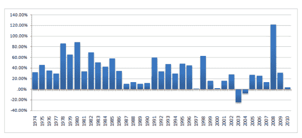
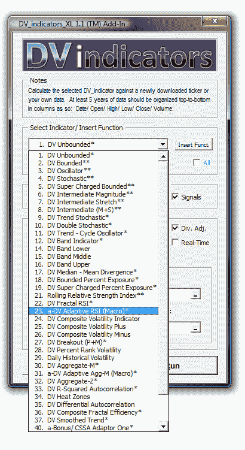

<!--yml
category: 未分类
date: 2024-05-12 18:31:48
-->

# Level 2 Adaptation: The Adaptive RSI | CSSA

> 来源：[https://cssanalytics.wordpress.com/2010/04/09/level-2-adaptation-the-adaptive-rsi/#0001-01-01](https://cssanalytics.wordpress.com/2010/04/09/level-2-adaptation-the-adaptive-rsi/#0001-01-01)

Whenever I find myself suddenly talking in terms of Level 1 or Level 2 technology, I am always reminded of Jeff Pietsch of **[ETF Rewind](http://etfrewind.blogspot.com/)**who is the real wizard behind the curtain in programming the **DV Indicators Excel Plug-In**–and besides that is an incredibly smart guy. One can only imagine the amount of time and effort (and headaches!) that went into dealing with both me and my cumbersome calculations. (Both of us can be a handful!)  But he managed to get everything right down to the last decimal place.

Yesterday we took a sneak  preview at the “Fractal RSI”, which is a self-adjusting RSI variant that shifts dynamically between 2 and 30 days to account for the degree of choppiness in the market. The “Fractal RSI” is a Level 1 adaptive indicator: it adjusts for market conditions but it is not self-aware. Level 2 adaptation represents the ability of an indicator to understand the components of its own sources of profitability. Note that this is not the same thing as optimization, nor is it the use of a timing mechanism to trade the equity curve. A Level 2 adapter such as the Adaptive RSI (DVAR) will shift weightings between trend and countertrend as well as across parameter lengths from 2 to a maximum of 30 if necessary. It observes the distribution of profitability to adjust the indicator output. It cannot handle adjustments for current market conditions like the Fractal RSI. However it can better understand how a given market behaves. Below is an interesting test where we run the DVAR on  both the Nasdaq Composite and the S&P500 Index going back to 1974\. We allow the DVAR to do its thing and generate buy and sell signals and simply trade the market that has the highest combination of 12/6 month total return.  No timing was used to trade the equity curve. ***The result was a frictionless compound return of 33.68% over the 35-year backtest.*** There were only two losing years: 2003 and 2004 and for those of you who have done a lot of testing–there are a lot of systems that did well over the same time period, *including the Fractal RSI!* This brings me to my final point, which is that using multiple types of adaptation and/or indicators is the true holy grail to achieving consistency—but Level 2 Adaptation always helps :o)

