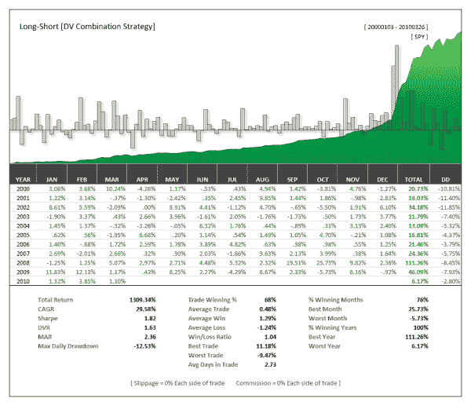

<!--yml
category: 未分类
date: 2024-05-12 18:30:59
-->

# Like MPT, The Only Holy Grail is To Combine Indicators | CSSA

> 来源：[https://cssanalytics.wordpress.com/2010/03/30/like-mpt-the-only-holy-grail-is-to-combine-indicators/#0001-01-01](https://cssanalytics.wordpress.com/2010/03/30/like-mpt-the-only-holy-grail-is-to-combine-indicators/#0001-01-01)

Everyone including myself have been guilty of trying to find the magical indicator or variable that has eluded us all. Truthfully, it is not likely to exist–at least to the degree that you expect. All indicators share a reasonably high correlation to others that are measuring the same thing in slightly different ways—DV2 and related DV variants are a good example. Another example would be the 20 day moving average and the 20 day slope. Even if one is much better than the other, both will either do well or struggle during the same periods most of the time. This is one reason why its actually useful to hop on the momentum train of what is working well now–or to use a  better version (such as the DVO) to improve your returns. But one thing that experienced researchers understand both consciously and intuitively is that combining uncorrelated variables/indicators leads to superior results that are also more robust. The graph below is a test that combines two DV Indicators in an extremely simple manner (note one of them is new). The result is spectacular from an absolute and risk-adjusted perspective. In this case, the system is either Long, or Short a full position or in Cash—no leverage was used. Exposure is roughly 80%. The parameters used are the default entry/exit levels—no optimization was employed. The system will be available explained in a PDF document along with some bonus research to anyone that purchases or upgrades to the new **Amibroker or Tradestation packages**. [http://www.dvindicators.com/indicator/](http://dvindicators.cssanalytics.com/indicator/)

