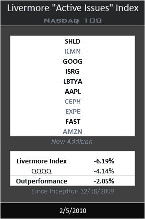

<!--yml
category: 未分类
date: 2024-05-12 18:36:32
-->

# Livermore Active Issues Index for Friday, Feb 5th | CSSA

> 来源：[https://cssanalytics.wordpress.com/2010/02/05/livermore-active-issues-index-for-friday-feb-5th/#0001-01-01](https://cssanalytics.wordpress.com/2010/02/05/livermore-active-issues-index-for-friday-feb-5th/#0001-01-01)

A reader pointed out that last week’s performance was overstated and he was in fact correct, I computed things manually at the time  (Corey was away) and I missed a switch.  We ran the numbers using the computer this week and corrected everything. The last couple weeks has not been kind to the Livermore and to the general market-wiping out the small outperformance and putting the index in a small drawdown. However, as a long term rotational strategy, it will not outperform the index all the time and it is certainly more prone to drawdowns than short-term strategies. The hedged Livermore investor would be down a mere 2% from inception, and this is the model index that was presented as the best performing version on a risk-adjusted and absolute return basis. If you used trailing stops through this period, you would probably be about even. Following these types of long term strategies successfully is like flossing your teeth—it should be treated as an essential yet mundane activity that you must do regularly for it to work. Have fun with your short-term or discretionary trading for a small portion of your portfolio (unless you are a pro), but let these passive strategies do the heavy lifting over time. The Livermore allows you to hold the true leaders or soon to be leaders in the market.  If you can’t make money out of the market leaders, than you can’t make money in the market.