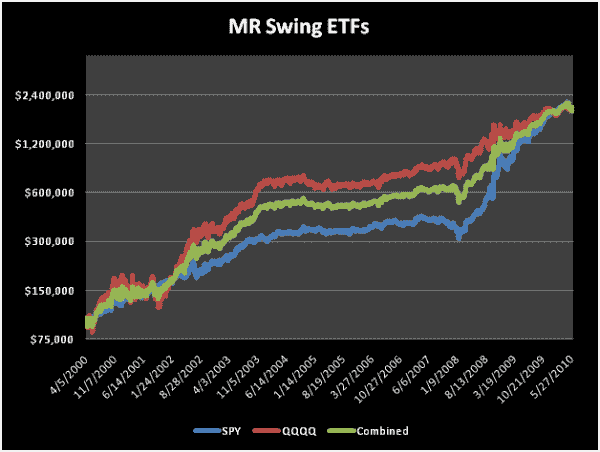
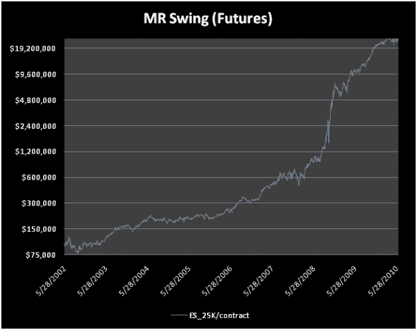

<!--yml
category: 未分类
date: 2024-05-12 18:23:28
-->

# MR Swing: Mean Reversion and Swing Trading in Market Regimes | CSSA

> 来源：[https://cssanalytics.wordpress.com/2010/06/17/mr-swing-mean-reversion-and-swing-trading-in-market-regimes/#0001-01-01](https://cssanalytics.wordpress.com/2010/06/17/mr-swing-mean-reversion-and-swing-trading-in-market-regimes/#0001-01-01)

Early on in my forays into technical research, it was clear that no one simple indicator was adequate for all seasons. The first indicator that I introduced—the DV2—showed strong performance across the board on a variety of ETFs and stocks, but seemed to perform best during volatile conditions. This was true regardless of whether you looked at bull or bear markets. During quiet conditions where price moved higher, a binary (long below 50, short above 50) strategy often exited prematurely from trades, and made the dual mistake of going short well in advance of true short-term peaks. When you combine these muted gains per trade in this scenario with commissions, it cuts into the overall returns substantially. Two of our researchers addressed this problem independently in a novel way by utilizing different indicators that were ideal for these separate market conditions. David Abrams and Scott Walker, wrote an [innovative paper](http://www.daveab.com/mr_swing/) on a new quantitative system that David presented at the [NAAIM Uncommon Knowledge 2010 Conference](http://www.naaim.org/annualconference.aspx) in the Secret Sauce Trading Seminar.  This classic “out of the box” mentality is critical in order to create unique systems and portfolio management tools to gain an edge on the competition.

The paper introduces an innovative new trading system, and goes in-depth into topics you rarely see in published papers on trading systems.  It reveals advanced “underneath the hood” techniques in building a robust and adaptive trading system.  The paper also demonstrates how this system complements buy and hold and the longer-term trend following portfolios, like the Ivy Portfolio by providing counter-cyclical returns. This concept is important—because it highlights swing trading as a true diversifier and return-enhancer primarily because it harvests volatility efficiently in conditions that are often unfavorable for trend-following.

The Ivy Portfolio (modeled after university endowments)is proxied using an ETF portfolio of non-correlated components with a full cross-correlation matrix.  A set of long-only ETFs are held above the 10 month SMA for the basic long-term portfolio.  Then a conservative version of MR Swing is allocated to 20% of the portfolio.  The table below illustrates a key finding in the paper that adding in a 20% asset allocation of MR Swing to the portfolio further substantially increases the returns, while reducing the risk.

**Performance   8/1/2000 to 01/28/2010**

|  | **CAGR** | **Sharpe** | **Max DD** |
| **SPY (S&P 500) Buy & Hold** | -2.48% | -0.16 | 56.49% |
| **ETF Portfolio Buy & Hold** | 5.05% | 0.26 | 29.83% |
| **ETF Portfolio (10-month SMA)** | 8.45% | 0.99 | 11.65% |
| **ETF Portfolio (10-month SMA) 80% allocation + MR Swing 20%** | 13.42% | 1.60 | 4.48% |

The system has been tested out-of-sample on ETFs and futures under various configurations and using different money management.

So what is the secret sauce?  MR Swing is based on four key design principles:

(1)    ***Market-regime-switching*:** uses short-term mean reversion in the bear regime and intermediate term swing trading the bull regime.  This takes advantages of changes in market character based on the current regime state.

(2)    ***Non-symmetrical trading algorithms****:* uses a blended approach instead of a single indicator.  MR swing employees the ValueChart for entries and the SVAPO for exits in swing trading.  It uses DV2 for mean reversion in the bear regime.

(3)    ***Volatility adaptive metrics*:** every component is carefully chosen to robustly handle changes in market volatility.  A market regime trading channel is used to reduce whipsaws.  The DV2 normalizes price distributions using the CSS classic non-parametric PercentRank technique.  An adaptive standard deviation band is used for the volume and price oscillator SVAPO for swing trade exits.  Also, a dynamic volatility unit is built into the Value Chart entry method.

(4)    ***Robustness to regime whipsaws:*** instead of trying to eliminate whipsaws in the regime model, MR Swing instead structures each component to be able to withstand whipsaws.  That means, an entry in the swing trading regime must be able to handle a change to the mean-reversion regime without causing the system to become unstable.  MR Swing is designed to address these cases and ensure robustness to changes in regime, including whipsaws.

Here are the results:

| **Symbol** | **Time Period** | **CAGR** | **Sharpe Ratio** | **DVR** | **Max Drawdown** |
| SPY | 04/05/2000 to 06/14/2010 | 34.41% | 1.56 | 1.34 | 27.04% |
| QQQQ | 04/05/2000 to 06/14/2010 | 34.08% | 0.99 | 0.90 | 36.94% |
| Combined SPY + QQQQ | 04/05/2000 to 06/14/2010 | 34.25% | 1.36 | 0.92 | 22.23% |
| @ES $25,000/contract | 05/28/2002 to 06/14/2010 | 98.29% | 2.06 | 1.70 | 46.59% |

During the 2010 market, MR Swing has continued to perform quite well out of sample:

| SPY | 01/01/2010 to 06/14/2010 | 21.07% | 1.14 | 0.37 | 11.91% |
| QQQQ | 01/01/2010 to 06/14/2010 | 8.64% | 0.41 | 0.19 | 10.55% |

And MR Swing using Futures is shown below:

