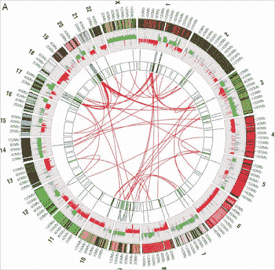

<!--yml
category: 未分类
date: 2024-05-18 04:56:50
-->

# Magmasystems Blog: A Medical Graphic for Market Flow Analysis ???

> 来源：[http://magmasystems.blogspot.com/2008/12/medical-graphic-for-market-flow.html#0001-01-01](http://magmasystems.blogspot.com/2008/12/medical-graphic-for-market-flow.html#0001-01-01)

New York Times article of

[what happens inside a cancer cell](http://www.nytimes.com/2008/12/25/science/25visual.html)

. This graphic struck me as being apropos to flow analysis of markets.

(The outer ring would be a heatmap of sector movement, the next inner ring would be the current volumes, the next inner rings might show trading movements from one sector to another,...)

http://www.nytimes.com/2008/12/25/science/25visual.html

©2008 Marc Adler - All Rights Reserved.

All opinions here are personal, and have no relation to my employer.