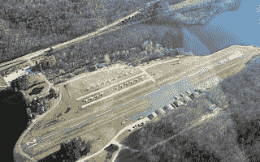

<!--yml
category: 未分类
date: 2024-05-18 05:24:59
-->

# Magmasystems Blog: Aeroflex Airport

> 来源：[http://magmasystems.blogspot.com/2005/10/aeroflex-airport.html#0001-01-01](http://magmasystems.blogspot.com/2005/10/aeroflex-airport.html#0001-01-01)

One of the prettiest airports in the world. I flew in there the other day and practiced some crosswind landings. If you come up short, you end up in one lake... too long, and you're in the other!