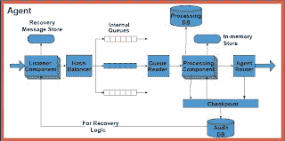

<!--yml
category: 未分类
date: 2024-05-18 04:58:35
-->

# Magmasystems Blog: Benchmarking .NET-based Tranaction Engines (and the LSE)

> 来源：[http://magmasystems.blogspot.com/2008/10/benchmarking-net-based-tranaction.html#0001-01-01](http://magmasystems.blogspot.com/2008/10/benchmarking-net-based-tranaction.html#0001-01-01)

Although somewhat dated (the infrastructure in from 2004, which can be considered to be light-years in the past), this is a useful read:

[Benchmarking a High Performance Real-Time Transaction Engine Design](http://citeseerx.ist.psu.edu/viewdoc/summary?doi=10.1.1.60.8158)

(Go to the bottom-left of the page, and click on the link that says "View or download")

Even more interesting is the

[slide deck that accompanied the presentation](http://w2ks.dei.isep.ipp.pt/labdotnet/files/IVNET/keynote_s.pdf)

. Slides 24 to 32 give some insight into the .NET-based architecture of the London Stock Exchange.

©2008 Marc Adler - All Rights Reserved.

All opinions here are personal, and have no relation to my employer.