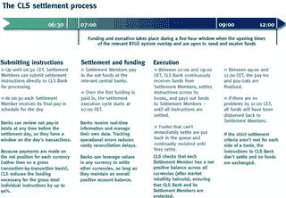

<!--yml
category: 未分类
date: 2024-05-18 05:20:24
-->

# Magmasystems Blog: FX Settlements

> 来源：[http://magmasystems.blogspot.com/2006/05/fx-settlements.html#0001-01-01](http://magmasystems.blogspot.com/2006/05/fx-settlements.html#0001-01-01)

The

[CLS](http://www.cls-services.com)

website has a great picture on how settlements work for FX trades. Here it is:

CLS is a bank set up by a consortium of different financial firms. It what my client uses for settling their FX trades.

©2006 Marc Adler - All Rights Reserved