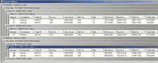

<!--yml
category: 未分类
date: 2024-05-18 05:21:21
-->

# Magmasystems Blog: Note To Self - Traversing Rows in a Single Band

> 来源：[http://magmasystems.blogspot.com/2006/04/note-to-self-traversing-rows-in-single.html#0001-01-01](http://magmasystems.blogspot.com/2006/04/note-to-self-traversing-rows-in-single.html#0001-01-01)

I am not really a hardcore Infragistics person. I find it amazing that some of the features that I consider essential in their Ultra

**WEB**

Grid offering are not found in their Ultra

**WIN**

Grid product.

I am writing a prototype of an app that has multiple levels of grouping. I need to be able to double-click on the column header of a band, and have it do something to only the rows in that band. For instance, if the user double-clicks on the column that says 'Selected', then I want every checkbox in that group to be toggled without affecting the rows in any other group.

[](http://photos1.blogger.com/blogger/138/258/1600/ManualConfs.jpg)

Sounds easy, right? Find out which header you double-clicked on, and then get the child rows that are associated with that header. The problem is that headers are not considered true rows within UltraWinGrid. They are "UI Elements". They do not have references to the rows that are directly beneath them.

After a while of messing around with the HeaderDoubleClicked event, I finally decided to base my procesing off of the MouseDoubleClick event.

Here is what I finally came up with after a few hours of tinkering around. (By the way, the function 'ToggleSelected' is a good way of walking down the entire tree of rows in a grouped grid.)

 ```

private UltraGridRow m_firstRowOfTheHeaderThatWasDoubleClickedOn = null;

private void dgTrades_MouseDoubleClick(object sender, MouseEventArgs e)
{
  Infragistics.Win.UIElement element =
  this.dgTrades.DisplayLayout.UIElement.ElementFromPoint(new Point(e.X, e.Y));
  if (element != null)
  {
    this.CalcGridRowForDblClick(element);
    if (element is Infragistics.Win.TextUIElement)
    {
      HeaderBase hdr = element.GetContext(typeof(HeaderBase)) as HeaderBase;
      if (hdr != null)
        this.dgTrades_DoubleClickHeader(hdr);
    }
  }
}

private void dgTrades_DoubleClickHeader(HeaderBase hdr)
{
  if (hdr.Column.Key == "Selected")
  {
    if (this.m_firstRowOfTheHeaderThatWasDoubleClickedOn != null)
      this.ToggleSelected(e.Header, 
                          this.m_firstRowOfTheHeaderThatWasDoubleClickedOn);
  }

  this.m_firstRowOfTheHeaderThatWasDoubleClickedOn = null;
}

private void ToggleSelected(HeaderBase header, UltraGridRow row)
{
  if (row == null)
    return;

  UltraGridBand band = header.Band;
  UltraGridRow childRow = row.GetChild(ChildRow.First, band);
  if (childRow == null)
  {
    // May be a leaf node
    UltraGridColumn colSelected = band.Columns["Selected"];
    if (colSelected == null)
      return;
    int idx = colSelected.Index;
    for (; row != null; row = row.GetSibling(SiblingRow.Next, false))
    {
      row.Cells[idx].Value = !((bool)row.Cells[idx].Value);
    }
  }
  else
  {
    // Is a non-leaf node
    this.ToggleSelected(header, childRow);
    this.ToggleSelected(header, row.GetSibling(SiblingRow.Next, false));
  }
}

private UltraGridRow CalcGridRowForDblClick(Infragistics.Win.UIElement uiElement)
{
  this.m_firstRowOfTheHeaderThatWasDoubleClickedOn = null;

  if (uiElement == null)
  return null;

  object elementContext = uiElement.GetContext(typeof(UltraGridRow));
  if (elementContext == null)
    return null;

  UltraGridRow row = elementContext as UltraGridRow;
  if (row != null)
    this.m_firstRowOfTheHeaderThatWasDoubleClickedOn = row;
  return row;
}

```  It works. The key was the UIElement.GetContext() function, which I finally found by reading a two sentence Knowledge Base article on the Infragistics website.

©2006 Marc Adler - All Rights Reserved