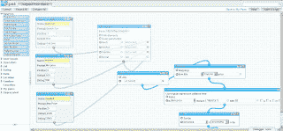

<!--yml
category: 未分类
date: 2024-05-18 05:03:50
-->

# Magmasystems Blog: Of Pipes, CEP, and Traders

> 来源：[http://magmasystems.blogspot.com/2008/02/of-pipes-cep-and-traders.html#0001-01-01](http://magmasystems.blogspot.com/2008/02/of-pipes-cep-and-traders.html#0001-01-01)

In our Complex Event Processing system, we will eventually want to be able to give a front-end to our traders which will let the trader develop ad-

hoc

streaming queries on real-time streams. We also want to allow the traders to implement their own analytics by doing back-testing on several years’ worth of data.

I have been looking at Yahoo Pipes a bit recently, and it is conceptually the same thing as the kind of GUI that I have been envisioning for the traders. In Yahoo Pipes, you can take the output of one or more high-level objects and pipe it into the inputs of another high-level object.

Here is an example of a Yahoo Pipes gadget:

In our simple use case, let’s say that we define high-level objects that are of interest to traders. Such objects could be

a real-time market data stream,

a historical market data stream,

a real time order flow stream and cache,

a historical order flow stream,

a ticker-to-sector mapper and filter, and

some calculation modules.

These are the kinds of “queries” that we built in the Complex Event Processing engines (

Streambase

, Coral8,

Aleri

,

NEsper

) during our evaluation process. However, just like Domain-Specific Languages (

DSL

) can be created to make developing applications in a certain domain easier, we can make a domain-specific version of Yahoo Pipes that is geared for analyzing Equities data.

Once the trader has put together his Pipes, the result can be translated into one of the languages that the

CEP

engine supports. If we encapsulate the code generation module, then we can have code generators for Coral8,

Streambase

,

Aleri

,

NEsper

, and others. I am pretty sure that all of these engines allow you to dynamically register and

unregister

queries. You can dynamically read the status and output of the

CEP

engine and feed it back into the GUI.

Aleri

and

Streambase

have GUI builders for their developers that look a lot like Yahoo Pipes. However, the

GUIs

are not packaged as

toolkits

; in other words, you could not take the

Streambase

GUI and adapt it for your own needs. Coral8 does not really have a fancy GUI builder; as mentioned here before, their GUI is fairly spartan.

NEsper

/

Esper

does not have any kind of GUI to speak of, as their model of embedding the engine inside of an application is different that the model used by the other vendors.

©2008 Marc Adler - All Rights Reserved