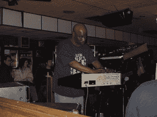

<!--yml
category: 未分类
date: 2024-05-18 05:21:28
-->

# Magmasystems Blog: RIP: Doug Walker (Alien Planetscapes)

> 来源：[http://magmasystems.blogspot.com/2006/04/rip-doug-walker-alien-planetscapes.html#0001-01-01](http://magmasystems.blogspot.com/2006/04/rip-doug-walker-alien-planetscapes.html#0001-01-01)

Doug Walker, long-time mainstay of the New York Spacerock scene and founder of the band Alien Planetscapes, passed away Tuesday April 4th at home. Doug had a heart condition for several years, and it finally caught up to him.

Doug was one of my oldest friends. I met Doug in 1975, and played in several seminal free-jazz bands with him in the mid to late 70's, including the great Third Sun.

Doug lost his wife Fran 2 years ago in a horrific car crash.

Doug leaves behind his son Evan, who was born three weeks after my own son.

God Bless You, Doug. Now you can jam with Robert Moog.

©2006 Marc Adler - All Rights Reserved