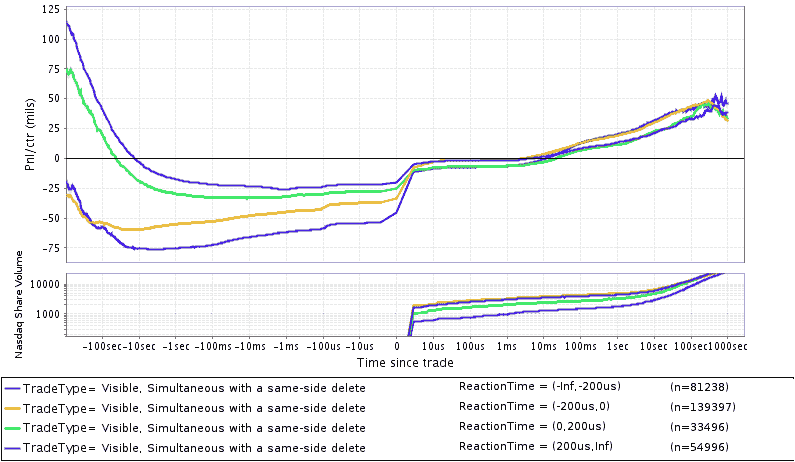

<!--yml
category: 未分类
date: 2024-05-18 06:43:52
-->

# Manipulation Using Compliance Tools: Equities Analysis Inspired By Allston Case | Mechanical Markets

> 来源：[https://mechanicalmarkets.wordpress.com/2015/03/31/manipulation-using-compliance-tools-equities-analysis-inspired-by-allston-case/#0001-01-01](https://mechanicalmarkets.wordpress.com/2015/03/31/manipulation-using-compliance-tools-equities-analysis-inspired-by-allston-case/#0001-01-01)

Recently, Allston has been [accused](http://www.bloomberg.com/news/articles/2015-03-31/allston-said-to-face-cftc-investigation-for-alleged-manipulation) of engaging in market manipulation on the CME. In this post, I’ll discuss why these [specific allegations](http://www.bloomberg.com/news/articles/2014-08-29/allston-accused-by-hft-rival-of-manipulative-trading) are extraordinary and examine whether similar manipulation could be occurring on equities markets.

The alleged manipulation is much more serious than ordinary spoofing. Spoofing involves a trader entering orders with the intention of artificially moving market prices and without any desire for those orders to actually execute. There are plenty of descriptions available detailing how spoofing defrauds market participants and damages public confidence in markets. What makes this case special is that the alleged spoofing makes use of an exchange’s Self-Match Prevention. Self-matching (also called “self-trading”) is a separate method employed by manipulators who, by executing fake trades, induce participants into thinking an instrument is trading away from its market value. Because self-matching is so damaging, regulators frown on it even when it’s accidental. Self-Match Prevention is an exchange feature designed to prevent such accidents, particularly those by algorithmic traders, who can inadvertently self-match even when they use strong countermeasures. It is thus, at its core, a compliance tool.

If the allegations turn out to be true, this case is unique in that a seemingly reputable trading company used a tool with only one purpose, increased compliance, to manipulate the market. I have always assumed that exchanges and regulators heavily monitor the usage of Self-Match Prevention. It seems virtually inevitable that somebody using it manipulatively would be caught, which makes me wonder if any traders involved thought they were above the law. It’s either that, or there would have been such a lack of compliance culture at Allston, that it never even crossed their minds to consider the legality of a trading strategy before running it. My guess would be the latter, but I’m not sure which possibility should be more concerning. In either case, if Allston is guilty, it indicates that potentially it could have been engaging in manipulative trading on an even broader scale. I want to stress that my intuition here is that they are not guilty; the whole thing seems a little too absurd for reality. Still, I wonder if its recent [cessation](http://www.bloomberg.com/news/articles/2015-01-23/chicago-speed-trader-allston-withdraws-from-u-s-stock-market) of equities trading is more than coincidence. Equities are considered a heavily regulated asset class, so I imagine shadier trading companies are better off steering clear of them.

Because of this possibility, I wanted to check if similar manipulation could have been occurring on US equities markets. Before you get excited, I’ll spoil the surprise by saying that I didn’t find any smoking gun. Still, there are a surprisingly large number of market data events that I suspect are due to Self-Match Prevention. Exchange surveillance could well be doing similar analysis, but also checking the identities of traders.

# Self-Match Prevention for US Equities

To see one way in which Self-Match Prevention could be used as part of a manipulation scheme, an example given in Nasdaq’s documentation is illuminating (see “Cancel Oldest” on [p.2](https://www.nasdaqtrader.com/content/productsservices/trading/selfmatchprevention.pdf)). In this example the market has three resting orders on the offer, one of which came from market participant (MPID) A. MPID A then sends a new buy order at the same price as those resting sell orders. To prevent a self-match, Nasdaq cancels the resting order from MPID A, after first executing the other two orders. Now, in this case the order cancelled by Self-Match Prevention was at the back of the queue, so almost certainly did not induce the other two orders into being submitted.[[1](#bottom1)] It’s still possible that by being at the back of the queue, it affected the behavior of the orders in front of it, but that kind of subtle manipulation would be hard to detect.

The most readily detectable manipulation might be similar to what was detailed in a potentially related [lawsuit](http://blogs.wsj.com/moneybeat/2015/03/12/was-john-doe-manipulating-treasury-futures-new-lawsuit-says-yes/) by HTG. I imagine spoofing that makes use of Self-Match Prevention in its simplest form would look something like:

1.  Market is 10.00/10.02
2.  Spoofer adds new sell order at 10.01
3.  Victim follows spoofed order by adding a sell order of its own at 10.01
4.  Spoofer sweeps the entire offer, relying on Self-Match Prevention to cancel its prior sell order

How might orders that are cancelled by exchange Self-Match Prevention appear in market data? My guess is that, for events like those described in the above example, an order deleted message would be distributed in the same packet as an order executed message. In such events, there is only one order entry message sent to the exchange that would trigger both market data messages; it would make sense for the exchange to distribute those market data messages in one burst – that is, one network packet. A search for these simultaneous messages reveals a substantial number on Bats BZX and Nasdaq, but few on EdgeX. Nasdaq does offer an [expensive FPGA feed](http://www.nasdaqtrader.com/TraderNews.aspx?id=dn2012-13) that reduces message queueing (and presumably the number of messages agglomerated into a packet). The data analyzed here did not come from that feed, but the results are similar if the deleted and executed messages are considered “simultaneous” when the exchange timestamped them in the same microsecond.[[2](#bottom1)]

What we look for next is the difference between the creation times of the deleted and executed orders. In our example above, this would be the interval between 3 and 2\. If there’s widespread spoofing, we would expect the executed order to perform worse if it was added after the order that was later deleted by Self-Match Prevention (i.e. step 4 would tend to be very toxic sweep). I’d be particularly suspicious in instances where that time interval is short enough for the second order to have been submitted by an HFT (or other algo) in response to the first. The figure below plots the pre and post-trade performance of executed orders, split by this time interval.

[](https://mechanicalmarkets.wordpress.com/wp-content/uploads/2015/03/inet_trades_with_del_insamebc_splitbycreatetimediffinexec-del_1.png)

Pre and Post-trade performance of trades on Nasdaq that were received in the same network packet as a delete message from about 6 days in August. The order deleted must have had the same side as the passive side of the trade. Includes only messages that deleted orders that were resting at the very front of the queue (including deletes of orders that were alone at the price level) – this excludes a fair number of otherwise qualifying events, but I wanted to stay close in spirit to our example. “ReactionTime” refers to the creation timestamp of the executed order subtracted from the creation timestamp of the deleted order. If a computer, colocated with Nasdaq, reacted to the order that was later cancelled, you’d expect to see it in the “(0,200us)” group. Humans and non-colocated computers reacting to that order would appear in the “(200us,Inf)” group. Bottom Panel: Share Volume on Nasdaq including fiducial trade

As you can see, there’s no smoking gun here. There are actually fewer events in the groups with a positive reaction time than a negative one. And the positive reaction time groups do not have noticeably different post-trade performance. This doesn’t prove anything of course, but I think it’s suggestive that any manipulation using this method occurs infrequently at most. Note that the figure does include simultaneous deletes and trades that are at different prices.[[3](#bottom1)]

Again, the unique aspect here is the use of a compliance tool in alleged market manipulation. The manipulation itself is most likely mundane. There are many [examples](http://dealbreaker.com/2012/06/libor-was-whatever-barclays-wanted-it-to-be/) of manipulation far more consequential and brazen. Self-Match Prevention could easily be modified to prevent it from being used in this way.[[4](#bottom4)] Of course, spoofing could still be done with countless other methods. If it were up to me, I’d probably leave it the way it is and allow it to function as a sort of spoofer’s honeypot.

If true, these allegations would be unhelpful in the effort to convince conspiracy theorists that large HFTs are subject to the same rules as everybody else. This is really too bad, because my impression is that the vast majority of HFTs take ethics and compliance very seriously. If indeed a previously respected company like Allston has engaged in this sort of activity, it suggests that a few HFTs may be lacking proper compliance culture. The SEC has expressed a desire to [require HFTs to join FINRA](http://www.reuters.com/article/2015/03/25/us-sec-highspeedtrading-idUSKBN0ML1Z920150325). I would argue that a painless and more important reform would be to require high-volume proprietary traders and developers to take a short compliance course. I think a single day should suffice, with lots of examples and Q&A. If the course instructor is in-house or under NDA/privilege, then those examples could even be made directly relevant to a firm’s strategies. One day of new employees’ time seems like a small price to ensure they have some common sense about compliance.

[[1](#1)] Technically it could have. A spoofer could modify an order in a way that sends it to the back of the queue, behind the order that it had previously induced into being submitted at the same price.

[[2](#2)] Similar in terms of their long term post-trade performance. The pre-trade performance and absolute number are fairly different in the “(0,200us)” group. Interestingly, that’s not as true for the other 3 groups. The exchange logic that determines whether two market data messages are aggregated into a single packet may be complex, and possibly different for the FPGA feed.

The two methods also give substantially different results for BatsZ, with significantly fewer deletes and executes timestamped in the same microsecond than distributed in the same packet.

[[3](#3)] There are fewer of these events than those with a simultaneous delete and execute occurring at the same price. Still, there are some. I’ve included an example of one below (with the prices changed by a small constant offset, and order IDs obfuscated):

```
t < 0, The order Book is:
|        | 23.19 |    300 |
|        | 23.15 |    100 |
|    100 | 23.12 |        |
|    200 | 23.10 |        |

t = 0, New 100 share bid at 23.12 (order ID X):
|        | 23.19 |    300 |
|        | 23.15 |    100 |
|    200 < 23.12 >        |
|    200 | 23.10 |        |

t ~ 450us, New 100 share bid at 23.13 (order ID Y):
|        | 23.23 |    300 |
|        | 23.15 |    100 |
|    100 < 23.13 >        |
|    200 | 23.12 |        |

t ~ 950us, New 100 share bid at 23.13 (order ID Z):
|        | 23.24 |    660 |
|        | 23.23 |    300 |
|    200 < 23.13 >        |
|    200 | 23.12 |        |

t ~ 260ms, 100 share bid at 23.13 (order ID Y) executes:
|        | 23.23 |    400 |
|        | 23.15 |    200 |
|    100 < 23.13 >        |
|    100 | 23.12 |        |

t ~ 260ms (same packet as above), 100 share bid at 23.13 (order ID Z) executes:
|        | 23.23 |    400 |
|        | 23.15 |    200 |
|    100 | 23.12 |        |
|    200 | 23.10 |        |

t ~ 260ms (same packet as above), 100 share bid at 23.12 (order ID X) is deleted:
|        | 23.23 |    400 |
|        | 23.15 |    200 |
|    200 | 23.10 |        |
|    300 | 23.09 |        |
```

[[4](#4)] All that would need to be changed is for Self-Match Prevention to be made strictly “Cancel Both” or “Cancel Newest.” That would make it impossible to initiate a trade with a self-matching order.