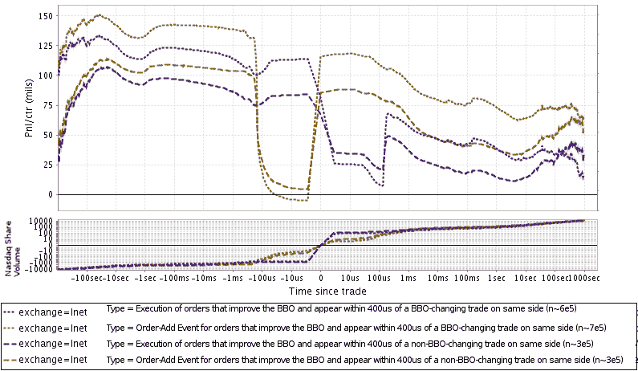
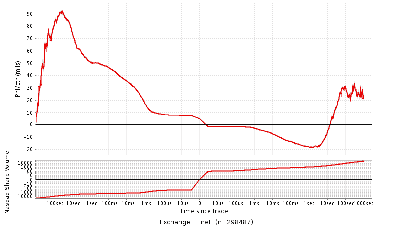
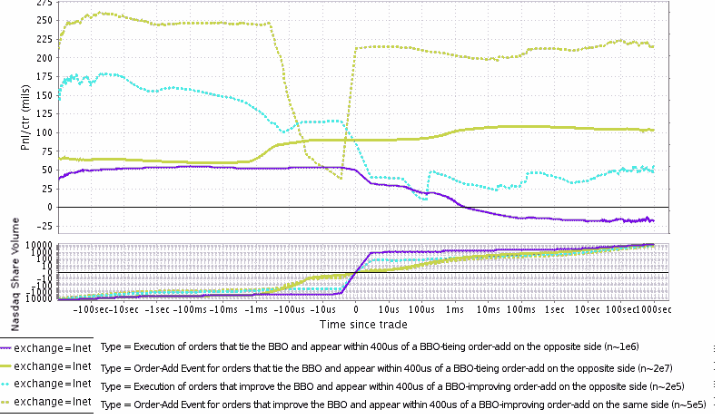
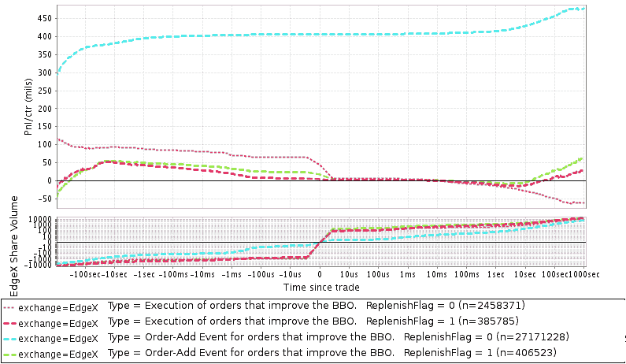

<!--yml
category: 未分类
date: 2024-05-18 06:43:31
-->

# Market Data Patterns, Order Anticipation, and An Example Trading Strategy | Mechanical Markets

> 来源：[https://mechanicalmarkets.wordpress.com/2015/04/30/market-data-patterns-order-anticipation-and-an-example-trading-strategy/#0001-01-01](https://mechanicalmarkets.wordpress.com/2015/04/30/market-data-patterns-order-anticipation-and-an-example-trading-strategy/#0001-01-01)

I recently [discussed](https://mechanicalmarkets.wordpress.com/2015/04/12/spoofing-corrupts-markets-a-reply-to-john-arnold/) the inseparability between predicting an instrument’s price and anticipating its order flow. But, sometimes it’s possible to directly predict order flow from the signatures of execution algorithms or even certain exchange order types. In this post, we’ll see examples of common patterns in market data that have an association with future orders. I’ll also outline a simple trading strategy with one of these patterns as its primary feature.

# Reserve Orders

A reserve order (also called an “iceberg order” or [“MaxShow order](http://www.cmegroup.com/confluence/display/EPICSANDBOX/iLink+-+Order+Qualifiers#iLink-OrderQualifiers-Tag210-MaxShow)“) is a resting order that is programmed to have its quantity refilled in some fashion after it executes. I believe the existence of reserve orders is motivated by participants’ desire to hide the full extent of their trading intentions. A reserve order, for instance, might display 200 shares at any one time when its full size is many times that. Here’s a simplified illustration of how they work:

1.  Trader submits a reserve order to buy 5000 shares of AAPL at $100, setting the order to display 200 shares at any one time.
2.  Market data shows a new bid at $100 for 200 shares.
3.  Someone else trades with that $100 bid.
4.  A new 200 share bid for $100 appears in the market data.
5.  Steps 3 and 4 repeat until the full 5000 shares are executed, the price moves away, or the trader cancels the order.

See p56-60 of this [document](http://www.nasdaqomx.com/digitalAssets/75/75620_nasdaqomxnordicmarketmodel2.6.pdf) from Nasdaq Nordic for more detailed examples.

You might guess that reserve orders, because they tend to be large and worth hiding, have substantial alpha. You can probably also see how they might leave a fairly obvious signature in market data. So, let’s check. Here is a chart of the performance of a few types of refilled orders.

Top panel: Average profit or loss per share vs distance in time from market event. For events marked “Order-Add,” the line follows the market price trajectory relative to the order price and time of appearance. Events marked “Execution” follow the price trajectory of any of these orders that later trade, relative to execution price and time. The “market price” here is the Nasdaq midpoint, not the last-traded price like in previous posts, and is weighted respectively by order-add/execution quantity. Viewing the midpoint makes it easy to see the price-level trading-through and the market price snap-back that follows. Chart is over 6 days in August and excludes fees and rebates. Bottom panel: Shares traded on Nasdaq vs time from event (including volume from any part of these events).

These orders that are the result of a refill definitely have noticeable alpha, even when they execute. Which is somewhat surprising given that a large part of the market ought to know that these orders were potential icebergs. You might have expected that after the first refill only very confident participants would want to trade with them, and after several refills, traders would be getting increasingly wary. About 67% of these displayed shares are eventually filled, a high portion by any standard. Generally speaking, a high fill rate is associated with greater market impact; though, of course, we don’t have any information about the hidden portions of these orders which are not executed.

Most importantly, notice how the market midpoint tends to snap back after a trade, more or or less confirming that many refilled orders continue to get refilled after subsequent trades. Also, note that the time-scale of the snap-back is pretty tightly in the 200~400us range, significantly greater than the usual roundtrip time for an HFT trading on Nasdaq. My guess is that Nasdaq handles reserve orders via computers external to their core matching engines. That would explain this latency as well as reserve orders [not being available](http://nasdaqtrader.com/content/ProductsServices/Trading/Protocols_quickref.pdf) on the high-speed [OUCH](http://www.nasdaqtrader.com/Trader.aspx?id=ouch) order entry interface. [[1](#bottom1reserve)] Of course, these refills could also be due to execution algorithms operated independently from Nasdaq, but I suspect that many are, in fact, reserve orders. [[2](#bottom2reserve)]

# Anticipating Order Flow

If that’s the case, this is a great example of exchange order handling being potentially open to what Michael Lewis might call front-running [[3](#bottom3reserve)]. If reserve orders take ~250us for the exchange to refill them, what happens if somebody tries to submit an order in anticipation of that refilling? Exchange latency varies by the situation, and I haven’t tested it myself in situations like these, but I’d bet that an HFT could have an order of their own live before a hypothesized reserve order is refilled by Nasdaq. [[4](#bottom4reserve)] An HFT could even delete their order after a few hundred microseconds if the reserve order does not refill behind it. I’m *not* saying that this is happening, but if so the hypothetical HFT would have pretty limited risk of being filled in situations where they did not have an order behind them in the queue, which is generally considered desirable.

My feeling is that this sort of trading by an HFT would be perfectly legal, even if it feels a little shady. HFTs’ compliance departments might forbid flashing and quickly deleting an order if nobody joins its price level, partly because that kind of activity may indicate a strategy is hoping to elicit a reaction from the market with its orders. That’s not what we’re discussing here, but compliance departments are hopefully very watchful of any trading that resembles market manipulation.

But, what if we simulate the next simplest thing? We’re not trying to do anything too complicated here, so let’s just pick the highest performing type of refill events for our strategy to mimic. Events with refills that improve the BBO at the time of adding perform better than those that tie the BBO (for the latter group, here’s the same [analysis](https://mechanicalmarkets.wordpress.com/wp-content/uploads/2015/04/inet_sfa_reserve_midpt_nontoxic_1366.png) as above). Refilling orders that display more than 101 shares also perform significantly better. Our strategy will be essentially to copy these orders. Here’s the performance of simulated trades that result from adding a 100-share order *after* one of these refills occurs, with the simulation keeping its orders live until it sees the suspected reserve orders stop refilling:

Top panel: Average market-priced profit or loss per share vs distance in time from trades simulated by the above-described strategy. The “market price” here is a measure of the last-traded price, which is why you don’t see a snap-back in the price after a trade. Chart is over 8 days in August (different from the days in the above chart). Bottom panel: Shares traded on Nasdaq vs time from trade (excluding simulated trade).

Even this simple trading strategy appears to be profitable. The above chart excludes fees and the roughly 0.30 cents/share Nasdaq rebates, which raise the profitability significantly. All told, at least in simulation, this would make nearly 20k/day. And that is just by sending 100 share orders to Nasdaq, with Nasdaq refills as the only signal. There are other exchanges with very similar behavior that are amenable to this kind of strategy.

# Automated Pattern Detection

In the simulation, after the once-refilled order in front of the simulated order executes, another refill generally comes in behind the simulated order. So, this simulated strategy is still pretty explicitly anticipating order flow. Again, I believe this kind of trading activity is legal (not that I’m a lawyer). But it does make me slightly uncomfortable, and neither I nor my company have ever used this signal or others like it in live trading. But, it’s easy to imagine this market data pattern being used in trading strategies without the operator being aware of it. [[5](#bottom5reserve)] Quants could create a model that automatically searches for patterns in market data and combines them into a prediction statistically, without actually looking at what those patterns are. [[6](#bottom6reserve)] This particular pattern occurs quite often, so I think that many pattern-detection methods would find it easily.

I’ll also mention that sometimes certain patterns in market data do not obviously resemble exchange order types, but still have similar predictive power to our example of reserve orders. Below, we can see the anomalously high performance of orders that are added shortly after the appearance of another order on the opposite side.

Top panel: Average profit or loss per share vs distance in time from market event. The “market price” here is again the Nasdaq midpoint, not the last-traded price. Chart is over 6 days in August and excludes fees and rebates. Bottom panel: Shares traded on Nasdaq vs time from event (including volume from any part of these events).

Orders that are part of event sequences of this type are pretty high-alpha as you can see. There could be all sort of reasons for that, including:

1.  Execution algorithms that make their quotes more aggressive when they see the spread tighten
2.  Some could be reserve orders like those above, and are refilling after both an incoming trade and a new order on the opposite side (other algos may add that order in response to the trade).
3.  Exchange order types that I’m not familiar with
4.  Or, in light of [recent events](http://www.bloombergview.com/articles/2015-04-21/guy-trading-at-home-caused-the-flash-crash), spoofing. (Hopefully not, and I doubt it). [Edit: For an example of how spoofing may induce somebody into trading with a reserve order on the opposite side, see this [CME disciplinary notice](http://www.cmegroup.com/tools-information/lookups/advisories/disciplinary/NYMEX-10-07963-BC-IGOR-OYSTACHER.html#pageNumber=1)]

# Ethics of Using Signatures from Algorithmic Trading Tools

Would using this particular signal, which is not directly linked to an exchange order type, in a trading strategy be unethical? Neither I nor my company have used it (or anything like it), but I don’t see a problem with doing so. If somebody wants to use an execution algorithm that leaves a blaring signature in market data, it’s hard to feel too sympathetic.

Ultimately, it is the traders submitting these orders that are accountable for their efficacy. In an ideal world, traders responsible for substantial volume perform careful analysis of their execution methods and choose the best one for a given situation. Order types such as icebergs are algorithmic tools designed for sophisticated participants. I think it’s important to note that many of the most vocal opponents of order-anticipation strategies also have a [Darwinist view of markets](http://johnhcochrane.blogspot.com/2015/04/just-when-you-thought-financial.html) and feel that algorithmic traders should not be protected from spoofers. That view feels like it’s in tension with an objection to order-anticipation strategies that predict behavior of other algorithms. The above market data patterns, even if partly from reserve orders, are signatures from algorithmic trading. If you don’t mind algorithmic traders being gamed by spoofers, you ought not to mind their order flow being anticipated using the information they blast out to the market.

# Exchange Improvements

That said, I think it might be helpful if exchanges were a little more transparent about their order handling process. If, for example, order types that mimic execution algorithms have a high latency because they operate on separate computers from the matching engine, then maybe the exchange ought to provide latency statistics so that users can make a more educated choice. Similarly, if an exchange could add a trivial feature to help obscure reserve orders, why shouldn’t they? For example, Nasdaq offers functionality for reserve orders to be refilled with a random quantity, presumably with the intention of obfuscation. Why not offer functionality for reserve orders to be refilled at a random time interval as well? If refills didn’t just occur in a tight range of 200-400us, they would have been much harder for me to detect. Of course, many traders could just implement that functionality in their own iceberg algorithms if they wanted it. But it’s worth mentioning that some market data patterns, that are likely from traders’ algorithms (rather than exchanges’ algorithms), also seem to be due to the use of non-random timers – so exchanges are certainly not outside the mainstream here.

Some people might also say that our markets have become too complex and that traders are being increasingly forced to use order types that they don’t understand. I’m somewhat sympathetic with that sentiment, and there are [proposals](http://www.ft.com/intl/cms/s/0/e9c66ddc-be7a-11e3-b44a-00144feabdc0.html) to reduce the number of order types. But even if the markets are simplified, large traders should still read the documentation for exchange matching engines and any order types they plan on using. The most verbose exchange documentation is generally no more than a few hundred pages, and specific order types are usually documented in just a few pages – all of which, though boring, can probably be read in under a day. In the case of reserve orders on Nasdaq, the admittedly brief description provided in the [order types guide](http://nasdaqtrader.com/content/ProductsServices/Trading/OrderTypesG.pdf) is likely sufficient for traders to understand that reserve orders may leak valuable information upon refilling. Market professionals are handsomely compensated and probably should take the time to read the manual.

# Explicit Marking of Reserve Orders on DirectEdge

More generally, exchanges probably should do the best they can, within the confines of an order type, to keep client information as secret as possible. And, when they don’t, they probably should explain that as clearly as possible, just in case some traders don’t read every exchange document. In DirectEdge’s old market data protocol ([p9](https://mechanicalmarkets.wordpress.com/wp-content/uploads/2015/04/denextgenmdmulticast-1-1-5.pdf)), there is a field (“Replenish Flag”) that discloses whether a new order is associated with a reserve order:

> This message indicates a replenishment of an existing reserve order.

I know exchanges work hard to protect client info, so I was surprised to see this. As we saw, it’s not that hard to identify reserve orders anyway. But even so, I would not be astonished if some iceberg users were upset by this order flag. One philosophy of market data distribution is that more disclosure is always better; DirectEdge could have been operating under this assumption when they elected to include the flag.

This field is not (to my knowledge) disseminated on the new market data protocol, used after DirectEdge’s integration with the Bats platform. In fact, Bats’s [documentation](https://www.batstrading.com/resources/membership/BATS_MC_PITCH_Specification.pdf) seems to stress the importance of keeping this information secret:

> To better protect reserve orders, BATS handles executions against reserve orders as follows: …
> When the displayed portion of the reserve order is refreshed, the order is assigned a new OrderID on the PITCH feed. This is reported by an Add Order(0x21, 0x22, or 0x2F) when the remainder is nonzero.

In any case, here’s a plot of what the market looks like around the time these flagged orders were added and executed:

Top panel: Average profit or loss per share vs distance in time from market event. The “market price” here is the EdgeX last-traded price. Chart is over 6 days in August and excludes fees and rebates. Bottom panel: Shares traded on EdgeX vs time from event (including volume from any part of these events).

It appears that these orders carry valuable information as well. As with the suspected Nasdaq reserve orders, [larger orders with this flag have greater alpha](https://mechanicalmarkets.wordpress.com/wp-content/uploads/2015/04/edgex_sfa_bboimprove-addflag_reserve_feedaddqty_1366.png). A simple strategy that just copies them is profitable in simulation too. I will mention that neither I nor my company have used this flag (or anything like it) as a signal.

# Adding vs Removing Liquidity

One thing I like about strategies that essentially mimic reserve orders (or other patterns) is that they post liquidity even though they could be embarrassing for anybody using them (again, embarrassment does not imply anything illegal). Passively trading, often called adding liquidity or market-making, is generally a revered activity thought of as a service to the market. Adding liquidity as part of an explicit order-anticipation strategy turns that picture on its head. [[7](#bottom7reserve)]

Earlier trading strategies posted on this blog all remove liquidity, something often frowned upon by the media. Those aggressive strategies, which focus on trading with [old](https://mechanicalmarkets.wordpress.com/2015/01/20/identifying-trader-type-pt-2/) , [large](https://mechanicalmarkets.wordpress.com/2015/02/09/order-size-in-the-hft-era-identifying-trade-type-pt-3/), or [MPID-labeled](https://mechanicalmarkets.wordpress.com/2015/02/16/protecting-client-interests-anonymity-in-us-equities/) orders, choose to trade with counterparties that exhibit characteristics suggestive of a human or retail origin. So, the strategies are likely trading with entities who want to be executed, even if the short-term market price tends to move through their orders after execution. Those strategies may technically remove liquidity, but as far as counterparties would be concerned, they provide a valuable service worthy of being called market-making.

[[1](#1reserve)] From p28 of Nasdaq Nordic’s [Market Model document](http://www.nasdaqomx.com/digitalAssets/75/75620_nasdaqomxnordicmarketmodel2.6.pdf)

> All changes on the Order including changes to the volume (both visible and total volume) of a Reserve Order are accomplished using an Order cancellation followed by an Order insert. In addition, when the displayable portion of the Order is completely executed within the Order Book, the non – displayable portion of the Order is decremented (retaining time priority) and a new displayable Order is sent to the Order Book (with new time priority).
> 
> The technical implementation for some Order functionality means that the functions are offered on a best effort basis. This means that the execution may be subject to so called ‘race conditions’ and that the outcome may be impacted by other (incoming) Orders. E.g. the updating of open or displayed volume of a Reserve Order is done at a time when other Orders may be entering the Order Book, thus leaving the Order priority of the update non – deterministic.

Nasdaq Nordic uses Inet technology, so it’s a reasonable guess that their American markets have similar order-handling logic. But, it’d be great if Nasdaq could provide some clarifying guidance. It’s a sign of the state of disclosure (which has dramatically improved in recent years) on US exchanges that sometimes you need to read the documentation of foreign analogues to understand how they operate.

[[2](#2reserve)] Reserve orders account for about 8% of volume on [NYSE Arca](https://www.nyse.com/publicdocs/nyse/markets/nyse-arca/NYSE_Arca_Order_Type_Usage.pdf) and about 4% on [NYSE](https://www.nyse.com/publicdocs/nyse/markets/nyse/NYSE_Order_Type_Usage.pdf). It wouldn’t surprise me if they were also very common on Nasdaq.

[[3](#3reserve)] I, and [others](http://www.bloombergview.com/articles/2014-06-20/why-i-love-high-speed-trading), certainly wouldn’t call it that.

[[4](#4reserve)] See [[1](#bottom1reserve)] for Nasdaq Nordic’s depiction of reserve order refills having non-deterministic priority in the queue.

[[5](#5reserve)] This is, again, not the case for me or my company.

[[6](#6reserve)] This isn’t advice, but it wouldn’t be a terrible idea for compliance departments to ask developers for a list of all pattern-like signals used in trading strategies. Developers might automatically add signals without really looking at them, but there’s no reason compliance can’t review them before they’re used in live trading. Unless there are tens of thousands of such features, in which case it may still be possible to create automated tools to check them for potentially problematic behavior.

[[7](#7reserve)] Of course, you could imagine using the order patterns we’ve seen in other strategies that remove liquidity. I do feel like just copying the anticipated orders is the most pure method of capturing some of their alpha though.