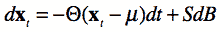
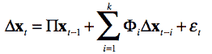
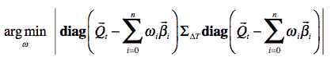

<!--yml
category: 未分类
date: 2024-05-18 15:27:44
-->

# Market-Making Portfolio & Hedging | Tr8dr

> 来源：[https://tr8dr.wordpress.com/2015/05/02/market-making-portfolio-hedging/#0001-01-01](https://tr8dr.wordpress.com/2015/05/02/market-making-portfolio-hedging/#0001-01-01)

With market making we can try to be neutral by skewing prices in such a way as to maintain a neutral position.   To the extent that the market can become 1-sided (in momentum) or may have large sized requests (if offering at different sizes), one’s portfolio may require explicit hedging.

In a live market-making scenario we can determine how we want to hedge on a case-by-case basis and with a view on where it is cheapest to achieve the hedge.   Within a FX portfolio there is opportunity to hedge an excess position in one currency with a position in one or more other currency pairs, potentially taking on some basis-risk.

An interesting inverse problem was posed by a colleague of mine.   Supposing one knows the net positions of a portfolio at each time-step historically and want to back out the most conservative view on:

1.  whether the portfolio is hedged
2.  what positions it was running (assuming it is not hedged)

This problem cannot be solved definitively as any view on hedging or risk assumes a model of forward price dynamics.   However, I thought a reasonable way to approach this would be to:

1.  **determine multivariate model of mean-reversion across assets**
    1.  this would allow us to pair more loosely associated assets that tend to mean-revert as opposed to limiting our hedging to assets with a tightly coupled dynamic (i.e. close to 100% correlated)
2.  **determine risk measure on residual portfolio (**after factoring out mean-reverting positions)
    1.  i.e. we reduce the portfolio positions by scaled mean-reverting sub-portfolios.   If fully hedged, after these reductions, the residual portfolio positions would be close to 0.

**Mean Reversion Model**

There are a variety of choices for mean-reversion model.   Some of the simplest are:

1.  Multivariate Ornstein-Uhlenbeck process:
    
2.  Vector Error Correction Model (VECM)
    
3.  PCA or ICA based decompositions
    1.  Can use the vectors produced in decomposition to produce mean-reverting sub-portfolios

Regardless of which formulation we start with, can express hedges as a combination of scaled portfolios on subsets of assets in **x**.  That is, can determine sparse weighting vectors β[0], β[1], …, β[n] such that each linear combination of β[i]**x** is mean reverting and possibly cointegrating.   Note that one can have multiple mean-reverting vectors that include the same asset both because there are different periodicities in mean-reversion and because of the cross-relationships between assets.

For example in a portfolio containing EUR, JPY, CHF, one (cointegrating) weight vector would be: [ 1.0, 0.0, -1.0 ].

**Optimisation Problem**

Assuming we have:

1.  mean-reverting vectors β[0], β[1], …, β[n]
2.  covariance matrix of returns on **x** over period ΔT, **Σ**[ΔT]
3.  net portfolio positions: **Q**[t]

The goal is to find the smallest net portfolio after subtracting scaled mean-reverting vectors **ω**[i]**β**[i], over some objective function O(q):

The most appropriate objective function is one that expresses the residual risk of the portfolio.   For simplicity, defining the risk objective to be to find the residual portfolio with a minimum covariance matrix volume (i.e. determinant).  The intuition is that a covariance matrix with highly aligned (correlated) vectors will have smaller volume.   Likewise, lower variance will reduce the magnitude of the vectors (and therefore volume).

Given a covariance matrix on unit positions **Σ**[ΔT], can scale the covariance matrix given residual position vector **q** as:

and hence determine the objective function O(q) to be the determinant of the residual covariance:

putting it all together, we want to minimize:

Given a minimizing vector **ω**, we can determine the residual, unhedged position at time step **t** to be:

**Solution**

The optimization problem is similar to the packing problem, where we try to determine how many units of each item, where we have K distinct item types (our beta vectors), optimally fill a bag.

In our case, the items to be packed are the beta vectors and the bag is the position we are trying to reduce.   We are trying to determine how many units of each beta vector to use in combination with other beta vectors to achieve the best reduction (packing).

To reduce the combinatorial possibilities to something finite, we can assume that only certain scalings of the beta vectors are used.   For a FX portfolio, the market tends to trade in multiples of 100K on one of the currencies (usually the base currency). In equities, the convention would usually be units of 100.

We can then solve this with a combinatorial approach (exponential) or approximately with either a greedy algorithm (polynomial) or meta-heuristic optimization approach.

**Addendum**

I should mention that there are many approaches that can be taken in evaluating portfolio risk.  Gary Basin suggested looking at a PCA decomposition of the portfolio.  PCA is definitely a useful way in determining the primary determinants of variance in the portfolio.   I chose to use a method that allowed me to factor out mean-reverting sub-portfolios.   There are so many approaches to this, can’t really comment on what is best.