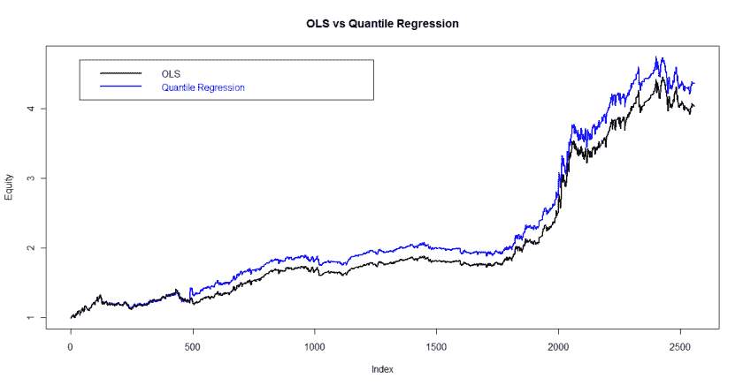

<!--yml
category: 未分类
date: 2024-05-18 14:01:13
-->

# Market Neutral Strategy Portfolio – Quantum Financier

> 来源：[https://quantumfinancier.wordpress.com/2010/12/15/market-neutral-strategy-portfolio/#0001-01-01](https://quantumfinancier.wordpress.com/2010/12/15/market-neutral-strategy-portfolio/#0001-01-01)

In continuation with last post on market neutrality, this post will look into obtaining market neutrality for a portfolio of strategy. As mentioned in last post, investors can trade many strategies with conflicting signals. For this particular example, imagine an investor that trades two strategies; a RSI2 and the 50-200 moving average crossover on the S&P 500\. You can imagine that the signals from these strategies are going to be conflicting. The RSI2 is a really short-term strategy with a high turnover, while the so termed “golden cross” is a polar opposite very slow moving low frequency strategy. Also assume this investor allocate 50% of his capital to both strategy.

Now in this particular experiment, we have that portfolio of strategies and want to short or long some SPY in order to remain market neutral. To accomplish this we will use the commonly used simple linear regression and the slightly more robust quantile regression.

Simply put, we are simply using the portfolio (dependant) and market (independent) returns series to obtain the prescribed hedge ratio approximated by the regression coefficient. Now everyone is likely familiar with the linear regression so I will skip the intro. However the quantile regression is not as mainstream. It simply estimates the tau()-th conditional quantile regression function, and give the expected value based on the current quantile (tau) of the predictor variables. The premise for using quantile regression is that we expect the regression coefficients to vary depending on the level of the predictor variable. Note that in this experiment I used the linear quantile regression but there exists a non-linear version of it.

The results below are obtained using a 60 days lookback period for the hedge ratio calculation. They represent the equity curves of the portfolio traded with the market neutral long/short hedge as prescribed by the regression coefficient. A note of caution here, doing this will reduce returns however, it also reduces volatility.

I think this result is interesting in a couple of ways. But first I want to look if market neutrality is effectively obtained. As explained in last post, we often say we are market neutral if our beta is zero. Readers that have experimented with this concept know that the beta is never going to be strictly zero, but will oscillate around it. To test whether or not my goal was accomplished I used a simple t-test for the 60 day rolling mean of the observed beta. Alternatively, I could have used a more robust bootstrap test but I wanted to keep things simple. The t-test confirmed that the observed beta was effectively not different from zero and that we obtained theoretical market neutrality with both methods.

To conclude, I was happy the result confirmed my expectation with quantile regression which tested slightly better. I think there is value in the quantile regression when considering market neutrality as an objective for a strategy or a portfolio of strategies. The dynamic linear modelling approach is left to the interested reader.

QF