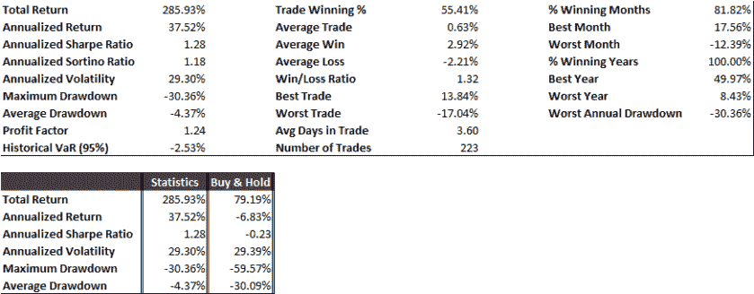

<!--yml
category: 未分类
date: 2024-05-18 14:01:05
-->

# Market Rewind’s Sentiment Spreads Remix – Quantum Financier

> 来源：[https://quantumfinancier.wordpress.com/2010/12/20/market-rewind%e2%80%99s-sentiment-spreads-remix/#0001-01-01](https://quantumfinancier.wordpress.com/2010/12/20/market-rewind%e2%80%99s-sentiment-spreads-remix/#0001-01-01)

In this post, I want to build on a good discussion in the comment section of this post: [An Intermarket Ensemble Model for the S&P500 Using Market Rewind’s “Sentiment Spreads”.](http://cssanalytics.wordpress.com/2010/09/19/creating-an-ensemble-intermarket-spy-model-with-etf-rewinds-sentiment-spreads/) One of [ETF Prophet’s](http://etfprophet.com/) contributors and the initial thinker for the spreads, [Mr. Pietsch](http://marketrewind.blogspot.com/) commented on CSS’s use of the sentiment spreads to predict the S&P 500\. The part that spiked my interest was the very last question: *what can you tell us about improving performance yet again with weak learner methodologies?* While originally directed to Mr. Varadi, I felt compelled to try the idea.

The setup layed out in the post linked above is a good candidate for a support vector machine prediction model. You can think of the process as mapping the information contained in the spreads in relation to the ETF tracking the S&P 500\. This approach, a weak form of ensemble learning is the next level after single indicator/variable model. Conceptually, one can think of market movements as the aggregation of a high (very) quantity of information and data. Trying to process the market and generate signals using a single raw filter/signal/strategy has a small chance to succeed for a long time without adaptation. Using multi-variables adaptive models/strategies tends to increase the odds in our favour. I would argue that two of the most important variables to take in consideration are price action and inter market effects. Most technical indicator covers the price action angle. These sentiment spreads are a simple way to introduce the other very important part into a quantitative strategy. For now, I will only take these into consideration, but I plan to expand on this and show how we can combine price action and intermarket effects to our best advantage. The following results are from using a -svm classification model trained on the last 100 days of spread. Note that the sample is very small since I wanted to take all seven spreads together, it will be interesting to see how it plays out with more data to our disposition and to test it using intraday data.

QF