<!--yml
category: 未分类
date: 2024-05-18 14:24:54
-->

# Market(ing) versus Art – Sniper In Mahwah & friends

> 来源：[https://sniperinmahwah.wordpress.com/2013/11/13/marketing-versus-art/#0001-01-01](https://sniperinmahwah.wordpress.com/2013/11/13/marketing-versus-art/#0001-01-01)

La lecture de *[Traders Magazine](http://www.tradersmagazine.com)* est toujours réjouissante, notamment en raison des publicités qu’on peut y trouver. Une analyse sémiologique de ces publicités (dans le même genre que les *Mythologiques* de Roland Barthes) pourrait être menée sans difficulté tant les images utilisées font appel à des symboles grossiers, signe d’un marketing assez transparent… surtout lorsqu’il s’agit de liquidité.

Commençons avec [Jones Trading](http://www.jonestrading.com/Home.php), qui ne manque jamais d’humour comme en témoignent ces deux publicités. La première fait référence à l’introduction en bourse ratée de Bats Global Markets le 23 mars 2012, introduction qui n’aura duré qu’une seconde et demie ; la seconde est une allusion au #hashcrash du 23 avril 2013, lorsque les marchés ont fondu suite au piratage du compte Twitter d’Associated Press, quand bien même ce ne sont pas les machines qui furent réellement responsable de ce mini-crash – “*people think, machines still don’t*” rappelle également ce slogan d’IBM, *People should think, machines should work*, que l’on trouve dans cette [publicité](http://www.youtube.com/watch?v=PyBNR8ThrNQ) de 1967.

[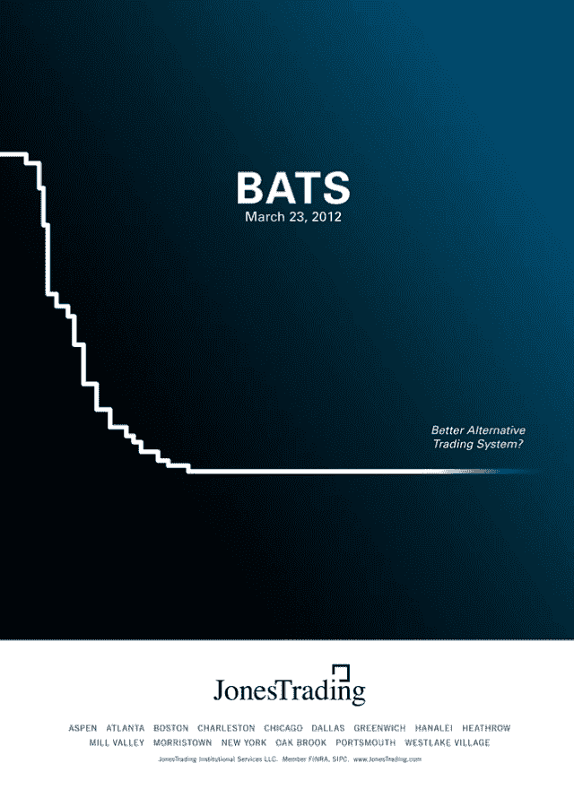](https://sniperinmahwah.wordpress.com/wp-content/uploads/2013/11/bats.jpg)

[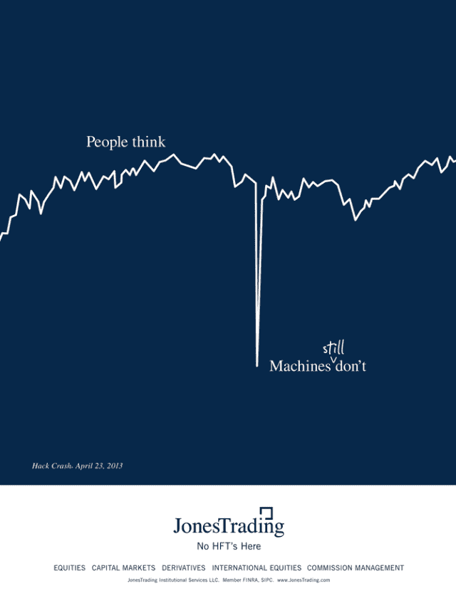](https://sniperinmahwah.wordpress.com/wp-content/uploads/2013/11/hashcrash1.png)

Cette autre publicité fait allusion à l’introduction en bourse quelque peu ratée de Facebook le 18 mai 2012, suite à des “problèmes techniques” qu’a connu le Nasdaq :

[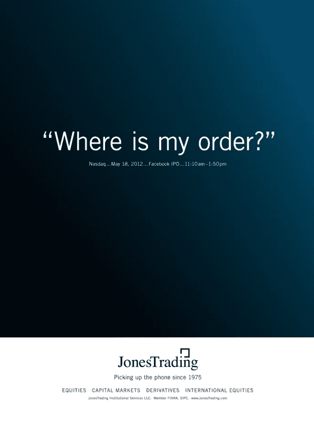](https://sniperinmahwah.wordpress.com/wp-content/uploads/2013/11/order.png)

Il y a aussi toutes ces publicités autour de la *liquidité* des marchés, où les traders en silicone sont anthropomorphisés en surfeurs ou en skieurs :

[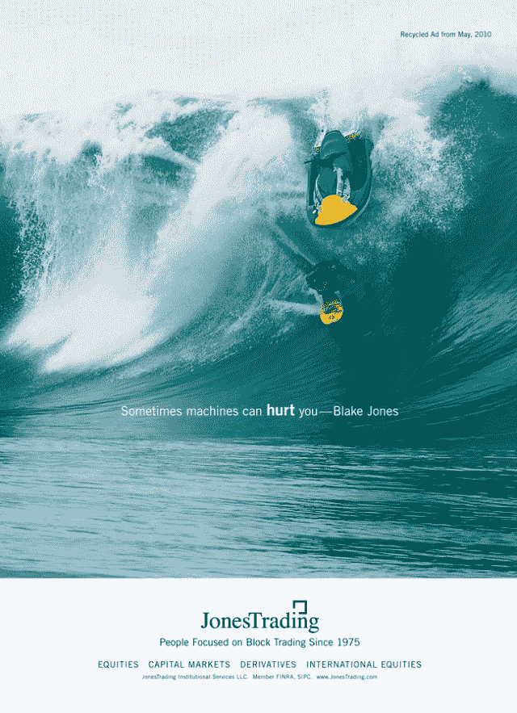](https://sniperinmahwah.wordpress.com/wp-content/uploads/2013/11/capture-d_c3a9cran-2013-03-24-c3a0-12-22-09.png)

[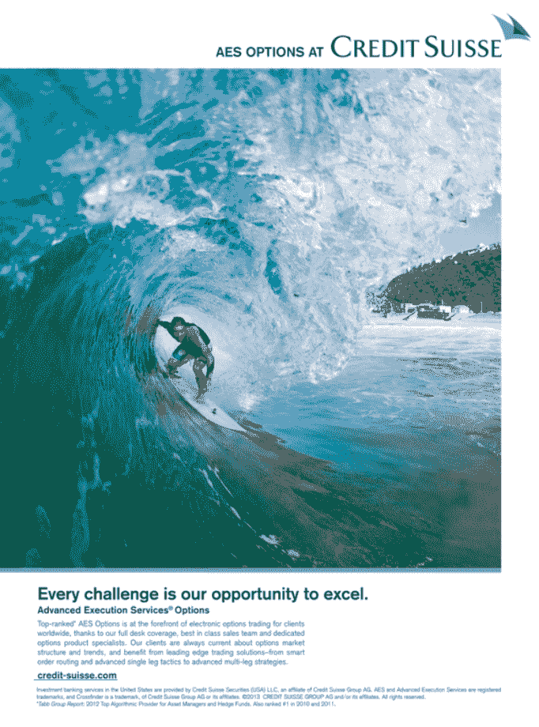](https://sniperinmahwah.wordpress.com/wp-content/uploads/2013/11/capture-d_c3a9cran-2013-03-23-c3a0-17-31-39.png)

[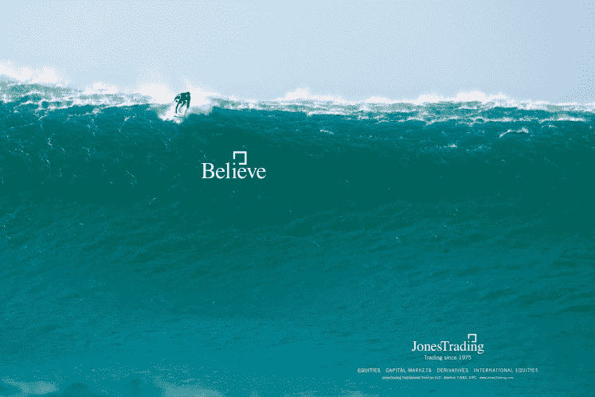](https://sniperinmahwah.wordpress.com/wp-content/uploads/2013/11/capture-d_c3a9cran-2013-03-24-c3a0-12-41-34.png)

Parfois, d’anciennes publicités deviennent férocement ironiques, comme celle-ci pour Knight Capital pour qui “*Being Smarter is a Key*“, même si le 1er août 2012 Knight ne fut clairement pas “le plus intelligent”, comme je le raconte [ici](https://sniperinmahwah.wordpress.com/2013/11/02/good-knight/) :

Il y a aussi les publicités animistes, qui vous font croire que les machines pensent :

Il y a ces publicités qui vous donnent subitement envie d’assister aux conférences du Chicago Board Options Exchange, histoire de débattre management du risque en toute tranquillité, en bronzant au bord d’une piscine :

[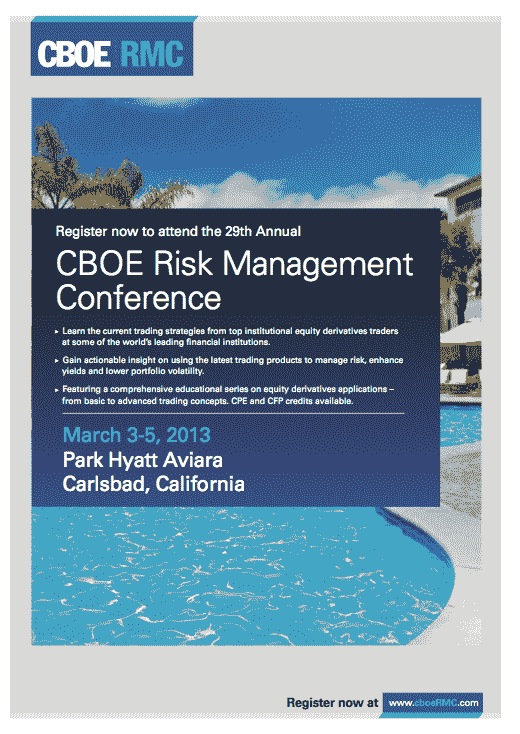](https://sniperinmahwah.wordpress.com/wp-content/uploads/2013/11/capture-d_c3a9cran-2013-03-23-c3a0-17-53-23.png)

La banque Goldman Sachs (qui achète systématiquement la quatrième de couverture de *Traders Magazine*) est parfois un peu plus conceptuelle (?!) :

[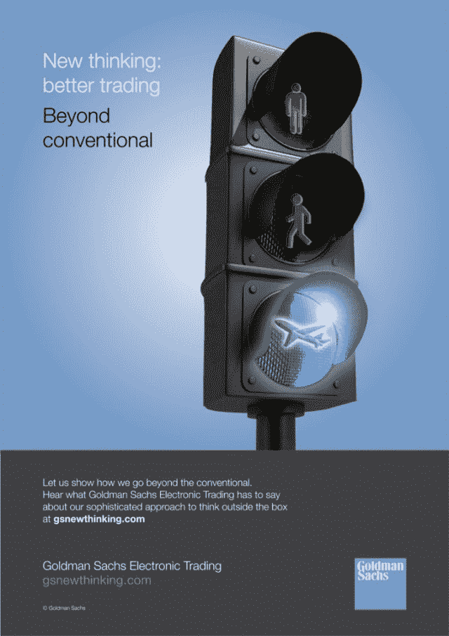](https://sniperinmahwah.wordpress.com/wp-content/uploads/2013/11/lumaxis-goldman-sachs_ad_samples-3-724x1024.jpg)

Lorsque Deutsche Bank vante son algorithme Stealth, tout d’un coup on se retrouve dans *Tron* (version de 1982) :

[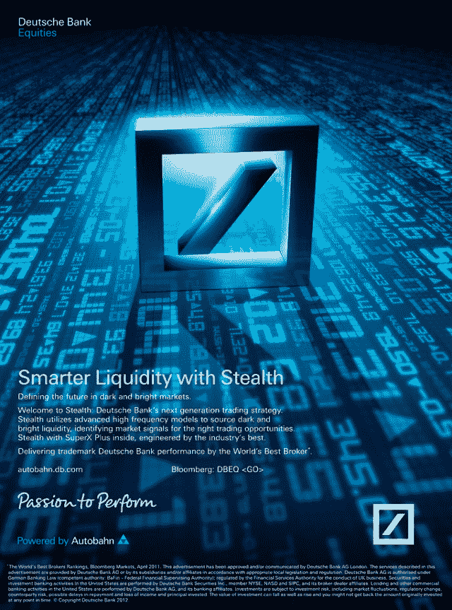](https://sniperinmahwah.wordpress.com/wp-content/uploads/2013/11/capture-d_c3a9cran-2013-03-24-c3a0-12-33-02.png)

Tout cela – il faut bien en convenir – est un peu lourdingue. Mais fort heureusement il existe d’autres adeptes de Photoshop qui réussirent à rendre compte des liens entre la nature et les marchés financiers de manière plus subtile, comme ici :

[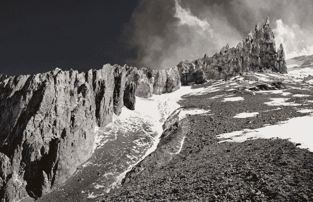](https://sniperinmahwah.wordpress.com/wp-content/uploads/2013/11/michaelnajjar02.jpg)

© Michael Najjar

Cette photographie est l’œuvre de l’artiste [Michael Najjar](http://www.michaelnajjar.com), extraite de sa série *High Altitude*. Najjar a réalisé un trek de trois semaines du côté de l’Aconcagua, la montagne la plus haute de la cordillère des Andes, afin de prendre des milliers de photographies qu’il réagence ensuite avec Photoshop, et ce pour transformer la cime des montagnes en courbes de marchés, comme l’explique le schéma ci-dessus :

[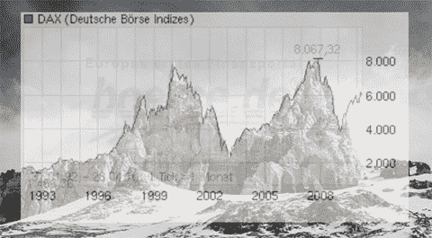](https://sniperinmahwah.wordpress.com/wp-content/uploads/2013/11/najjar_overlay.jpg)

© Michael Najjar

*High Altitude* se base autant sur l’évolution de certains indices (DAX, Nikkei, Dow Jones, etc.) que sur les courbes parfois erratiques de certaines institutions financières, comme en témoigne cette visualisation pierreuse de l’évolution de Lehman Brothers, de 1992 à sa chute (brutale) en 2008 :

Cette autre photographie représente l’évolution du DAX (cf. le schéma ci-dessus, 1993-2009) :

[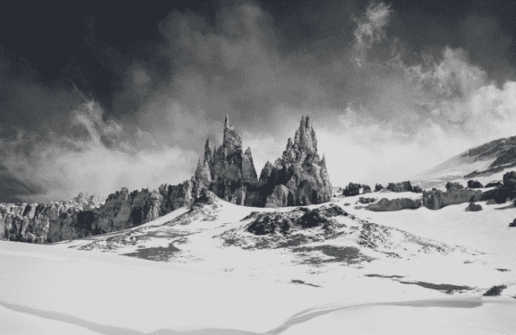](https://sniperinmahwah.wordpress.com/wp-content/uploads/2013/11/08.jpg)

Ici, le Nasdaq, de 1980 à 2009 :

[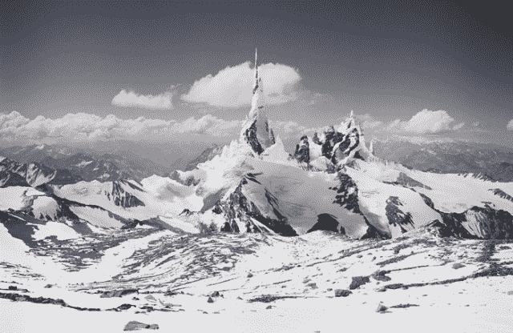](https://sniperinmahwah.wordpress.com/wp-content/uploads/2013/11/01.jpg)

Pour les collectionneurs, un tirage photographique de cette série vaut entre 5000 et 10 000 dollars. La série *High Altitude* est présentée [ici](http://www.michaelnajjar.com/ipad/gallery_high_altitude.html), avec quelques autres photographies. Laissons les derniers mots à Michael Najjar : “*The information society has brought about a tectonic shift in our understanding of space and time. Humankind is confronted with a process of such dynamic complexity that the borderlines we seemingly identify at one moment are already sublimated in the next. In future the virtual value system could demand its proper reincarnation in the real world.*“