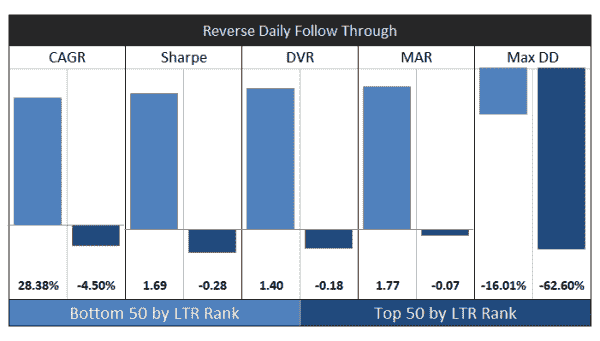
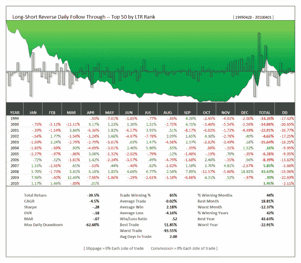
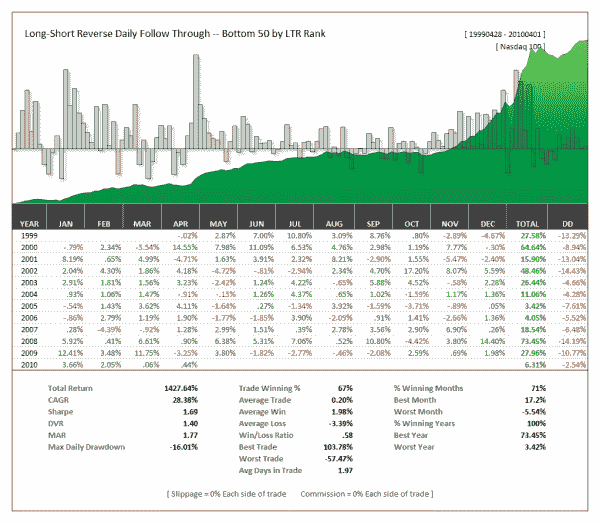

<!--yml
category: 未分类
date: 2024-05-12 18:32:39
-->

# Markets within the Market | CSSA

> 来源：[https://cssanalytics.wordpress.com/2010/04/05/markets-within-the-market/#0001-01-01](https://cssanalytics.wordpress.com/2010/04/05/markets-within-the-market/#0001-01-01)

In the last post, I was trying to highlight that markets and stocks can have their own idiosyncratic behavior and that it is possible to isolate them using different variables. The ability to do this permits a wide range of opportunities: 1) finding stocks/markets best suited to your trading style 2) allowing for more focused analysis by controlling for these effects 3) alllowing us to create internal breadth measures that are far more accurate.

One variable that stands out in our research is the propensity of a stock or market to trend. This variable is a core component of the Livermore Active Issues Index and is called the “LTR” which stands for Livermore Trend Rank. Note that this is not a relative strength based score, but rather a historical measure of relative “trendiness” over a longer period of time. We then combine relative strength with the LTR and volume metrics to create the final index score.  While the technique used to create the LTR is proprietary, it does not involve anything that is statistically complex. The LTR is accurate and highly robust and has show to work across 35 different markets and on the stocks from all major stock indices. **A high LTR score indicates that a market or stock is expected to trend, a low LTR score indicates that a market or stock is expected to mean-revert.** LTR scores are calculated monthly and do not turnover frequently. This means that behavior is not a temporary volatility effect but rather a more intermediate or long-term behavioural tendency for a stock or market to trend/mean-revert.

Below we show the performance of a standard mean-reversion/reverse  daily follow through strategy (long down days, short up days) using the   LTR factor to separate the top and bottom 50% of the Nasdaq 100 index. 

As you can clearly see, there is a market within the market–half of the stocks have a tendency to trend while the other half have a very strong tendency to mean-revert. This has enormous implications—especially given that the index itself the QQQQ has a tendency to mean-revert. ***It means that we can more accurately predict the direction of the QQQQ or SPY or any other ETF/index by controlling for the effects of this variable. It also means that you should focus different strategies such as trend or mean-reversion on different stocks of the index rather than trying to create a universal system.***

