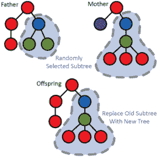
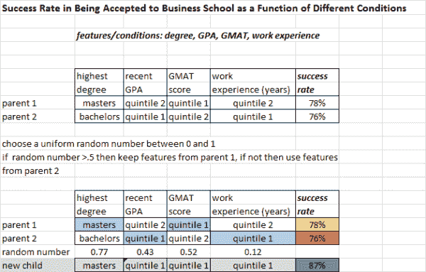

<!--yml
category: 未分类
date: 2024-05-12 17:58:55
-->

# Mating and Uniform Crossover | CSSA

> 来源：[https://cssanalytics.wordpress.com/2013/09/05/mating-and-uniform-crossover/#0001-01-01](https://cssanalytics.wordpress.com/2013/09/05/mating-and-uniform-crossover/#0001-01-01)

In the last post, we showed a basic blueprint for [Micro Genetic Algorithms](https://cssanalytics.wordpress.com/2013/09/03/micro-genetic-algorithm-schematic/ "Micro Genetic Algorithm Schematic"). It is worthwhile clarifying the process for mating to produce offspring. The picture to the left demonstrates a basic blueprint for mating within genetic algorithms. But the picture does not describe the process used to select which features to swap and how to perform the selection. It always helps to have a concrete example . The simplest method to change features with two parents to produce offspring is a uniform crossover. In this method a uniform random number is used to determine which features to swap. The purpose of producing offspring is to hopefully produce a better objective function than the best individuals/chromosomes within the original population. In the example below, we are trying to predict the success rate of being accepted to business school by examining different criteria across candidates. After performing tournament selection, we find two parents and now wish to produce new offspring:

This is a very simple but effective way to produce offspring. There are a lot of more complex variations such as weighting the probability of switching features based upon the expected value for a particular feature: in other words, we may wish to choose a specific breakpoint for our uniform random number to reflect the probability of selecting an inferior feature. For example, if we believe that quintile order is predictive we may for example say that quintile 1 GMAT scores are better than quintile 2 scores. For this feature we may use the following rule:

if RAND()> .25 then quintile 1 GMAT,  if not then quintile 2

where RAND() is a uniform random number between 0 and 1

This reflects a probability of 75% that quintile 1 will be selected, and 25% that quintile 2 will be selected. It is possible to extend this concept in multiple ways, but the caveat is that you may restrict the search from finding a unique or counter-intuitive combination. A little a priori knowledge is useful, but too much can leave you trapped in a local optimum.