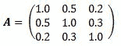

<!--yml
category: 未分类
date: 2024-05-18 08:10:38
-->

# Matrix decomposition with QuantLib | Quant Corner

> 来源：[https://quantcorner.wordpress.com/2011/02/20/matrix-decomposition-with-quantlib/#0001-01-01](https://quantcorner.wordpress.com/2011/02/20/matrix-decomposition-with-quantlib/#0001-01-01)

**QuantLib** includes several **matrix decomposition** as well as **Eigen values/vectors** finding tools. If your memory needs a simple refresh in this area of linear algebra, you should visit the Wikipedia’s page on [matrix decomposition](http://en.wikipedia.org/wiki/Matrix_decomposition#Decompositions_based_on_eigenvalues_and_related_concepts). For more advanced discussions and other matrix-related topics, [Math World](www.mathworld.wolfram.com) reads numerous valuable pages.

In the code below, we shall implement some of these tools. As you will see, it’s quite straightforward. The matrix we work with is the standard **square matrix** :

[](https://quantcorner.wordpress.com/wp-content/uploads/2011/02/standard_matrix_b1.jpg)

```
#include<ql\quantlib.hpp>
using namespace QuantLib;

using std::endl;
using std::cout;

int main(int, char*[]){

	// Matrix declaration and population
	Matrix A(3,3);
	A[0][0] = 1.0; A[0][1] = 0.5; A[0][2] = 0.2;
	A[1][0] = 0.5; A[1][1] = 1.0; A[1][2] = 0.3;
	A[2][0] = 0.2; A[2][1] = 0.3; A[2][2] = 1.0;

	SymmetricSchurDecomposition schurDec(A);
	SVD SVDDec(A);

	// Outputting
	cout << "Matrix A : " << endl << A << endl;
	cout << "Eigen values (Schur): " << endl;
	schurDec.eigenvalues() << endl;
	cout << "Eigen vector (Schur) : " << endl;
	schurDec.eigenvectors() << endl;
	cout << "Cholesky decomposition : " << endl;
	CholeskyDecomposition(A) << endl;
	cout << "SVD U-matrix : " << endl;
	SVDDec.U() << endl;
	cout << "SVD V-matrix : ";
	endl << SVDDec.V() << endl;

	return 0;
}
```