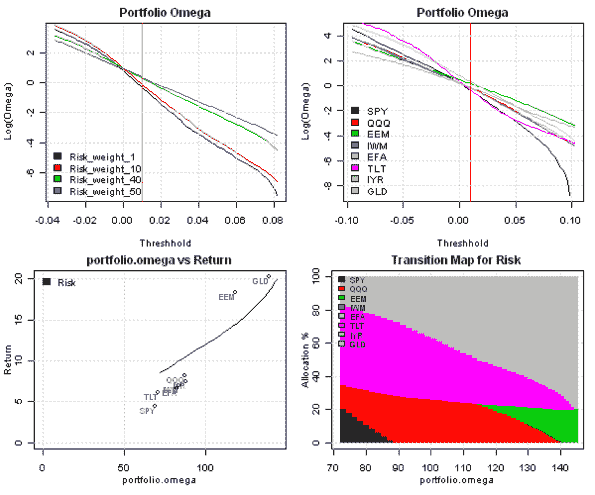

<!--yml
category: 未分类
date: 2024-05-18 14:47:34
-->

# Maximizing Omega Ratio | Systematic Investor

> 来源：[https://systematicinvestor.wordpress.com/2011/11/03/maximizing-omega-ratio/#0001-01-01](https://systematicinvestor.wordpress.com/2011/11/03/maximizing-omega-ratio/#0001-01-01)

The [Omega Ratio](http://en.wikipedia.org/wiki/Omega_ratio) was introduced by [Keating and Shadwick](http://faculty.fuqua.duke.edu/~charvey/Teaching/BA453_2006/Keating_An_introduction_to.pdf) in 2002\. It measures the ratio of average portfolio wins over average portfolio losses for a given target return L.

Let x.i, i= 1,…,n be weights of instruments in the portfolio. We suppose that j= 1,…,T scenarios of returns with equal probabilities are available. I will use historical assets returns as scenarios. Let us denote by r.ij the return of i-th asset in the scenario j. The portfolio’s Omega Ratio can be written as

![\Omega(L) = \frac{E\left [ max(\sum_{i=1}^{n}r_{ij}x_{i} - L, 0) \right ]}{E\left [ max(L - \sum_{i=1}^{n}r_{ij}x_{i}, 0) \right ]}  ](img/7c6ae5b6ac440223dd7e9afdcfed4f65.png)

I will use methods presented in [Optimizing Omega by H. Mausser, D. Saunders, L. Seco (2006)](http://www.math.uwaterloo.ca/~dsaunder/Site/Publications_files/OmegaOptimizationWAppendix.pdf) paper to construct optimal portfolios that maximize Omega Ratio.

The maximization problem (pages 5-6) can be written as


It can be formulated as a linear programming problem with following transformation


This method will only work for . In the case , I will use a Nonlinear programming solver, [Rdonlp2](http://arumat.net/Rdonlp2/tutorial.html), which is based on donlp2 routine developed and copyright by [Prof. Dr. Peter Spellucci](http://www.mathematik.tu-darmstadt.de/fbereiche/numerik/staff/spellucci/spellucci.html). Following code might not properly execute on your computer because Rdonlp2 is only available for R version 2.9 or below.

```

max.omega.portfolio <- function
(
	ia,		# input assumptions
	constraints	# constraints
)
{
	n = ia$n
	nt = nrow(ia$hist.returns)

	constraints0 = constraints

	omega = ia$parameters.omega	

	#--------------------------------------------------------------------------
	# Linear Programming, Omega > 1, Case
	#--------------------------------------------------------------------------

	# objective : Omega
	# [ SUM <over j> 1/T * u.j ]
	f.obj = c(rep(0, n), (1/nt) * rep(1, nt), rep(0, nt), 0)

	# adjust constraints, add u.j, d.j, t
	constraints = add.variables(2*nt + 1, constraints, lb = c(rep(0,2*nt),-Inf))

	# Transformation for inequalities
	# Aw < b => Aw1 - bt < 0
	constraints$A[n + 2*nt + 1, ] = -constraints$b
	constraints$b[] = 0	

	# Transformation for Lower/Upper bounds, use same transformation
	index = which( constraints$ub[1:n] < +Inf )	
	if( len(index) > 0 ) {			
		a = rbind( diag(n), matrix(0, 2*nt, n), -constraints$ub[1:n])		
		constraints = add.constraints(a[, index], rep(0, len(index)), '<=', constraints)			
	}

	index = which( constraints$lb[1:n] > -Inf )	
	if( len(index) > 0 ) {	
		a = rbind( diag(n), matrix(0, 2*nt, n), -constraints$lb[1:n])		
		constraints = add.constraints(a[, index], rep(0, len(index)), '>=', constraints)					
	}

	constraints$lb[1:n] = -Inf
	constraints$ub[1:n] = Inf

	# [ SUM <over i> r.ij * x.i ] - u.j + d.j - L * t = 0, for each j = 1,...,T 	
	a = rbind( matrix(0, n, nt), -diag(nt), diag(nt), -omega)
		a[1 : n, ] = t(ia$hist.returns)
	constraints = add.constraints(a, rep(0, nt), '=', constraints)			

	# [ SUM <over j> 1/T * d.j ] = 1	
	constraints = add.constraints(c( rep(0,n), rep(0,nt), (1/nt) * rep(1,nt), 0), 1, '=', constraints)				

	# setup linear programming
	f.con = constraints$A
	f.dir = c(rep('=', constraints$meq), rep('>=', len(constraints$b) - constraints$meq))
	f.rhs = constraints$b

	# find optimal solution
	x = NA
	sol = try(solve.LP.bounds('max', f.obj, t(f.con), f.dir, f.rhs,
					lb = constraints$lb, ub = constraints$ub), TRUE)

	if(!inherits(sol, 'try-error')) {
		x0 = sol$solution[1:n]
		u = sol$solution[(1+n):(n+nt)]
		d = sol$solution[(n+nt+1):(n+2*nt)] 
		t = sol$solution[(n+2*nt+1):(n+2*nt+1)] 

		# Reverse Transformation	
		x = x0/t
	}

	#--------------------------------------------------------------------------
	# NonLinear Programming, Omega > 1, Case
	#--------------------------------------------------------------------------
	# Check if any u.j * d.j != 0 or LP solver encounter an error
	if( any( u*d != 0 ) || sol$status !=0 ) {
		require(Rdonlp2)

		constraints = constraints0

		# compute omega ratio
		fn <- function(x){
			portfolio.returns = x %*% t(ia$hist.returns)	
			mean(pmax(portfolio.returns - omega,0)) / mean(pmax(omega - portfolio.returns,0))
		}

		# control structure, fnscale - set -1 for maximization
		cntl <- donlp2.control(silent = T, fnscale = -1, iterma =10000, nstep = 100, epsx = 1e-10)	

		# lower/upper bounds
		par.l = constraints$lb
		par.u = constraints$ub

		# intial guess
		if(!is.null(constraints$x0)) p = constraints$x0

		# linear constraints
		A = t(constraints$A)
		lin.l = constraints$b
		lin.u = constraints$b
		lin.u[ -c(1:constraints$meq) ] = +Inf

		# find solution
		sol = donlp2(p, fn, par.lower=par.l, par.upper=par.u, 
			A=A, lin.u=lin.u, lin.l=lin.l, control=cntl)
		x = sol$par
	}

	return( x )
}

```

First let’s examine how the traditional mean-variance efficient frontier looks like in the Omega Ratio framework.

```

# load Systematic Investor Toolbox
setInternet2(TRUE)
source(gzcon(url('https://github.com/systematicinvestor/SIT/raw/master/sit.gz', 'rb')))

#--------------------------------------------------------------------------
# Create Efficient Frontier
#--------------------------------------------------------------------------
	ia = aa.test.create.ia()
	n = ia$n		

	# 0 <= x.i <= 0.8 
	constraints = new.constraints(n, lb = 0, ub = 0.8)

	# SUM x.i = 1
	constraints = add.constraints(rep(1, n), 1, type = '=', constraints)		

	# Omega - http://en.wikipedia.org/wiki/Omega_ratio
	ia$parameters.omega = 13/100 
		ia$parameters.omega = 12/100 
		# convert annual to monthly
		ia$parameters.omega = ia$parameters.omega / 12

	# create efficient frontier(s)
	ef.risk = portopt(ia, constraints, 50, 'Risk')

	# Plot Omega Efficient Frontiers and Transition Maps
	layout( matrix(1:4, nrow = 2, byrow=T) )

	# weights
	rownames(ef.risk$weight) = paste('Risk','weight',1:50,sep='_')
	plot.omega(ef.risk$weight[c(1,10,40,50), ], ia)

	# assets
	temp = diag(n)
	rownames(temp) = ia$symbols
	plot.omega(temp, ia)

	# mean-variance efficient frontier in the Omega Ratio framework
	plot.ef(ia, list(ef.risk), portfolio.omega, T, T)			

```

[](https://systematicinvestor.wordpress.com/wp-content/uploads/2011/11/plot1-small1.png)

Portfolio returns and Portfolio Omega Ratio are monotonically increasing as we move along the traditional mean-variance efficient frontier in the Omega Ratio framework. The least risky portfolios (Risk_weight_1, Risk_weight_10) have lower Omega Ratio for 13% threshold (target return) and the most risky portfolios (Risk_weight_40, Risk_weight_50) have higher Omega Ratio.

To create efficient frontier in the Omega Ratio framework, I propose first to compute range of returns in the mean-variance framework. Next split this range into # Portfolios equally spaced points. For each point, I propose to find portfolio that has expected return less than given point’s expected return and maximum Omega Ratio.

```

#--------------------------------------------------------------------------
# Create Efficient Frontier in Omega Ratio framework
#--------------------------------------------------------------------------
	# Create maximum Omega Efficient Frontier
	ef.omega = portopt.omega(ia, constraints, 50, 'Omega')

	# Plot Omega Efficient Frontiers and Transition Maps
	layout( matrix(1:4, nrow = 2, byrow=T) )

	# weights
	plot.omega(ef.risk$weight[c(1,10,40,50), ], ia)

	# weights
	rownames(ef.omega$weight) = paste('Omega','weight',1:50,sep='_')	
	plot.omega(ef.omega$weight[c(1,10,40,50), ], ia)

	# portfolio
	plot.ef(ia, list(ef.omega, ef.risk), portfolio.omega, T, T)			

```

[](https://systematicinvestor.wordpress.com/wp-content/uploads/2011/11/plot2-small1.png)

The Omega Ratio efficient frontier looks similar to the traditional mean-variance efficient frontier for expected returns greater than 13% threshold (target return). However, there is a big shift in allocation and increase in Omega Ratio for portfolios with expected returns less than 13% threshold.

[](https://systematicinvestor.wordpress.com/wp-content/uploads/2011/11/plot3-small.png)

The Omega Ratio efficient frontier looks very inefficient in the Risk framework for portfolios with expected returns less than 13% threshold. But remember that goal of this optimization was to find portfolios that maximize Omega Ratio for given user constraints. Overall I find results a bit radical for portfolios with expected returns less than 13% threshold, and this results defiantly call for more investigation.

To view the complete source code for this example, please have a look at the [aa.omega.test() function in aa.test.r at github](https://github.com/systematicinvestor/SIT/blob/master/R/aa.test.r).