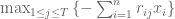
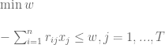
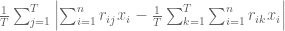
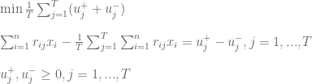
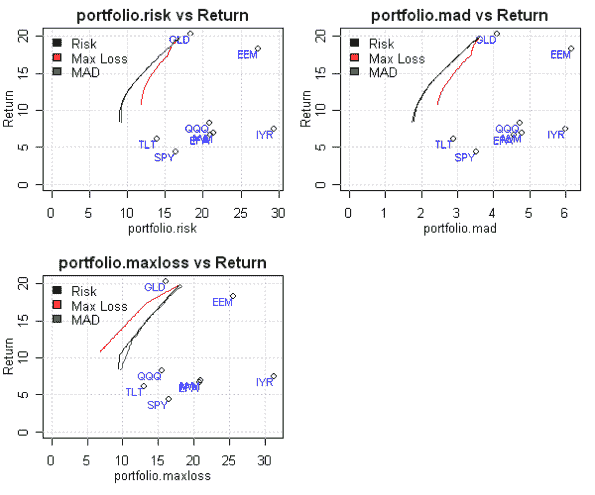
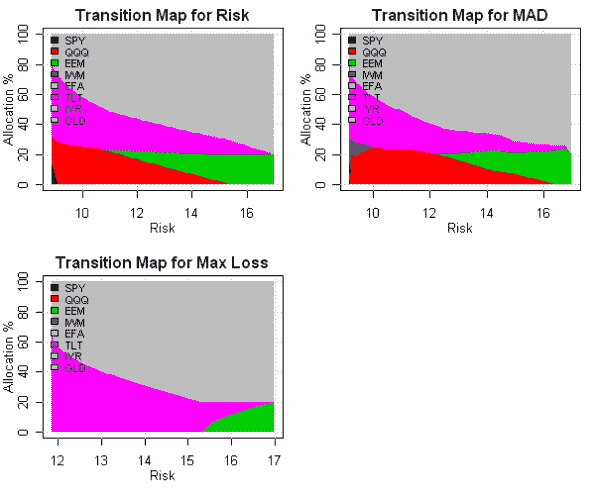

<!--yml
category: 未分类
date: 2024-05-18 14:48:29
-->

# Maximum Loss and Mean-Absolute Deviation risk measures | Systematic Investor

> 来源：[https://systematicinvestor.wordpress.com/2011/10/14/maximum-loss-and-mean-absolute-deviation-risk-measures/#0001-01-01](https://systematicinvestor.wordpress.com/2011/10/14/maximum-loss-and-mean-absolute-deviation-risk-measures/#0001-01-01)

During construction of typical [efficient frontier](http://en.wikipedia.org/wiki/Efficient_Frontier), risk is usually measured by the standard deviation of the portfolio’s return. Maximum Loss and [Mean-Absolute Deviation](http://en.wikipedia.org/wiki/Median_absolute_deviation) are alternative measures of risk that I will use to construct [efficient frontier](http://en.wikipedia.org/wiki/Efficient_Frontier). I will use methods presented in [Comparative Analysis of Linear Portfolio Rebalancing Strategies: An Application to Hedge Funds by Krokhmal, P., S. Uryasev, and G. Zrazhevsky (2001)](http://papers.ssrn.com/sol3/papers.cfm?abstract_id=297639) paper to construct optimal portfolios.

Let x.i, i= 1,…,n be weights of instruments in the portfolio. We suppose that j= 1,…,T scenarios of returns with equal probabilities are available. I will use historical assets returns as scenarios. Let us denote by r.ij the return of i-th asset in the scenario j. The portfolio’s Maximum Loss (page 34) can be written as



It can be formulated as a linear programming problem



This linear programming problem can be easily implemented

```

min.maxloss.portfolio <- function
(
	ia,		# input assumptions
	constraints	# constraints
)
{
	n = ia$n
	nt = nrow(ia$hist.returns)

	# objective : maximum loss, w
	f.obj = c( rep(0, n), 1)

	# adjust constraints, add w
	constraints = add.variables(1, constraints)

	#  - [ SUM <over i> r.ij * x.i ] < w, for each j = 1,...,T 
	a = rbind( matrix(0, n, nt), 1)
		a[1 : n, ] = t(ia$hist.returns)
	constraints = add.constraints(a, rep(0, nt), '>=', constraints)

	# setup linear programming	
	f.con = constraints$A
	f.dir = c(rep('=', constraints$meq), rep('>=', len(constraints$b) - constraints$meq))
	f.rhs = constraints$b

	# find optimal solution
	x = NA
	sol = try(solve.LP.bounds('min', f.obj, t(f.con), f.dir, f.rhs, 
							lb = constraints$lb, ub = constraints$ub), TRUE)

	if(!inherits(sol, 'try-error')) {
		x = sol$solution[1:n]

	}

	return( x )
}

```

The portfolio’s Mean-Absolute Deviation (MAD) (page 33) can be written as



It can be formulated as a linear programming problem



This linear programming problem can be implemented

```

min.mad.portfolio <- function
(
	ia,		# input assumptions
	constraints	# constraints
)
{
	n = ia$n
	nt = nrow(ia$hist.returns)

	# objective : Mean-Absolute Deviation (MAD)
	# 1/T * [ SUM  (u+.j + u-.j) ]
	f.obj = c( rep(0, n), (1/nt) * rep(1, 2 * nt) )

	# adjust constraints, add u+.j, u-.j
	constraints = add.variables(2 * nt, constraints, lb = 0)

	# [ SUM <over i> r.ij * x.i ] - 1/T * [ SUM <over j> [ SUM <over i> r.ij * x.i ] ] = u+.j - u-.j , for each j = 1,...,T 
	a = rbind( matrix(0, n, nt), -diag(nt), diag(nt))
		a[1 : n, ] = t(ia$hist.returns) - repmat(colMeans(ia$hist.returns), 1, nt)
	constraints = add.constraints(a, rep(0, nt), '=', constraints)			

	# setup linear programming	
	f.con = constraints$A
	f.dir = c(rep('=', constraints$meq), rep('>=', len(constraints$b) - constraints$meq))
	f.rhs = constraints$b

	# find optimal solution
	x = NA
	sol = try(solve.LP.bounds('min', f.obj, t(f.con), f.dir, f.rhs, 
							lb = constraints$lb, ub = constraints$ub), TRUE)

	if(!inherits(sol, 'try-error')) {
		x = sol$solution[1:n]
	}

	return( x )
}

```

Let’s examine efficient frontiers computed under different risk measures using historical input assumptions presented in the [Introduction to Asset Allocation](https://systematicinvestor.wordpress.com/2011/10/13/introduction-to-asset-allocation/) post:

```

###############################################################################
# Create Efficient Frontier
###############################################################################
	n = ia$n

	# 0 <= x.i <= 0.8 
	constraints = new.constraints(n, lb = 0, ub = 0.8)

	# SUM x.i = 1
	constraints = add.constraints(rep(1, n), 1, type = '=', constraints)

	# create efficient frontier(s)
	ef.risk = portopt(ia, constraints, 50, 'Risk')
	ef.maxloss = portopt(ia, constraints, 50, 'Max Loss', min.maxloss.portfolio)
	ef.mad = portopt(ia, constraints, 50, 'MAD', min.mad.portfolio)

	# Plot multiple Efficient Frontiers
	layout( matrix(1:4, nrow = 2) )
	plot.ef(ia, list(ef.risk, ef.maxloss, ef.mad), portfolio.risk, F)
	plot.ef(ia, list(ef.risk, ef.maxloss, ef.mad), portfolio.maxloss, F)
	plot.ef(ia, list(ef.risk, ef.maxloss, ef.mad), portfolio.mad, F)

	# Plot multiple Transition Maps
	layout( matrix(1:4, nrow = 2) )
	plot.transition.map(ef.risk)
	plot.transition.map(ef.maxloss)
	plot.transition.map(ef.mad)

```

[](https://systematicinvestor.wordpress.com/wp-content/uploads/2011/10/plot4-small1.png)

[](https://systematicinvestor.wordpress.com/wp-content/uploads/2011/10/plot5-small1.png)

[The Mean-Absolute Deviation and Standard Deviation risk measures are very similar by construction – they both measure average deviation](http://www.leeds.ac.uk/educol/documents/00003759.htm), so it is not a surprise that their efficient frontiers and transition maps are close. On the other hand, the Maximum Loss measures the extreme deviation and has very different efficient frontier and transition map.

To view the complete source code for this example, please have a look at the [aa.test() function in aa.test.r at github](https://github.com/systematicinvestor/SIT/blob/master/R/aa.test.r).