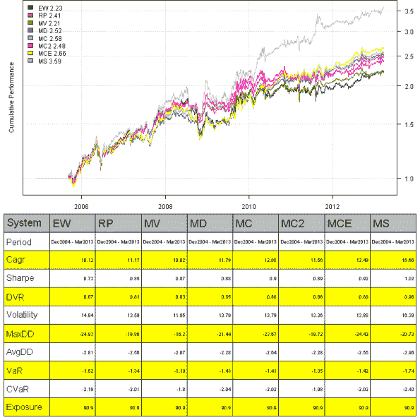

<!--yml
category: 未分类
date: 2024-05-18 14:33:18
-->

# Maximum Sharpe Portfolio | Systematic Investor

> 来源：[https://systematicinvestor.wordpress.com/2013/03/22/maximum-sharpe-portfolio/#0001-01-01](https://systematicinvestor.wordpress.com/2013/03/22/maximum-sharpe-portfolio/#0001-01-01)

Maximum Sharpe Portfolio or Tangency Portfolio is a portfolio on the [efficient frontier](http://en.wikipedia.org/wiki/Efficient_frontier) at the point where line drawn from the point (0, risk-free rate) is tangent to the [efficient frontier](http://en.wikipedia.org/wiki/Efficient_frontier).

There is a great discussion about Maximum Sharpe Portfolio or Tangency Portfolio at [quadprog optimization](http://stackoverflow.com/questions/10526243/quadprog-optimization) question. In general case, finding the Maximum Sharpe Portfolio requires a non-linear solver because we want to find portfolio weights `w` to maximize `w' mu / sqrt( w' V w )` (i.e. [Sharpe Ratio](http://www.stanford.edu/~wfsharpe/art/sr/sr.htm) is a non-linear function of `w`). But as discussed in the [quadprog optimization](http://stackoverflow.com/questions/10526243/quadprog-optimization) question, there are special cases when we can use quadratic solver to find Maximum Sharpe Portfolio. As long as all constraints are homogeneous of degree 0 (i.e. if we multiply w by a number, the constraint is unchanged – for example, w1 > 0 is equivalent to 5*w1 > 5*0), the quadratic solver can be used to find Maximum Sharpe Portfolio or Tangency Portfolio.

I have implemented the logic to find Maximum Sharpe Portfolio or Tangency Portfolio in the [max.sharpe.portfolio() function in strategy.r at github](https://github.com/systematicinvestor/SIT/blob/master/R/strategy.r). You can specify following 2 parameters:

*   Type of portfolio: ‘long-only’, ‘long-short’, or ‘market-neutral’
*   Portfolio exposure. For example, ‘long-only’ with exposure = 1, is a fully invested portfolio

Now, let’s construct a sample [efficient frontier](http://en.wikipedia.org/wiki/Efficient_frontier) and plot Maximum Sharpe Portfolio.

```

###############################################################################
# Load Systematic Investor Toolbox (SIT)
# https://systematicinvestor.wordpress.com/systematic-investor-toolbox/
###############################################################################
setInternet2(TRUE)
con = gzcon(url('http://www.systematicportfolio.com/sit.gz', 'rb'))
    source(con)
close(con)

	#*****************************************************************
	# Create Efficient Frontier
	#****************************************************************** 	
	# create sample historical input assumptions
	ia = aa.test.create.ia()

	# create long-only, fully invested efficient frontier
	n = ia$n		

	# 0 <= x.i <= 1
	constraints = new.constraints(n, lb = 0, ub = 1)
		constraints = add.constraints(diag(n), type='>=', b=0, constraints)
		constraints = add.constraints(diag(n), type='<=', b=1, constraints)

	# SUM x.i = 1
	constraints = add.constraints(rep(1, n), 1, type = '=', constraints)		

	# create efficient frontier
	ef = portopt(ia, constraints, 50, 'Efficient Frontier') 

	#*****************************************************************
	# Create Plot
	#****************************************************************** 	
	# plot efficient frontier
	plot.ef(ia, list(ef), transition.map=F)	 

	# find maximum sharpe portfolio
	max(portfolio.return(ef$weight,ia) /  portfolio.risk(ef$weight,ia))

	# plot minimum variance portfolio
	weight = min.var.portfolio(ia,constraints)	
	points(100 * portfolio.risk(weight,ia), 100 * portfolio.return(weight,ia), pch=15, col='red')
	portfolio.return(weight,ia) /  portfolio.risk(weight,ia)

	# plot maximum Sharpe or tangency portfolio
	weight = max.sharpe.portfolio()(ia,constraints)	
	points(100 * portfolio.risk(weight,ia), 100 * portfolio.return(weight,ia), pch=15, col='orange')
	portfolio.return(weight,ia) /  portfolio.risk(weight,ia)

	plota.legend('Minimum Variance,Maximum Sharpe','red,orange', x='topright')	

```

[](https://systematicinvestor.wordpress.com/wp-content/uploads/2013/03/plot1-small1.png)

Now let’s see how to construct ‘long-only’, ‘long-short’, or ‘market-neutral’ Maximum Sharpe Portfolio or Tangency Portfolios:

```

	#*****************************************************************
	# Examples of Maximum Sharpe or Tangency portfolios construction
	#****************************************************************** 	
	weight = max.sharpe.portfolio('long-only')(ia,constraints)	
		round(weight,2)
		round(c(sum(weight[weight<0]), sum(weight[weight>0])),2)

	weight = max.sharpe.portfolio('long-short')(ia,constraints)			
		round(weight,2)
		round(c(sum(weight[weight<0]), sum(weight[weight>0])),2)

	weight = max.sharpe.portfolio('market-neutral')(ia,constraints)			
		round(weight,2)
		round(c(sum(weight[weight<0]), sum(weight[weight>0])),2)	

```

The long-only Maximum Sharpe portfolio as expected has exposure of 100%. The long-short Maximum Sharpe portfolio is 227% long and 127% short. The market-neutral Maximum Sharpe portfolio is 100% long and 100% short.

As the last step, I run Maximum Sharpe algo vs other portfolio optimization methods I have previously discussed (i.e. Risk Parity, Minimum Variance, Maximum Diversification, Minimum Correlation) on the 10 asset universe used in the [Adaptive Asset Allocation](https://systematicinvestor.wordpress.com/2012/08/14/adaptive-asset-allocation/) post.

```

	#*****************************************************************
	# Load historical data
	#****************************************************************** 
	load.packages('quantmod')

	tickers = spl('SPY,EFA,EWJ,EEM,IYR,RWX,IEF,TLT,DBC,GLD')

	data <- new.env()
	getSymbols(tickers, src = 'yahoo', from = '1980-01-01', env = data, auto.assign = T)
		for(i in ls(data)) data[[i]] = adjustOHLC(data[[i]], use.Adjusted=T)							
	bt.prep(data, align='keep.all', dates='2004:12::')

	#*****************************************************************
	# Code Strategies
	#******************************************************************
	prices = data$prices  
	n = ncol(prices)

	models = list()

 	#*****************************************************************
	# Code Strategies
	#******************************************************************
	# find period ends
	period.ends = endpoints(prices, 'months')
        period.ends = period.ends[period.ends > 0]

	n.mom = 180
	n.vol = 60
	n.top = 4        
	momentum = prices / mlag(prices, n.mom)  

	obj = portfolio.allocation.helper(data$prices, period.ends=period.ends,
		lookback.len = n.vol, universe = ntop(momentum[period.ends,], n.top) > 0,
		min.risk.fns = list(EW=equal.weight.portfolio,
						RP=risk.parity.portfolio,
						MV=min.var.portfolio,
						MD=max.div.portfolio,
						MC=min.corr.portfolio,
						MC2=min.corr2.portfolio,
						MCE=min.corr.excel.portfolio,
						MS=max.sharpe.portfolio())
	) 

	models = create.strategies(obj, data)$models

	#*****************************************************************
	# Create Report
	#******************************************************************    
	strategy.performance.snapshoot(models, T)

	plotbt.custom.report.part2(models$MS)

	# Plot Portfolio Turnover for each strategy
	layout(1)
	barplot.with.labels(sapply(models, compute.turnover, data), 'Average Annual Portfolio Turnover')

```

The allocation using Maximum Sharpe Portfolio produced more concentrated portfolios with higher total return, higher Sharpe ratio, and higher turnover.

[](https://systematicinvestor.wordpress.com/wp-content/uploads/2013/03/plot2-small.png)

[](https://systematicinvestor.wordpress.com/wp-content/uploads/2013/03/plot3-small.png)

[](https://systematicinvestor.wordpress.com/wp-content/uploads/2013/03/plot4-small.png)