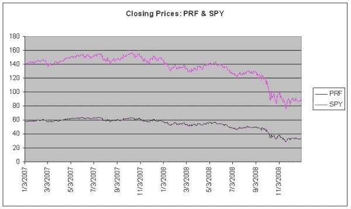
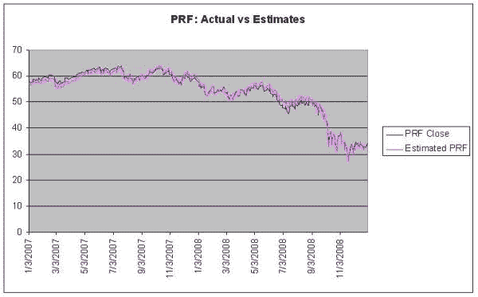
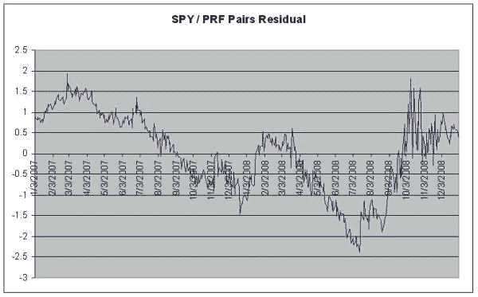

<!--yml
category: 未分类
date: 2024-05-18 13:56:12
-->

# Mean Reversion | Quantivity

> 来源：[https://quantivity.wordpress.com/2009/07/19/mean-reversion/#0001-01-01](https://quantivity.wordpress.com/2009/07/19/mean-reversion/#0001-01-01)

Continuing introduction of fundamental phenomena, or stylized facts of financial markets, underlying quantitative trading.

Mean reversion is the second, of two, force driving prices:

> “A price will tend to average over time.” ([Wikipedia](http://en.wikipedia.org/wiki/Mean_reversion_(finance)))

One intellectual challenge in understanding financial markets is internalizing, what appears at first to be, fundamental contradiction: prices are *simultaneously* driven by the *counteracting* forces of both momentum and mean reversion. Up is down, and left is right.

Mean reversion is one of the most generic phenomena, manifesting in myriad beautiful ways across diverse subjects. For example, [Ornstein–Uhlenbeck processes](http://en.wikipedia.org/wiki/Ornstein%E2%8%93Uhlenbeck_process) are continuous-time stochastic processes for modeling mean-reversion. [Cointegration](http://en.wikipedia.org/wiki/Cointegration) from time-series econometrics is a stationarity property of linear combinations of series. The Bollinger Bands is a technical indicator formed by bracketed upper and lower bounds based upon [standard deviation](http://en.wikipedia.org/wiki/Standard_deviation). Mean reversion also forms the basis for entire trading disciplines such as [statistical arbitrage](http://en.wikipedia.org/wiki/Statistical_arbitrage) and [volatility arbitrage](http://en.wikipedia.org/wiki/Volatility_arbitrage).

Mean reversion is nicely illustrated via [pairs trading](http://en.wikipedia.org/wiki/Pairs_trading), a classic statistical arbitrage trading strategy. For simplicity, consider closing prices of [SPY](http://finance.yahoo.com/q?s=SPY) and [PRF](http://finance.yahoo.com/q?s=PRF) during 2007 – 2008\. This relationship is potentially interesting, as both are large-cap indices; their difference lies in weighting: PRF is weighted by fundamentals, while SPY is weighted by market capitalization. Price graph over this period is:

Estimation via [OLS regression](http://en.wikipedia.org/wiki/Least_squares) indicates the following relationship:

`PRF = -7.356 + (0.455 * SPY)`

Which explains 98.8% of the observed variance (adjusted R²), with both terms significant (p-values << 0.05). Note standard cointegration tests and related analysis are deliberately being glossed over, for sake of brevity. Graph of estimated versus actual closing prices for PRF, indicates decent fitness:

From this graph, calculate the difference between actual and estimated closing prices for PRF (or, use residuals from above OLS), which can be visualized as the vertical difference between two lines on the preceding graph:

This residuals graph illustrates mean reversion beautifully: SPY and PRF have a long-term relationship whose residual difference reverts to zero (subject to the offset captured by the -7.356 intercept value, which represents the capital cost per share of trading the position). From this knowledge of mean reversion, myriad trading strategies can be devised. For example, go long the SPY/PRF basket when the residual difference exceeds -2; conversely, go short the basket when the residual difference exceeds +1.

This example illustrates several attributes which are common across strategies which rely upon mean reversion:

*   Multiple instruments: stability relationship amongst two or more instruments is being exploited
*   Residual series: use of a statistical technique, classically OLS (modern techniques range from state space models to Bayesian estimators), to generate a residual time-series composed of a combination of the instruments (either linear or non-linear)
*   Statistical tendency: strategy is motivated by statistical likelihood of convergence, given dynamic historical data

Many algorithms exploit mean reversion, whether explicitly or implicitly.