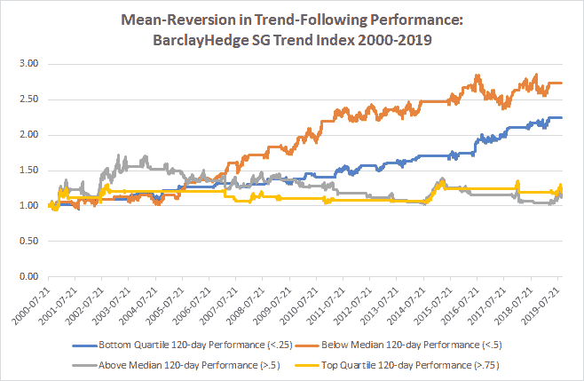

<!--yml
category: 未分类
date: 2024-05-12 17:40:00
-->

# Mean-Reversion in Trend-Following Performance Using a 120-day Lookback | CSSA

> 来源：[https://cssanalytics.wordpress.com/2019/09/19/mean-reversion-in-trend-following-performance-using-a-120-day-lookback/#0001-01-01](https://cssanalytics.wordpress.com/2019/09/19/mean-reversion-in-trend-following-performance-using-a-120-day-lookback/#0001-01-01)

In [the last post](https://cssanalytics.wordpress.com/2019/09/18/mean-reversion-in-trend-following-performance/) we showed that trend-following tends to be mean-reverting in the short-term. Data analysis also shows that trend-following has an even stronger mean-reverting effect using a 6-month or 120-day window using the same methodology. Take a look at the chart below using the BarclayHedge SG Trend Index:

In the last post I hypothesized that the mean-reversion effect exists because investors tend to chase recent performance. But there is obviously a lot more going on that drives the performance of trend-followers including lower interest rates, higher correlations, and generally less pronounced trends. Certainly monetary policy worldwide has also played a factor. [A very good paper by Spring Valley](https://www.springvalleyam.com/ctas-in-perspective) analyzes some of the factors that have affected trend-following performance. Ultimately the data suggests that you need to incorporate this effect into your strategy or asset allocation methodology in order to be more consistently profitable using a trend-following approach.