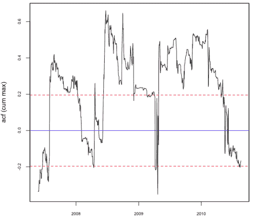
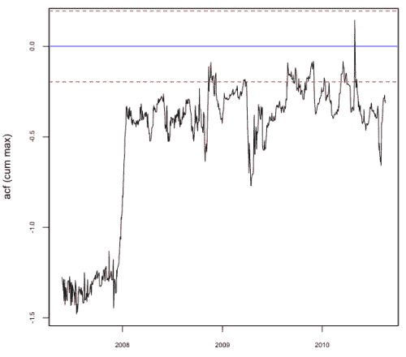
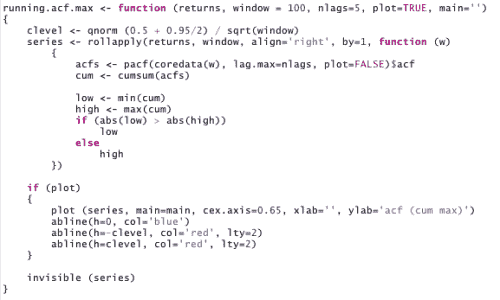

<!--yml
category: 未分类
date: 2024-05-18 15:32:06
-->

# Mean Reverting Strategies | Tr8dr

> 来源：[https://tr8dr.wordpress.com/2010/09/05/mean-reverting-strategies/#0001-01-01](https://tr8dr.wordpress.com/2010/09/05/mean-reverting-strategies/#0001-01-01)

September 5, 2010 · 5:10 pm

Recently there have been some discussions on one of the quant groups, where someone indicated “mean reverting strategies no longer work”.    I don’t agree with this at all.    However, there has been a lot of risk aversion and the market movements of the last few months (well since Feb or March) have been quite different then those preceding.    The market of the last few months has been ideal for market making given the tight bands and much less favorable for strategies that rely on trends or big swings.

One of my strategies is quite simple and depends on mean-reverting behavior across a large portfolio.   When MR behavior in the market is “cranked back” it makes sense to filter the portfolio, increasing the chance of successful trades and reducing possible losses from assets without the desired footprint.

I decided to do some tests on the biggest winners and losers by asset to confirm my belief that wining assets would exhibit strong negative autocorrelation and losing assets would likely exhibit positive or statistically not-significant levels of autocorrelation (+/-).  Indeed one of the biggest losing assets had the following profile:

The above asset spends most of the time in positive auto-corr territory and does not tend to mean-revert over the window of interest.    The asset below spend most of its time in negative auto-corr territory and hence is very strongly mean-reverting:

Of course measures like this have lag associated with them, but if chosen carefully can be used to effectively filter assets on the run.   Here is the test code in R:

