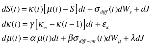
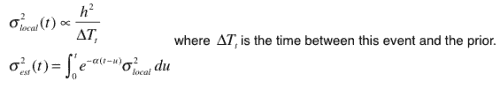
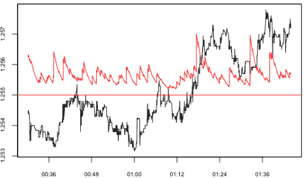
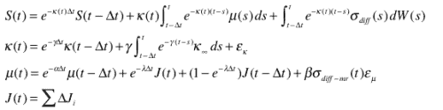
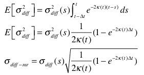
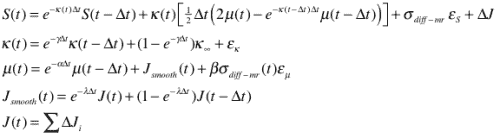

<!--yml
category: 未分类
date: 2024-05-18 15:36:27
-->

# Mean in the context of Mean-Reversion | Tr8dr

> 来源：[https://tr8dr.wordpress.com/2009/12/02/mean-in-the-context-of-mean-reversion-take-3/#0001-01-01](https://tr8dr.wordpress.com/2009/12/02/mean-in-the-context-of-mean-reversion-take-3/#0001-01-01)

December 2, 2009 · 7:45 pm

I want a running mean estimator that acts as a mode through mean reversion cycles of target amplitude or frequency.   The key characteristics should be:

*   **adaptation to local volatility**
    *   determination of diffusion related squared return
    *   determination of jump related squared return
    *   determination as to how much of the jump should be absorbed into the mean
*   **model of mean reversion**
    *   calibrated to a desired long-run rate of reversion
    *   allowance for changes in reversion constant and reversion to long run
*   **model of mean**
    *   autoregressive
    *   innovations scaled by sigma term (with MR component and jumps removed)
*   **recursive backward estimation of ML**
    *   implicitly decide how innovation is distributed amongst mean, mean-reversion, and noise

**A SDE-based Approach**
The model is an expanded variant of the familiar *Ornstein*–*Uhlenbeck* process, with specialized mean-reversion, mean, and volatility processes.   It also attempts to correct for jumps.    Let’s start with the following SDEs (in continuous time):

**Variance**
There are many approaches to modeling volatility (all with issues).   Initially I had though to use a predictive model based on:

*   **intensity process** (based on “first exit” duration)
    This is a very complex process.  First approximations have been to use ACD, a family of AR models for duration.   ACD models perform very poorly on HF data however.    It seems that a markov chain model recognizing the patterns will be most appropriate.
*   **amplitude process**
    The amplitudes of squared returns seem to follow a largely AR process.   This seems fairly well behaved.

Before fully committing to a complex volatility model thought its makes sense to first try with a non-predictive measure of realized variance.  I will use:

The choice of α determines the degree of smoothing with previous values based on how local (and noisy) we want this function to be.   For example, here is the estimate with a smoothing factor of 60 and a threshold of 3e-5:

**Discretising**
Using Ito’s lemma we discretise the processes as follows:

Simplifying the volatility term in S(t), we first determine the variance of the SDE:

We reorganize as follows:

**Putting it together**
We can now model this discretely as a state-space based filter, searching for parameters that fit a-posteriori idealized view on the mode and mean-reversion process.   Post-parameterization, the process can be used in real-time to provide an estimate of the mode.

**Final Notes**
As you may have seen I took a (useful) 2-3 week diversion before coming back to the SDE based approach.   This is not a final model by any means, but I think a a solid starting point.    The purpose of the above is as a one of a number of factors in a multi-factor  strategy that want to optimize further.