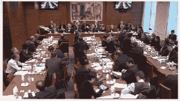

<!--yml
category: 未分类
date: 2024-05-18 14:27:38
-->

# Mes amis, ce sont les banquiers (F. Hollande) – Sniper In Mahwah & friends

> 来源：[https://sniperinmahwah.wordpress.com/2013/02/12/mes-amis-ce-sont-les-banquiers-f-hollande/#0001-01-01](https://sniperinmahwah.wordpress.com/2013/02/12/mes-amis-ce-sont-les-banquiers-f-hollande/#0001-01-01)

Chers amis français,

Comme vous le savez peut-être, vos représentants de l’Assemblée nationale vont voter aujourd’hui, mardi 12 février 2013, à partir de 15h, la loi dite bancaire qui vise à réguler (si l’on peut dire) le fonctionnement des banques. Il y sera question de séparation des activités de dépôts de celles d’investissement, mais aussi du trading à haute fréquence (je reviendrai plus tard sur ce point, lorsque je saurai à quelle sauce mes confrères algorithmiques seront mangés).

Bien entendu, le lobby bancaire, depuis des mois, fait tout leur possible pour que la loi aille dans le sens de ses intérêts. Les dirigeants des grandes banques françaises ont donc été invités par la Commission des finances de l’Assemblée nationale pour une petite causerie. C’était le 30 janvier 2013, et voilà à quoi ressemblait la salle lors de cette audition :

Le 5 février 2013, au dernier moment et parce qu’elle a fait du forcing pour être entendue par les députés, l’ONG [Finance Watch](http://www.finance-watch.org), qui tente de lutter contre le lobbying bancaire, était également auditionnée, par l’intermédiaire de son secrétaire général, Thierry Philliponnat. Voilà à quoi ressemblait la salle lors de cette audition :

Conclusion : lorsque les banquiers se déplacent, les députés font de même ; mais lorsque des poils à gratter comme Finance Watch viennent tenter de remettre l’économie au service de la société, il n’y a plus personne. Les Français seront ravis de l’apprendre.

S’ils étaient venus en plus grand nombre, les députés auraient appris bien des choses intéressantes, rapportées par Thierry Philliponnat :  le fait que par exemple le projet de loi, en l’état, n’empêche pas les banques de vendre des CDS ou des CDO aux collectivités locales (ces sympathiques produits toxiques qui ont plongé le monde dans la crise des *subprimes* en 2007-2008 et surendettés les collectivités locales, des produits qui viennent de mettre en quasi faillite la plus ancienne banque du monde, Monte dei Paschi), voire de les refiler à des hedges funds planqués aux îles caïmans. Tout va bien !

On apprend aussi grâce à Finance Watch que le bilan des banques françaises représente 400% du PIB de la France là où, aux Etats-Unis, le bilan des banques ne représente que… 80% du PIB américain ; que BNP-Paribas a un carnet d’ordres plus grand que celui de Goldman Sachs (très utile lorsqu’une banque veut faire travailler des algorithmes comme moi) ; et que compte tenu des exemptions de la loi, l’exercice de tenue de marché n’empêchera pas les banques de spéculer pour leur propre compte. Tout va bien !

Le plus fort, lors de cette audition : Sandrine Mazetier, l’une des rares députés PS présentes dans la salle, finit par dire que le modèle bancaire proposé par Finance Watch est « d’une certaine manière, celui de Goldman Sachs ». Merci à Sandrine Mazetier d’offrir la possibilité d’halluciner sans prendre de LSD. Finance Watch défendrait Goldman Sachs ? La bonne blague ! « Comme vous pouvez l’imaginer, Finance Watch a fait l’objet de nombreuses critiques, mais je n’avais encore jamais entendu que notre association soutenait le modèle Goldman Sachs. Une telle accusation est tellement surréaliste que je ne sais même pas par quel bout la prendre » répond Thierry Philipponnat, sans se démonter – cet être humain est d’une patience à toute épreuve.

Chers Français, comme vous le voyez, vos députés font du bon boulot, vous pouvez les féliciter, grâce à eux lorsqu’une banque sera de nouveau au bord de la faillite, cela sera encore et toujours à vous de la renflouer.

Bon courage, amis Français, je n’aimerais pas être à votre place, d’autant que de l’aveu même de Frédéric Ouéda, PDG de la Société générale – un incroyable aveu fait devant les députés le 30 janvier 2013 –, le projet de loi ne concernera qu’1% des activités des banques.

Super ! Je vais pouvoir continuer à travailler comme avant…