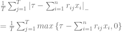
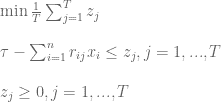
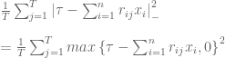
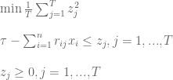
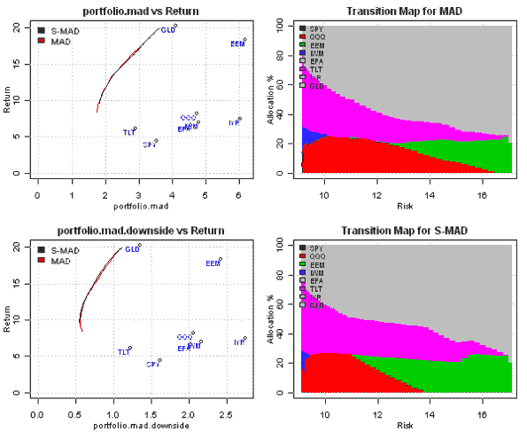
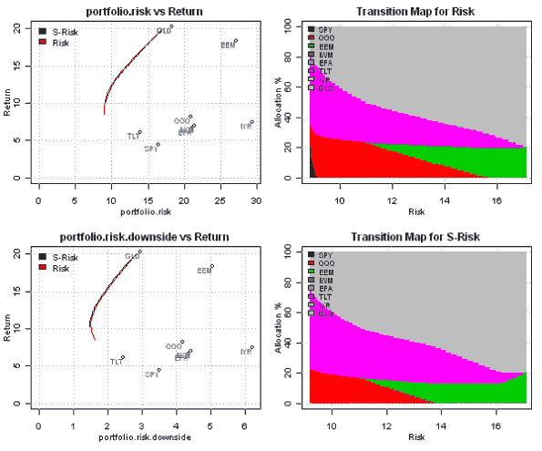

<!--yml
category: 未分类
date: 2024-05-18 14:47:45
-->

# Minimizing Downside Risk | Systematic Investor

> 来源：[https://systematicinvestor.wordpress.com/2011/11/01/minimizing-downside-risk/#0001-01-01](https://systematicinvestor.wordpress.com/2011/11/01/minimizing-downside-risk/#0001-01-01)

In the [Maximum Loss and Mean-Absolute Deviation risk measures](https://systematicinvestor.wordpress.com/2011/10/14/maximum-loss-and-mean-absolute-deviation-risk-measures/), and [Expected shortfall (CVaR) and Conditional Drawdown at Risk (CDaR)](https://systematicinvestor.wordpress.com/2011/10/25/expected-shortfall-cvar-and-conditional-drawdown-at-risk-cdar-risk-measures/) posts I started the discussion about alternative risk measures we can use to construct [efficient frontier](http://en.wikipedia.org/wiki/Efficient_Frontier). Another alternative risk measure I want to discuss is [Downside Risk](http://www.investopedia.com/terms/d/downside-deviation.asp).

In the traditional mean-variance optimization both returns above and below the mean contribute to the portfolio risk (usually measured by the standard deviation of the portfolio’s return). In the Downside Risk framework, only returns that are below the mean or below the [target rate of return (MAR)](http://www.investopedia.com/terms/d/downside-deviation.asp) contribute to the portfolio risk. I will discuss two Downside Risk measures: [Lower Semi-Variance](http://www.vosesoftware.com/ModelRiskHelp/Presenting_results/Statistical_descriptions_of_model_outputs/Measures_of_spread/Semi-variance_and_semi-standard_deviation.htm), and Lower Semi-Absolute Deviation. I will use methods presented in [Portfolio Optimization under Lower Partial Risk Measure by H. Konno, H. Waki and A. Yuuki (2002)](http://www.kier.kyoto-u.ac.jp/fe-tokyo/workingpapers/AFE-KyotoU_WP01-e.html) paper to construct optimal portfolios.

Let x.i, i= 1,…,n be weights of instruments in the portfolio. We suppose that j= 1,…,T scenarios of returns with equal probabilities are available. I will use historical assets returns as scenarios. Let us denote by r.ij the return of i-th asset in the scenario j. The portfolio’s Lower Semi-Absolute Deviation (page 6) can be written as



It can be formulated as a linear programming problem



This linear programming problem can be easily implemented

```

min.mad.downside.portfolio <- function
(
	ia,		# input assumptions
	constraints	# constraints
)
{
	n = ia$n
	nt = nrow(ia$hist.returns)

	mar = ia$parameters.mar

	# objective : Mean-Lower-Semi-Absolute Deviation (M-LSAD)
	#  1/T * [ SUM <over j> z.j ]
	f.obj = c( rep(0, n), (1/nt) * rep(1, nt) )

	# adjust constraints, add z.j
	constraints = add.variables(nt, constraints, lb = 0)

	#  MAR - [ SUM <over i> r.ij * x.i ] <= z.j , for each j = 1,...,T 
	a = rbind( matrix(0, n, nt), diag(nt))	
		a[1 : n, ] = t(ia$hist.returns)
	constraints = add.constraints(a, rep(mar, nt), '>=', constraints)					

	# setup linear programming	
	f.con = constraints$A
	f.dir = c(rep('=', constraints$meq), rep('>=', len(constraints$b) - constraints$meq))
	f.rhs = constraints$b

	# find optimal solution
	x = NA
	sol = try(solve.LP.bounds('min', f.obj, t(f.con), f.dir, f.rhs, 
					lb = constraints$lb, ub = constraints$ub), TRUE)

	if(!inherits(sol, 'try-error')) {
		x = sol$solution[1:n]
	}

	return( x )
}

```

The portfolio’s Lower Semi-Absolute Deviation (page 7) can be written as



It can be formulated as a quadratic programming problem



This quadratic programming problem can be implemented

```

min.risk.downside.portfolio <- function
(
	ia,		# input assumptions
	constraints	# constraints
)
{
	n = ia$n
	nt = nrow(ia$hist.returns)

	mar = ia$parameters.mar

	# objective : Mean-Lower Semi-Variance (MV)
	#  1/T * [ SUM <over j> z.j^2 ]
	f.obj = c( rep(0, n), (1/nt) * rep(1, nt) )

	# adjust constraints, add z.j
	constraints = add.variables(nt, constraints, lb = 0)

	#  MAR - [ SUM <over i> r.ij * x.i ] <= z.j , for each j = 1,...,T 
	a = rbind( matrix(0, n, nt), diag(nt))	
		a[1 : n, ] = t(ia$hist.returns)
	constraints = add.constraints(a, rep(mar, nt), '>=', constraints)					

	# setup quadratic minimization
	Dmat = diag( len(f.obj) )
	diag(Dmat) = f.obj
	if(!is.positive.definite(Dmat)) {
		Dmat <- make.positive.definite(Dmat)
	}	

	# find optimal solution	
	x = NA
	sol = try(solve.QP.bounds(Dmat = Dmat, dvec = rep(0, nrow(Dmat)) , 
		Amat=constraints$A, bvec=constraints$b, constraints$meq,
		lb = constraints$lb, ub = constraints$ub),TRUE) 

	if(!inherits(sol, 'try-error')) {
		x = sol$solution[1:n]
	}

	return( x )
}

```

Let’s examine efficient frontiers computed under different risk measures using historical input assumptions presented in the [Introduction to Asset Allocation](https://systematicinvestor.wordpress.com/2011/10/13/introduction-to-asset-allocation/) post:

```

# load Systematic Investor Toolbox
setInternet2(TRUE)
source(gzcon(url('https://github.com/systematicinvestor/SIT/raw/master/sit.gz', 'rb')))

#--------------------------------------------------------------------------
# Create Efficient Frontier
#--------------------------------------------------------------------------
	ia = aa.test.create.ia()
	n = ia$n		

	# 0 <= x.i <= 0.8
	constraints = new.constraints(n, lb = 0, ub = 0.8)

	# SUM x.i = 1
	constraints = add.constraints(rep(1, n), 1, type = '=', constraints)		

	# Set target return (or Minimum Acceptable Returns (MAR))
	# and consider only returns that are less than the target 
	ia$parameters.mar = 0/100 
		# convert annual to monthly
		ia$parameters.mar = ia$parameters.mar / 12

	# create efficient frontier(s)
	ef.mad = portopt(ia, constraints, 50, 'MAD', min.mad.portfolio)
	ef.mad.downside = portopt(ia, constraints, 50, 'S-MAD', min.mad.downside.portfolio)

	ef.risk = portopt(ia, constraints, 50, 'Risk')
	ef.risk.downside = portopt(ia, constraints, 50, 'S-Risk', min.risk.downside.portfolio)

	# Plot multiple Efficient Frontiers and Transition Maps
	layout( matrix(1:4, nrow = 2) )
	plot.ef(ia, list(ef.mad.downside, ef.mad), portfolio.mad, F)			
	plot.ef(ia, list(ef.mad.downside, ef.mad), portfolio.mad.downside, F)			

	plot.transition.map(ef.mad)
	plot.transition.map(ef.mad.downside)

	# Plot multiple Efficient Frontiers and Transition Maps
	layout( matrix(1:4, nrow = 2) )
	plot.ef(ia, list(ef.risk.downside, ef.risk), portfolio.risk, F)			
	plot.ef(ia, list(ef.risk.downside, ef.risk), portfolio.risk.downside, F)			

	plot.transition.map(ef.risk)
	plot.transition.map(ef.risk.downside)

```

[](https://systematicinvestor.wordpress.com/wp-content/uploads/2011/11/plot1-small.png)

[](https://systematicinvestor.wordpress.com/wp-content/uploads/2011/11/plot2-small.png)

The downside risk efficient frontiers, prefixed with S-, are similar to their full counterparts and have similar transition maps in our example.

Another way to approach minimization of the [Lower Semi-Variance](http://www.vosesoftware.com/ModelRiskHelp/Presenting_results/Statistical_descriptions_of_model_outputs/Measures_of_spread/Semi-variance_and_semi-standard_deviation.htm) that I want to explore later is presented in [Mean-Semivariance Optimization: A Heuristic Approach by Javier Estrada](web.iese.edu/jestrada/PDF/Research/Refereed/MSO.pdf) paper.

To view the complete source code for this example, please have a look at the [aa.downside.test() function in aa.test.r at github](https://github.com/systematicinvestor/SIT/blob/master/R/aa.test.r).