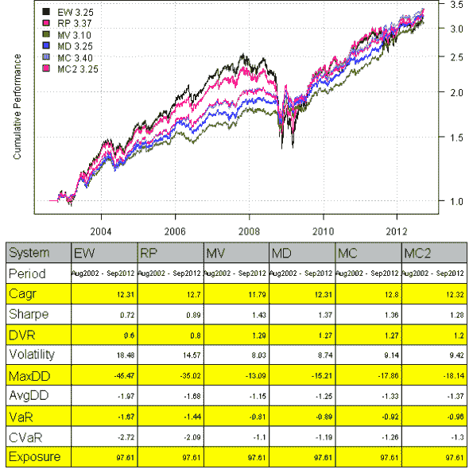
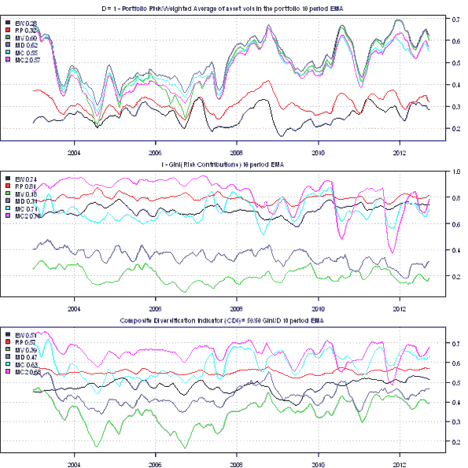
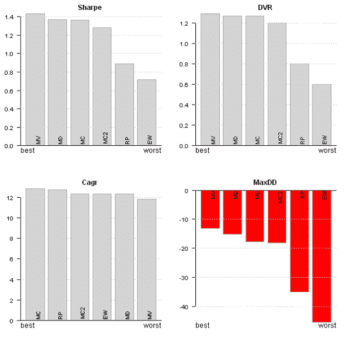
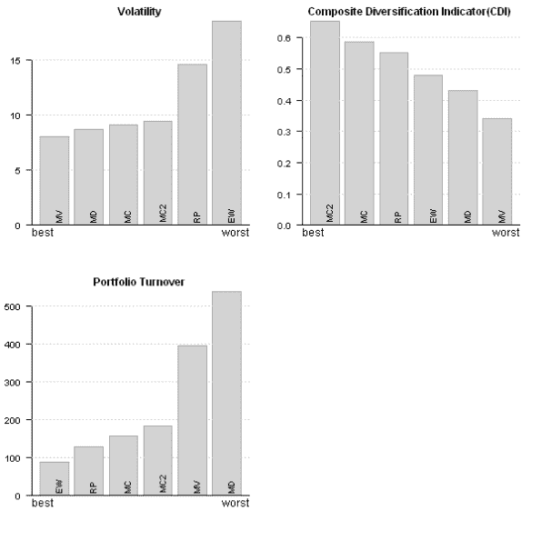
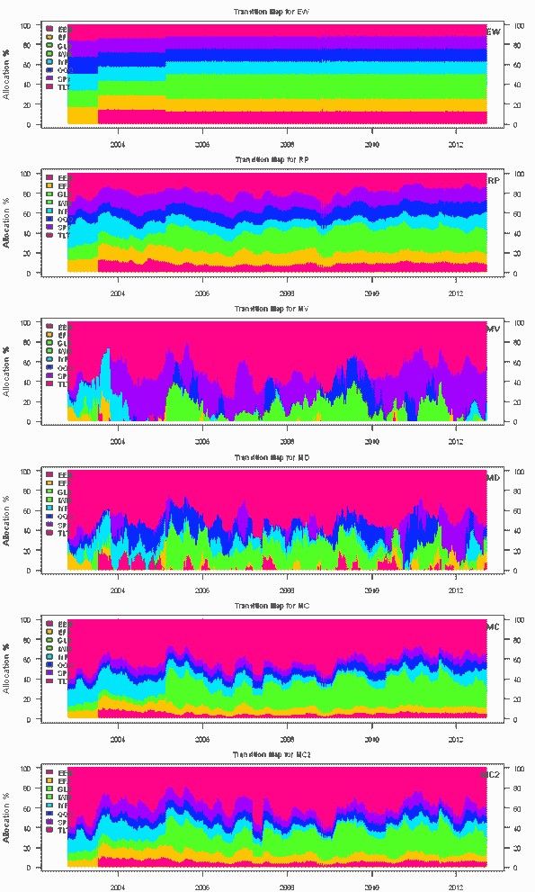
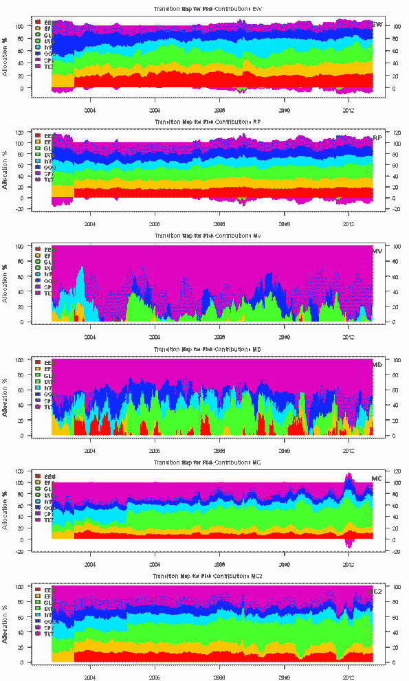

<!--yml
category: 未分类
date: 2024-05-18 14:37:39
-->

# Minimum Correlation Algorithm Example | Systematic Investor

> 来源：[https://systematicinvestor.wordpress.com/2012/09/24/minimum-correlation-algorithm-example/#0001-01-01](https://systematicinvestor.wordpress.com/2012/09/24/minimum-correlation-algorithm-example/#0001-01-01)

Today I want to follow up with the [Minimum Correlation Algorithm Paper](https://systematicinvestor.wordpress.com/2012/09/22/minimum-correlation-algorithm-paper/) post and show how to incorporate the Minimum Correlation Algorithm into your portfolio construction work flow and also explain why I like the Minimum Correlation Algorithm.

First, let’s load the ETF’s data set used in the [Minimum Correlation Algorithm Paper](https://systematicinvestor.wordpress.com/2012/09/22/minimum-correlation-algorithm-paper/) using the [Systematic Investor Toolbox](https://systematicinvestor.wordpress.com/systematic-investor-toolbox/).

```

###############################################################################
# Load Systematic Investor Toolbox (SIT)
# https://systematicinvestor.wordpress.com/systematic-investor-toolbox/
###############################################################################
setInternet2(TRUE)
con = gzcon(url('http://www.systematicportfolio.com/sit.gz', 'rb'))
    source(con)
close(con)

	#*****************************************************************
	# Load historical data for ETFs
	#****************************************************************** 
	load.packages('quantmod,quadprog')
	tickers = spl('SPY,QQQ,EEM,IWM,EFA,TLT,IYR,GLD')

	data <- new.env()
	getSymbols(tickers, src = 'yahoo', from = '1980-01-01', env = data, auto.assign = T)
		for(i in ls(data)) data[[i]] = adjustOHLC(data[[i]], use.Adjusted=T)							
	bt.prep(data, align='keep.all', dates='2002:08::')

```

Next, I created the portfolio.allocation.helper() function to ease the back-testing of portfolio construction algorithms:

```

	#*****************************************************************
	# Code Strategies
	#****************************************************************** 	

	obj = portfolio.allocation.helper(data$prices, periodicity = 'weeks',
		min.risk.fns = list(EW=equal.weight.portfolio,
						RP=risk.parity.portfolio,
						MV=min.var.portfolio,
						MD=max.div.portfolio,
						MC=min.corr.portfolio,
						MC2=min.corr2.portfolio),
		custom.stats.fn = 'portfolio.allocation.custom.stats'
	) 

	models = create.strategies(obj, data)$models

```

Please note that I assigned acronyms to various portfolio allocation algorithms in the code above.

For example, the Minimum Correlation Algorithm’s acronym is MC and the actual function that does all computations is min.corr.portfolio() function.

Next let’s create various summary reports to see the performance and allocations of different algorithms:

```

    #*****************************************************************
    # Create Report
    #******************************************************************       
	# Plot perfromance
	layout(1:2)
	plotbt(models, plotX = T, log = 'y', LeftMargin = 3)	    	
		mtext('Cumulative Performance', side = 2, line = 1)

	out = plotbt.strategy.sidebyside(models, return.table=T)

	# Plot time series of components of Composite Diversification Indicator
	cdi = custom.composite.diversification.indicator(obj,plot.table = F)	
		out = rbind(colMeans(cdi, na.rm=T), out)
		rownames(out)[1] = 'Composite Diversification Indicator(CDI)'

	# Portfolio Turnover for each strategy
	y = 100 * sapply(models, compute.turnover, data)
		out = rbind(y, out)
		rownames(out)[1] = 'Portfolio Turnover'		

	# Plot and compare strategies across different metrics
	performance.barchart.helper(out, 'Sharpe,Cagr,DVR,MaxDD', c(T,T,T,T))

	performance.barchart.helper(out, 'Volatility,Portfolio Turnover,Composite Diversification Indicator(CDI)', c(F,F,T))

	# Plot transition maps
	layout(1:len(models))
	for(m in names(models)) {
		plotbt.transition.map(models[[m]]$weight, name=m)
			legend('topright', legend = m, bty = 'n')
	}

	# Plot transition maps for Risk Contributions
	dates = index(data$prices)[obj$period.ends]
	for(m in names(models)) {
		plotbt.transition.map(make.xts(obj$risk.contributions[[m]], dates), 
		name=paste('Risk Contributions',m))
			legend('topright', legend = m, bty = 'n')
	}

```

[](https://systematicinvestor.wordpress.com/wp-content/uploads/2012/09/plot1-small2.png)

[](https://systematicinvestor.wordpress.com/wp-content/uploads/2012/09/plot2-small1.png)

[](https://systematicinvestor.wordpress.com/wp-content/uploads/2012/09/plot3-small2.png)

[](https://systematicinvestor.wordpress.com/wp-content/uploads/2012/09/plot4-small1.png)

[](https://systematicinvestor.wordpress.com/wp-content/uploads/2012/09/plot5-small.png)

[](https://systematicinvestor.wordpress.com/wp-content/uploads/2012/09/plot6-small.png)

Looking at the summary statistics, you mind wonder what makes the the Minimum Correlation Algorithm different and why do I like it?

The overall characteristics of the Minimum Correlation Algorithm makes it attractive for me. Specifically it has reasonable perfromance, limited draw-down, low turnover and high composite diversification score. The combination of these attractive properties does differentiate the Minimum Correlation Algorithm from others.

In the next post, I will show the speed benchmarks for the Minimum Correlation Algorithm.

To view the complete source code for this example, please have a look at the [bt.mca.test() function in bt.test.r at github](https://github.com/systematicinvestor/SIT/blob/master/R/bt.test.r).