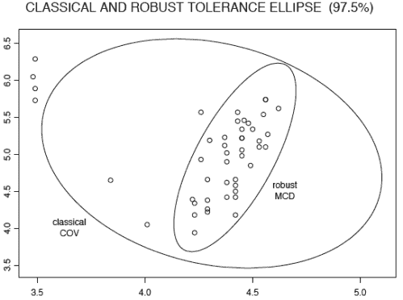

<!--yml
category: 未分类
date: 2024-05-18 15:31:05
-->

# Minimum Covariance Determinant | Tr8dr

> 来源：[https://tr8dr.wordpress.com/2010/09/24/minimum-covariance-determination/#0001-01-01](https://tr8dr.wordpress.com/2010/09/24/minimum-covariance-determination/#0001-01-01)

Outliers are very common in noisy data.  Unfortunately outliers can bias estimates of the moments.   In this case am interested in the covariance of a data set.   In addition to being prominent in stochastic equations, portfolio analysis (the usual stuff in finance), it is also used in linear projection and prediction.

Geometrically, the covariance matrix specifies an ellipsoid that circumscribes the primary dimensions of the data in N space (N being the dimension of the data).  Outlier data stretches the ellipsoid along the axis of the outlier relative to the mean.   Here is a diagram from a paper by Hubert and Verboven that illustrates this nicely:

For many applications we are interested in the “robust” covariance as illustrated in the smaller ellipse.

**Illustrative Brute Force Algorithm
We want to find the covariance matrix with minimum volume encompassing some % of the data set.  Let us assume we have a set of observations X = {x1, x2, … xN} of size N.  Further let us assume 10% of samples are outliers.   One could construct a brute-force algorithm as follows:**

1.  determine all unique sample subsets of size **h = 0.9N**
2.  for each subset S
    1.  compute the covariance matrix of Cs = S
    2.  compute Vs = det(Cs)
3.  choose the subset where Vs is a minimal

Geometrically, the determinant is the volume of the N dimensional vector space implied by the covariance matrix.  Minimizing the ellipsoid is equivalent to minimizing the volume.

**A Better Algorithm
The brute force algorithm is very inefficient (or not computable) as one has to evaluate an increasingly astronomical number of possible subsets.** Rousseeuw developed an algorithm called FAST-MCD.

Supposing we take a random sample of size **h**.  We can evaluate the similarity between data points in the full set and  our randomly sampled subset.    In particular the Mahalanobis distance is used.  Let **M** be the mean of the random subset and **S** be the standard covariance of the random subset:

The algorithm is then as follows:

1.  choose a random subset of H0 of X, with size h
2.  repeat
    1.  Determine covariance S and mean M of the subset H0
    2.  Determine distances d(Xi) for all Xi relative to H with the Mahalanobis distance
    3.  Choose the h smallest distances and create a new subset H1
    4.  repeat with Ho <- H1, until Ho and H1 are equal or 0
3.  Evaluate from 1 for K times (maybe 500) and determine the selection that had the smallest volume.

The random sampling works because it can be proven that det(H1) ≤ det(H0) in the iterative portion (i.e. we are iteratively reducing the volume) and that the set self-selects the tightest representative volume of points.

The reevaluation of the random samples can be cut short at the 2nd or 3rd iteration based on volume and then a smaller set of random sets can be fully evaluated.

There are other tricks that can be used to subdivide the problem for N very large.

**Results
I implemented the algorithm this morning.   Works nicely.   Here is an example of normally distributed 2-dimensional data with outliers (the red indicates points that were selected as optimal for the robust covariance):**

****