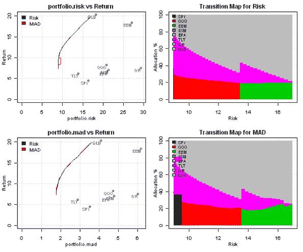

<!--yml
category: 未分类
date: 2024-05-18 14:48:17
-->

# Minimum Investment and Number of Assets Portfolio Cardinality Constraints | Systematic Investor

> 来源：[https://systematicinvestor.wordpress.com/2011/10/20/minimum-investment-and-number-of-assets-portfolio-cardinality-constraints/#0001-01-01](https://systematicinvestor.wordpress.com/2011/10/20/minimum-investment-and-number-of-assets-portfolio-cardinality-constraints/#0001-01-01)

The Minimum Investment and Number of Assets Portfolio [Cardinality Constraints](http://ieeexplore.ieee.org/Xplore/login.jsp?url=http%3A%2F%2Fieeexplore.ieee.org%2Fiel5%2F11108%2F35623%2F01688603.pdf%3Farnumber%3D1688603&authDecision=-203) are practical constraints that are not easily incorporated in the [standard mean-variance optimization](http://en.wikipedia.org/wiki/Efficient_frontier) framework. To help us impose these real life constraints, I will introduce extra binary variables and will use mixed binary linear and quadratic programming solvers.

Let’s continue with our discussion from [Introduction to Asset Allocation](https://systematicinvestor.wordpress.com/2011/10/13/introduction-to-asset-allocation/) post and examine range of portfolio weights and number of assets for each portfolio on the efficient frontier.

```

# load Systematic Investor Toolbox
setInternet2(TRUE)
source(gzcon(url('https://github.com/systematicinvestor/SIT/raw/master/sit.gz', 'rb')))

#--------------------------------------------------------------------------
# Create Efficient Frontier
#--------------------------------------------------------------------------
ia = aa.test.create.ia()
n = ia$n		

# 0 <= x.i <= 0.8 
constraints = new.constraints(n, lb = 0, ub = 0.8)

# SUM x.i = 1
constraints = add.constraints(rep(1, n), 1, type = '=', constraints)		

# create efficient frontier(s)
ef.risk = portopt(ia, constraints, 50, 'Risk')
ef.mad = portopt(ia, constraints, 50, 'MAD', min.mad.portfolio)

# Plot range of portfolio weights and number of assets in each portfolio on efficient frontier
layout(1:2)
par(mar = c(4,4,2,1), cex = 0.8)
y = iif(ef.risk$weight > 0.000001, ef.risk$weight, NA) 
plot(as.vector(sort(100 * y)), pch=20, xaxt='n', ylim = c(0, 80),
	xlab='', ylab='Weight', main='Portfolio Weights')
	abline(h=0, col = 'red')
	abline(h=10, col = 'red')

plot(100* ef.risk$risk, rowSums(!is.na(y), na.rm = T), pch=20, type='b', 
	xlab='Risk', ylab='# Assets', main='Number of Assets')

# Plot multiple Efficient Frontiers & Transition Maps
layout( matrix(1:4, nrow = 2) )
plot.ef(ia, list(ef.risk, ef.mad), portfolio.risk, F)	
plot.ef(ia, list(ef.risk, ef.mad), portfolio.mad, F)	

plot.transition.map(ef.risk)
plot.transition.map(ef.mad)

```

[](https://systematicinvestor.wordpress.com/wp-content/uploads/2011/10/plot1-small5.png)

[](https://systematicinvestor.wordpress.com/wp-content/uploads/2011/10/plot2-small5.png)

The portfolio weights range from 0% to 80%, and the number of assets range from 2 to 4 assets. First, let’s consider a minimum investment constraint. Suppose that if I decide to allocate to an asset class, I want to allocate at least 10%. This statement can be incorporated as a constraint using binary [0/1] variables:


```

#--------------------------------------------------------------------------
# Minimum Investment Constraint is 10%
# Add binary[0/1] variables
# 0.1 * b.i <= x.i <= 0.8 * b.i
#--------------------------------------------------------------------------

# SUM x.i = 1
constraints = new.constraints(n, rep(1, n), 1, type = '=')		

# New add binary constraint	
# adjust prior constraints: add b.i
constraints = add.variables(n, constraints)

# index of binary variables b.i
constraints$binary.index = (n+1):(2*n)

# 0.1 * b <= x.i <= 0.8 * b
# x.i >= 0.1 * b 
constraints = add.constraints(rbind(diag(n), -0.1 * diag(n)), rep(0, n), type = '>=', constraints)

# x.i <= 0.8 * b
constraints = add.constraints(rbind(diag(n), -0.8 * diag(n)), rep(0, n), type = '<=', constraints)

# create efficient frontier(s)
ef.risk = portopt(ia, constraints, 50, 'Risk')
	ef.risk$weight = ef.risk$weight[, 1:n]
ef.mad = portopt(ia, constraints, 50, 'MAD', min.mad.portfolio)
	ef.mad$weight = ef.mad$weight[, 1:n]

```

[](https://systematicinvestor.wordpress.com/wp-content/uploads/2011/10/plot3-small4.png)

[](https://systematicinvestor.wordpress.com/wp-content/uploads/2011/10/plot4-small3.png)

As expected, the portfolio weights range from 10% to 80%, and there is no allocation less than 10%.

To tackle number of assets constraint, I will also use binary [0/1] variables. Let’s say I want all portfolios on the efficient frontier to have allocation to exactly 3 assets, here are the additional constraints (note that for this example, I assumed that the smallest allocation to any asset class is 0.001%) :


```

#--------------------------------------------------------------------------
# Limit number of assets to 3
# Add binary[0/1] variables
# 0.00001 * b <= x.i <= 0.8 * b
# SUM b.i = 3
#--------------------------------------------------------------------------

# SUM x.i = 1
constraints = new.constraints(n, rep(1, n), 1, type = '=')		

# New add binary constraint	
# adjust prior constraints: add b.i
constraints = add.variables(n, constraints)

# index of binary variables b.i
constraints$binary.index = (n+1):(2*n)

# 0.00001 * b <= x.i <= 0.8 * b
# x.i >= 0.00001 * b 
constraints = add.constraints(rbind(diag(n), -0.00001 * diag(n)), rep(0, n), type = '>=', constraints)

# x.i <= 0.8 * b
constraints = add.constraints(rbind(diag(n), -0.8 * diag(n)), rep(0, n), type = '<=', constraints)

# SUM b.i = 3
constraints = add.constraints(c(rep(0,n), rep(1,n)), 3, type = '=', constraints)

# create efficient frontier(s)
ef.risk = portopt(ia, constraints, 50, 'Risk')
	ef.risk$weight = ef.risk$weight[, 1:n]
ef.mad = portopt(ia, constraints, 50, 'MAD', min.mad.portfolio)
	ef.mad$weight = ef.mad$weight[, 1:n]

```

[](https://systematicinvestor.wordpress.com/wp-content/uploads/2011/10/plot5-small3.png)

[](https://systematicinvestor.wordpress.com/wp-content/uploads/2011/10/plot6-small.png)

As expected, all portfolios on the efficient frontier have exactly allocation to 3 assets.

Please let me know what other real-life portfolio construction constraints you want me to discuss.

To view the complete source code for this example, please have a look at the [aa.cardinality.test() function in aa.test.r at github](https://github.com/systematicinvestor/SIT/blob/master/R/aa.test.r).