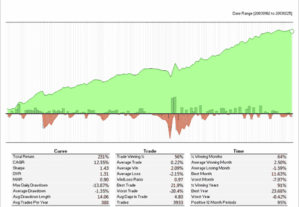
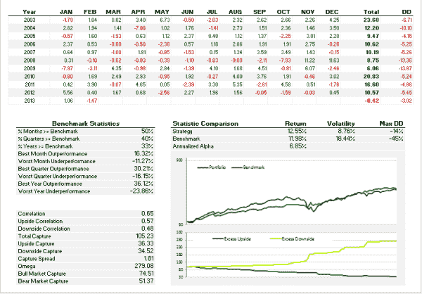

<!--yml
category: 未分类
date: 2024-05-12 18:00:43
-->

# Minimum Variance Algorithm (MVA) Test Drive | CSSA

> 来源：[https://cssanalytics.wordpress.com/2013/04/04/minimum-variance-algorithm-mva-test-drive/#0001-01-01](https://cssanalytics.wordpress.com/2013/04/04/minimum-variance-algorithm-mva-test-drive/#0001-01-01)

The Minimum Variance Algorithm (MVA) follows much of the same logic as the [Minimum Correlation Algorithm (MCA)](https://cssanalytics.wordpress.com/2012/09/21/minimum-correlation-algorithm-paper-release/ "Minimum Correlation Algorithm Paper Release") and differs primarily in the objective function which is to minimize portfolio variance versus correlations. Both are “heuristic” algorithms that seek to approximate the results of more complex methods that require employing quadratic optimization. In a recent [whitepaper](http://d1ao0hdmmn2izt.cloudfront.net/wp-content/uploads/2012/11/Allocating-Under-Uncertainty.pdf), [Newfound](http://www.thinknewfound.com/) performed various simulations and came to the same conclusion that I have shared for a long time:   in the case of uncertainty in the parameter inputs such as returns, correlations and volatilities, simple heuristic methods achieve results that are equivalent to more complex optimization methods. It is therefore feasible that good heuristic methods can exceed the performance of their more complex counterparts especially if they are designed to be less sensitive to parameter uncertainty.

The core principle of both MVA and MCA is to use proportional allocations to generate weightings because they are more stable than using discrete selection of both assets and weights. This principle is supported by information theorists, and is used frequently in technological applications. Cover also covers this principle in his work on Universal Portfolio Theory. A good [summary article](http://epchan.blogspot.com/2007/01/universal-portfolios.html) is presented on Ernie Chan’s blog. Another aspect of both MVA/MCA is that they use a gaussian transformation  to normalize the relative average correlations/covariances. MVA is very similar to “mincorr2” (see the whitepaper for more details) and simply finds the average covariance of each asset versus all other assets -including its own variance- and then converts the average value for each asset to a cross-sectional distribution using normalization. This is used to proportionately weight each asset to find an initial set of weights. The final weights are derived by multiplying each initial asset weight by its inverse variance and then releveraging to sum up the weights to a total of 100%.  The result is that weights reflect both the asset’s own relative variance and also average covariance to the universe of assets. However, the weights are less dependent on correlation estimates (which are critical in complex minimum variance but are noisier than volatility estimates) and do a better job of distributing risk since allocations are made to all assets in the universe.

Below is a backtest of the MVA on eight highly liquid ETFs used for the original MCA tests since 2003\. The variance-covariance matrix uses a 60-day parameter with weekly rebalancing. The benchmark used is equal weight:

As you can see the MVA achieves a high sharpe ratio (higher than MCA) and achieves slightly superior returns to an equal weight portfolio with less than 50% of the volatility. The benchmark analysis shows that MVA is simply a means to efficiently reduce downside relative to an equal weight portfolio, and this comes at the cost of some upside performance. MVA captures 75% of the upside in bull markets for the equal weight index, and only 50% of the downside in bear markets using a continuous distribution measurement. The actual results of this one test are not meant to be conclusive, but I have done a large range of tests on different universes with both long-term tests on index data and using recent ETF data and have found similar results. While there is nothing magical about MVA, it supports the point that a heuristic method can be very effective-especially with noisy time series data. For the sake of practicality, it can be implemented easily in just about any platform and like MCA can also be computed very quickly for large datasets. There isn’t really a good case to employ quadratic optimization to minimize variance unless you need handle different constraints. While I haven’t done much in the way of comparisons between the two, I would imagine that MVA would perform at least as well across a wide range of universes.