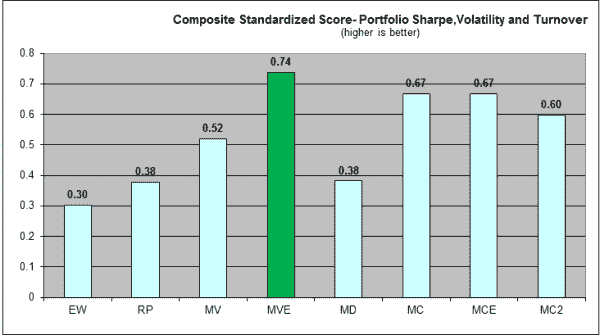

<!--yml
category: 未分类
date: 2024-05-12 18:00:23
-->

# Minimum Variance Algorithm Comparison Snapshot | CSSA

> 来源：[https://cssanalytics.wordpress.com/2013/04/19/minimum-variance-algorithm-comparison-snapshot/#0001-01-01](https://cssanalytics.wordpress.com/2013/04/19/minimum-variance-algorithm-comparison-snapshot/#0001-01-01)

The [Minimum Variance Algorithm](https://cssanalytics.wordpress.com/2013/04/01/minimum-variance-algorithm-mva/ "Minimum Variance Algorithm (MVA)") was compared to several standard optimization methods and algorithms in a recent set of tests done by Michael Kapler of [Systematic Investor](http://systematicinvestor.wordpress.com/).  Michael created a [webpage for MVA](http://www.systematicportfolio.com/minvar) to review some details of these tests and also to summarize some of the background information.  We plan to release a whitepaper on MVA with some additional material in the coming weeks. Below is a summary of testing done across multiple data sets contained in the [MCA paper](https://cssanalytics.wordpress.com/2012/09/21/minimum-correlation-algorithm-paper-release/ "Minimum Correlation Algorithm Paper Release").  We used a standardized score (the normsdist of the z-score) of the performance of each method versus other methods using three metrics: 1) sharpe ratio (higher is better) 2) volatility (lower is better) 3) portfolio turnover (lower is better). These factors were weighted equally to create a composite score. We tested across a wide range of data sets– stocks, ETFs and Futures. The Minimum Variance Algorithm (MVE in the chart below) scored the highest of all methods across datasets- outperforming standard minimum variance and also the [minimum correlation algorithm](https://cssanalytics.wordpress.com/2012/09/27/minimum-correlation-implementation-in-excel/ "Minimum Correlation: Implementation in Excel").

The following acronyms are defined below.

**MVE**:  Minimum Variance Algorithm (MVA) in Excel

**MCE**: Minimum Correlation Algorithm (MCA) in Excel

**MC**: Minimum Correlation Algorithm (MCA)– Whitepaper/R Version

**MC2**: Minimum Correlation Algorithm 2 (MCA)

**MV**: Minimum Variance – standard minimum variance using a quadratic optimizer long only

**MD**: Maximum Diversification-standard maximum diversification using a quadratic optimizer long only

**EW**: Equal Weight

**RP**: Risk Parity- basic version inverse volatility weighting