<!--yml
category: 未分类
date: 2024-05-18 13:51:25
-->

# Minimum Variance Portfolios | Quantivity

> 来源：[https://quantivity.wordpress.com/2011/04/17/minimum-variance-portfolios/#0001-01-01](https://quantivity.wordpress.com/2011/04/17/minimum-variance-portfolios/#0001-01-01)

As recounted in [Portfolio Theory is Dead, Now What?](https://quantivity.wordpress.com/2011/04/10/portfolio-theory-is-dead-now-what/), the *minimum variance portfolio* is the optimal portfolio in a world with zero risk premium. This post expands on the topic via practical implementation in R, preceded by walk through of the corresponding mathematics.

Recall the classic Markowitz mean-variance optimal portfolio is the solution to:

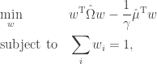

where 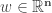 are vector of portfolio weights, 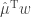 is sample mean portfolio return, and 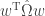 is sample covariance of portfolio returns. The summation to one constraint ensures weight percentages sum to 100%, meaning full investment. An additional common requirement is no short selling (*e.g.* 401k, IRAs, and mutual funds), which adds the following non-negative optimization constraint:

    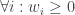

From this starting point, consider two assumptions which lead to the *minimum variance* portfolio:

*   Risk premium is zero
*   Aversion to risk is *infinite*, thus 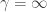

With those assumptions, the above optimization reduces to the following covariance minimization:

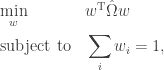

For portfolios constructed from individual stocks (as opposed to sectors, for example), an upper bound  constraint on the weights is appropriate to minimize *idiosyncratic* risk:

    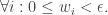

[Jagannathan and Ma](http://papers.ssrn.com/sol3/papers.cfm?abstract_id=424756) (2002) show this constraint improves estimation by amplifying shrinkage efficacy. The authors demonstrate a similar statistical shrinkage benefit provided by the zero lower bound.

Although this is a rudimentary constrained optimization problem, what makes it fun is the “Markowitz optimization enigma”: robustly estimating the covariance matrix 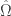. Consider three estimators from the literature, the first two following [Falkenblog](http://www.betaarbitrage.com/member-equityindices-mvp.php) and [Estimation Risk](http://estimationrisk.blogspot.com/) and the final being a more recent estimator. All estimators ensure the covariance matrix is [positive definite](http://en.wikipedia.org/wiki/Positive-definite_matrix) (as required to ensure the optimization is [convex](http://en.wikipedia.org/wiki/Convex_optimization)).

*   **Asymptotic Components with Hetersokedastic Factor Residuals**

Following Falkenstein, use Connor and Korajczyk (1993) and Jones (2001) to estimate :

   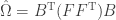
   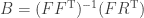

Where  (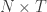) is historical returns for T periods on N instruments and 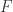 (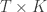) are the Jones factors.

*   **Bayesian Sample Shrinkage Estimator**

Similar to Nogales, use Ledoit and Wolf (2004) to estimate  via [shrinkage](http://en.wikipedia.org/wiki/Shrinkage_estimator) with a Bayesian prior and sample covariance matrix:

    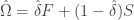
    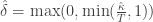
    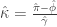

where 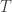 is length of time-series, 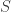 is the sample covariance matrix, 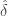 is the shrinkage constant, and the elements of the estimator  are composed:

    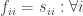
    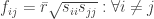

*   **Sample Variance and Correlation Shrinkage Estimator**

Following Schäfer and Strimmer (2005) and Opgen-Rhein and Strimmer (2007) to estimate  via [shrinkage](http://en.wikipedia.org/wiki/Shrinkage_estimator) of both variance and correlation:

    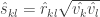
    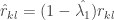
    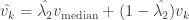
    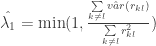
    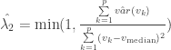

* * *

Now consider the R necessary to generate these portfolios. Readers seeking more background on portfolio optimization in R are referred to [R Tools for Portfolio Optimization](http://www.rinfinance.com/RinFinance2009/presentations/yollin_slides.pdf) by Yollin (R/Finance 2009).

The most important detail is choice of covariance estimator, including Schäfer-Strimmer-Opgen-Rhein from [`corpcor`](http://cran.r-project.org/web/packages/corpcor/) package and Ledoit-Wolf from [`tawny`](http://cran.r-project.org/web/packages/tawny/index.html) package (both functions confusingly named `cov.shrink`). The Ledoit-Wolf estimator will be used in this and subsequent posts.

These optimizations can be formulated as quadratic programming, and solved using `solve.QP` from `quadprog`, via formulating the above optimizations into the following functional form (following [Goldfarb and Idnani](http://www.javaquant.net/papers/GoldfarbIdnani.pdf) (1982, 1983)) with a zero 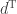:

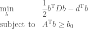

Assume `X` is a matrix of log returns, then generate optimization inputs:

```

<code>covar <- cov.shrink(X)
N <- ncol(X)
zeros <- array(0, dim = c(N,1))

```

Evaluate the optimization to generate minimum variance portfolio without short selling constraint:

```

aMat  <- t(array(1, dim = c(1,N)))
res <- solve.QP(covar, zeros, aMat, bvec=1, meq = 1)

```

Or, similar optimization with short selling constraint (*i.e.* non-negative weights):

```

aMat <- cbind(t(array(1, dim = c(1,N))), diag(N))
b0 <- as.matrix(c(1, rep.int(0,N)))
res <- solve.QP(covar, zeros, aMat, bvec=b0, meq = 1)

```

Finally, return portfolio attributes (similar to `portfolio.optim`):

```

y <- X %*% res$solution
port <- list(pw = round(res$solution,3), px = y, pm = mean(y), ps = sd(y))

```

One minor numerical analysis reminder: use of `solve.QP` with short selling constraints may generate weights with a negative sign (*e.g.* `-3.417223e-17`), due to floating point precision and numerical stability. Such weights are equal to zero when rounded to a reasonable number of digits.

A subsequent post will apply these minimum variance optimization to building and evaluating risk for rotation strategies.