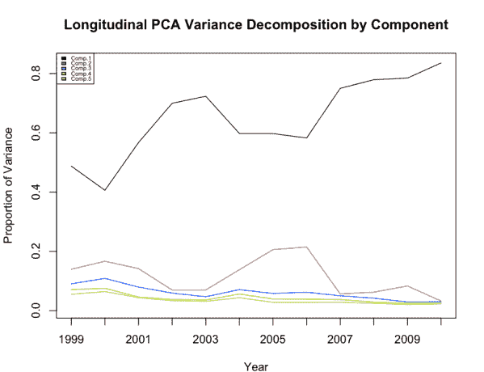
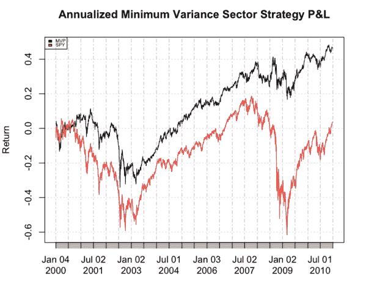
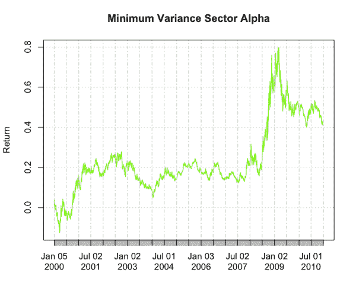
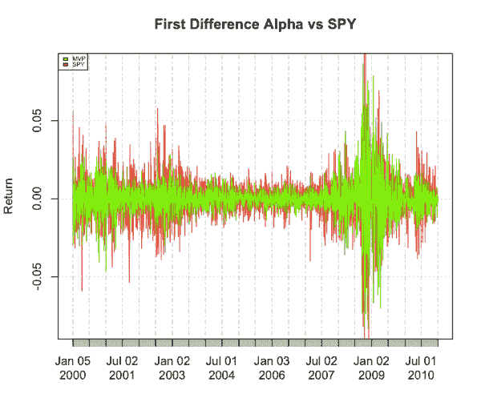
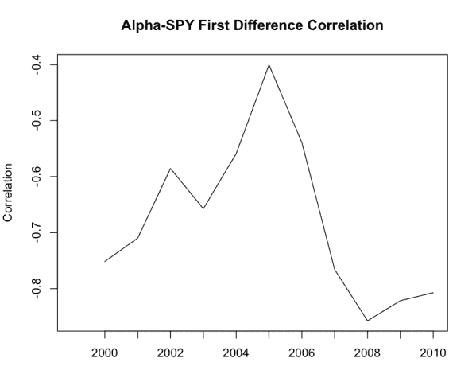
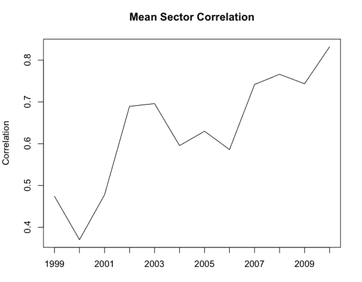

<!--yml
category: 未分类
date: 2024-05-18 13:51:37
-->

# Minimum Variance Sectors: Part 2 | Quantivity

> 来源：[https://quantivity.wordpress.com/2011/04/22/minimum-variance-sector-rotation-part-2/#0001-01-01](https://quantivity.wordpress.com/2011/04/22/minimum-variance-sector-rotation-part-2/#0001-01-01)

Continuing analysis of sector rotation with [minimum variance portfolios](https://quantivity.wordpress.com/2011/04/17/minimum-variance-portfolios/), John Hall inquired about performance of minimum variance sector rotation outside the period illustrated in the [previous post](https://quantivity.wordpress.com/2011/04/20/minimum-variance-sector-rotation/). This post expands analysis to consider the period extending back to *inception of US sector ETFs* (circa late 1998), unveiling several unexpected delights.

The period 1999 – 2010 includes a diversity of market price regimes: two bubbles, mixed up/down trending, and ample mean reversion. Begin minimum variance sector rotation analysis with MVP sector weights, which are unexpectedly quite interesting:

[](https://quantivity.wordpress.com/wp-content/uploads/2011/04/annual-mv-sector-weights-1999.png)

Specifically, the years 2000 – 2002 unveil a *remarkable* change in the sector weight of staples: increasing from 20% to 100%. Drilling further into the 2001 – 2002 weight transition, the difference is (*i.e.* `round(annualWeights[4,] - annualWeights[3,],3)`):

| XLB | XLE | XLF | XLK | XLI | XLP | XLU | XLV | XLY |
| 0.011 | -0.042 | -0.155 | -0.112 | 0.159 | 0.446 | -0.303 | -0.012 | 0.008 |

Thus, the increase in staples came at the expense of significant decrease in utilities (-30.3%), finance (-15.5%), and tech (-11.2%). This is a fascinating mix when viewed through the classic sector rotation mythology: finance and tech are “growth”, while utilities is “defensive”. The decrease in tech makes sense, given the bubble popping; decrease in finance is less clear, perhaps justified as it’s “growth”. No immediate economic explanation for the huge decrease in utilities, beyond the obvious that 2002 coincided with the post-tech bubble trough. Worth some pondering.

Next, the annual PCA decomposition for top 5 dominant components, affirming relationship between market dislocation and increased proportion of variance from the *market component*:

[](https://quantivity.wordpress.com/wp-content/uploads/2011/04/longitudinal-pca-decomp-1999.png)

Next, consider the daily P&L generated from these weights over the extended period:

[](https://quantivity.wordpress.com/wp-content/uploads/2011/04/mvp-pl-19992.png)

This strategy outperforms the benchmark throughout the period, by as much as 80%. To better understand the temporal dynamics of this outperformance, define “alpha” as the *spread* between strategy and SPY returns (*i.e.* `alpha <- cumsum(dailyPnL[2:length(dailyPnL)]) - cumsum(diff(log(coredata(spy))))`). The following illustrates alpha time series over the period:

[](https://quantivity.wordpress.com/wp-content/uploads/2011/04/min-var-alpha-19992.png)

This strongly hints that alpha generation may be inversely correlated with downward market price volatility, which matches *a priori* intuition that MVPs are intended to minimize variance. To investigate further, consider visualization of the time series relationship between these two with an overlay graph of both first differences:

[](https://quantivity.wordpress.com/wp-content/uploads/2011/04/min-var-alpha-diff2.png)

This affirms both series are strongly [heteroskedastic](http://en.wikipedia.org/wiki/Heteroscedasticity) (not surprisingly), along with strong temporal simultaneity in variance changes. There appears potential for strong correlation, yet unclear from time series whether positive or negative. To investigate directionality, consider the following annual Pearson correlation between first differences of alpha and SPY:

[](https://quantivity.wordpress.com/wp-content/uploads/2011/04/alpha-spy-correlation.png)

This indeed confirms a *strong inverse relationship between changes in alpha and corresponding changes in SPY* (note the y-axis is *negative* values). This is quite interesting, given the hunt for negative correlation with benchmark asset classes.

Compare the preceding negative correlation with the annual mean correlation of US sectors (as measured by same sector ETFs), exemplifying the standard strong positive correlation under distress:

[](https://quantivity.wordpress.com/wp-content/uploads/2011/04/mean-sector-correlation.png)

In summary, the preceding analysis indeed suggests minimum variance portfolios live up to their goal of truncating “bad” (downside) variance while simultaneously not reducing alpha during periods of either “good” (upside) variance or dampened variance.

* * *

For readers wanting to follow along in R, this post relies upon the preceding along with the following additional logic:

```

# plot annual alpha-spy correlation
plot(array(sapply(annualNames, function(yr) { cor(dalpha[yr], dspy[yr])})), type='l', xaxt="n", xlab="", ylab="Correlation", main="Alpha-SPY First Difference Correlation")
axis(1, 2:nrow(annualNames), annualNames[2:length(annualNames)])

# plot annual sector correlation
plot(sapply(annualNames, function(yr) { mean(cor(usRets[yr])) } ), type='l', xlab="", ylab="Correlation", xaxt="n", main="Mean Sector Correlation")
axis(1, 1:nrow(annualNames), annualNames)

```