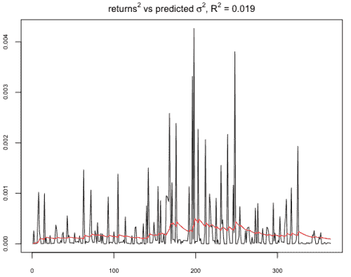
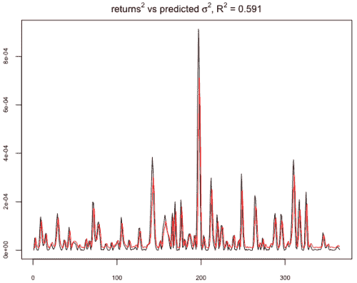
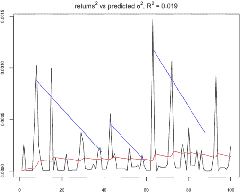
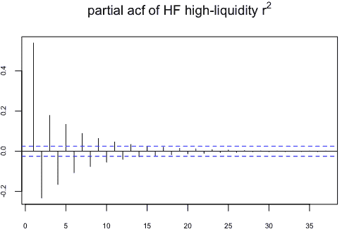
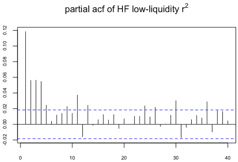

<!--yml
category: 未分类
date: 2024-05-18 15:37:11
-->

# Misadventures in Variance Estimation | Tr8dr

> 来源：[https://tr8dr.wordpress.com/2009/11/24/misadventures-in-variance-estimation/#0001-01-01](https://tr8dr.wordpress.com/2009/11/24/misadventures-in-variance-estimation/#0001-01-01)

I’ve been looking at a number of different volatility models for both daily and intra-day variance.   In the process have looked at **GARCH**(1,1) for daily and have developed a number of duration based variance (**DV**) models for intra-day.

**Daily Returns** I had concluded early on that GARCH(1,1) generally fits daily data well but fails miserably with intra-day data.    Unfortunately, for some markets, GARCH performs miserably as well.

I was looking at Canadian 2Y CMT yields over the last 10 years.   There are significant spikes in return for any given year.    For example in 2003, on the raw daily returns, GARCH does poorly (squared returns: black, sigma squared: red):

As an experiment I used (very) lightly smoothed prices as a basis for GARCH testing.  The smoothing gave continuity to the price function and to the 1st derivatives (returns).    GARCH(1,1) calibrated on the same data set, but with minimal smoothing yields a much higher degree of fit (25 x):

Of course we are now projecting sigma^2 on a lightly smoothed price series and not the original series.   Note that the magnitude of returns has reduced as well, as the smoothing allows for more gradual transitions.

Let’s look at a smaller section of returns on the raw price series:

Visually there appears to be a autoregressive component in squared returns, but involves jumps followed by periods of near zero return.   Subsequent jumps appear to follow a near linear decay in magnitude.    You will note that the last set appears to be a poor fit, however, there is a cluster of low jumps, that when considered in intensity space would have a higher combined value (ie, consider the cumulative return over a small window).

This **behavior would point to modeling this as a intensity function** (equivalent to duration).

**Intra-day Squared Returns**
Autocorrelation plots of liquid periods and illiquid periods both show significant autocorrelation out to 10+ seconds, indicating that we should be looking at an AR process at some level with long memory:

Thus far the most successful model is a duration based hawkes process which is “infinitely” autoregressive with exponential decay.