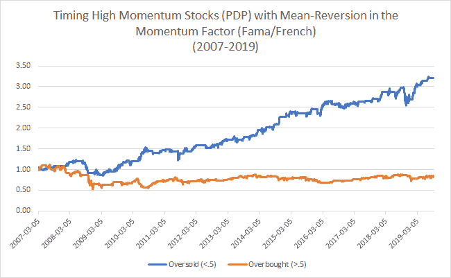

<!--yml
category: 未分类
date: 2024-05-12 17:40:32
-->

# Mo Data: Using Mean-Reversion in the Momentum Factor to Time Momentum | CSSA

> 来源：[https://cssanalytics.wordpress.com/2019/09/12/mo-data-using-mean-reversion-in-the-momentum-factor-to-time-momentum/#0001-01-01](https://cssanalytics.wordpress.com/2019/09/12/mo-data-using-mean-reversion-in-the-momentum-factor-to-time-momentum/#0001-01-01)

In the [last post](https://cssanalytics.wordpress.com/2019/09/12/when-should-you-buy-momentum-mean-reversion-in-the-momentum-factor/) we used the data available for the momentum factor using an ETF (ticker: MOM) which seeks to replicate The Dow Jones Thematic Market Neutral Momentum Index to time when to be in or out of high momentum stocks. Alpha Architect recently did some interesting analysis of the distribution of returns for the same momentum index [in this post](https://alphaarchitect.com/2019/09/12/value-dont-call-it-a-comeback-its-been-here-for-years/). One of the challenges was the lack of data available for testing. Ideally we would have much more data. To address this issue I found that the [Kenneth French Data Library](https://mba.tuck.dartmouth.edu/pages/faculty/ken.french/data_library.html) has daily momentum factor returns. To find a tradeable long-only momentum strategy, I used [PDP](https://www.invesco.com/portal/site/us/investors/etfs/product-detail?productId=pdp) which is the Invesco DWA Momentum ETF and is based on the Dorsey Wright^® Technical Leaders Index (DWA Technical Leaders Index). The strategy is to go long PDP when the momentum factor is oversold (<.5) and this is compared to a strategy that goes long PDP when the momentum factor is overbought (>.5). For more details please read the previous post. The results are in the chart below:

Having data prior to 2013 is valuable because we get to see how the strategy performed during the credit crisis in 2008 and also in the beginning of the explosive bull rally from 2009 to early 2010\. Clearly mean-reversion in the momentum factor has worked well in timing high momentum stocks since 2007\. While not shown, I tested a wide variety of different parameters and found very similar results. To determine whether this is a pervasive effect across history would require extensive testing with synthetic momentum strategies, however my guess is that this has been effective for at least the last 25 years. Ultimately if it works back to 2007, it is clearly worth using and at least watching as part of your trading in either high momentum stocks or their proxy ETFs or mutual funds. However it is worthwhile doing some additional analysis to determine why this strategy works.