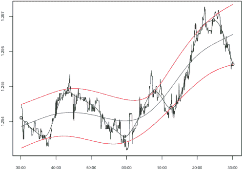

<!--yml
category: 未分类
date: 2024-05-18 15:38:11
-->

# Mode of the Signal Envelope | Tr8dr

> 来源：[https://tr8dr.wordpress.com/2009/11/06/mode-of-the-envelope/#0001-01-01](https://tr8dr.wordpress.com/2009/11/06/mode-of-the-envelope/#0001-01-01)

November 6, 2009 · 8:02 am

One thing that struck me as clever with the HHT was the use of projecting a spline across the minima and maxima for a given harmonic.   In effect this defines the envelope for the series for a given harmonic (level of decomposition).   A posteri, the mean or mode should be more or less equivalent to the average of the envelope splines.   Interesting!

This is a very appropriate way to model the mean within the context of mean-reversion (ie oscillations around the mode within an envelope).   Instead of trying to model the mean directly as a stochastic process, why not model the envelope — this is more appropriate as we can fit the envelope into our view of mean reversion.

**Version 1** I used a regressor to estimate the mean and connected minima and maxima with a spline for the envelope.  The approach has issues (such as what sort of bias does the mean regressor have with respect to the data).   There are some issues below:

**Version 2** I took a dfference approach, estimating the inflection points with a regressing “oscillator”  (in green) and determining the mid-points between minima and maxima to produce a spline representing the mode (blue).   So far looks good.   Edge cases, consolidation, and jumps need to be considered:

More on this later.