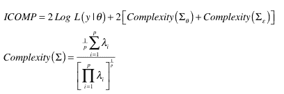
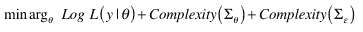

<!--yml
category: 未分类
date: 2024-05-18 15:33:42
-->

# Model Parsimony | Tr8dr

> 来源：[https://tr8dr.wordpress.com/2010/02/21/model-parsimony/#0001-01-01](https://tr8dr.wordpress.com/2010/02/21/model-parsimony/#0001-01-01)

Given the complexity of the markets, it is easy to fall into the trap of overfitting when creating a parametric model of some sort.    There are a variety of approaches to avoiding this, some heuristic and others theoretical, such as:

1.  cross-validation  (in-sample, out-of-sample)
2.  likelihood weighted information criteria

I want to briefly look at information criteria today.   The [Kullback-Leiber divergence](http://en.wikipedia.org/wiki/Kullback-Leibler_divergence) metric is probably the seminal work in this area.   Since then there have been a number of measures such as Akaike Information Criterion, Hannon-Quinn, etc.    More recently (well 2000) Hamaparsum Bozdogan developed another measure ([ICOMP](yaroslavvb.com/papers/bozdogan-akaike.pdf)) which has more appeal for me in terms of what it captures.   Conceptually the measure weighs the following:

1.  likelihood of the model given the parameters (lack or degree of fit)
2.  the complexity of model parameters (lack of parsimony)
3.  the complexity of model errors (profusion of complexity)

A simplified form of the measure is as follows:

where Σθ and Σε are the parameter and residuals covariance matrices respectively.  λ’s are the eigenvalues of each respective matrix.

We look to minimize the above function (effectively maximizing likelihood against the countervailing complexity measures):

The measure of complexity is explained as follows from his [paper](yaroslavvb.com/papers/bozdogan-akaike.pdf):

> Complexity of a system (of any type) is a measure of the degree of interdependency between the whole system and a simple enumerative composition of its subsystems or parts.
> 
> The contribution of the complexity of the model covariance structure is that it provides a numerical measure to assess *parameter redundancy* and *stability* uniquely all in one measure. When the parameters are stable, this implies that the covariance matrix should be approximately a diagonal matrix.
> 
> In general, large values of complexity indicate a high interaction between the variables, and a low degree of complexity represents less interaction between the variables. The minimum of *Complexity*(Σ) corresponds to the least complex structure. In other words:
> 
> *Complexity*(Σ) → 0 as Σ→ I
> 
> This establishes a plausible relation between information-theoretic complexity and computational effort. Furthermore, what this means is that the identity matrix is the least complex matrix. To put it in statistical terms, orthogonal designs, or linear models with no colinearity, are the least complex, or most informative, and the identity matrix is the only matrix for which the complexity vanishes. Otherwise, *Complexity*(Σ) > 0, necessarily.

Why bother?   Well the most commonly used criterion (the AIC) has does not adequately capture complexity and is know to be biased for some model systems.   The approach also has greater intuitive appeal.