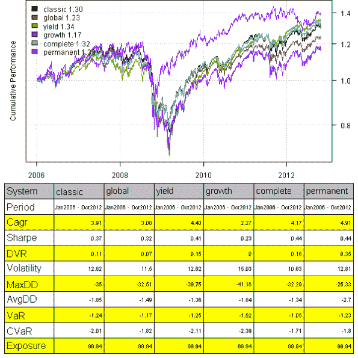
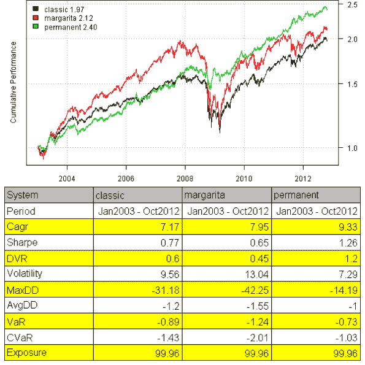

<!--yml
category: 未分类
date: 2024-05-18 14:36:24
-->

# Modeling Couch Potato strategy | Systematic Investor

> 来源：[https://systematicinvestor.wordpress.com/2012/10/26/modeling-couch-potato-strategy/#0001-01-01](https://systematicinvestor.wordpress.com/2012/10/26/modeling-couch-potato-strategy/#0001-01-01)

I first read about the [Couch Potato strategy in the MoneySense magazine](http://www.moneysense.ca/2006/04/05/couch-potato-portfolio-introduction/). I liked this simple strategy because it was easy to understand and easy to manage. The [Couch Potato strategy](http://www.moneysense.ca/2006/04/05/couch-potato-portfolio-introduction/) is similar to the [Permanent Portfolio strategy](https://systematicinvestor.wordpress.com/?s=Permanent+Portfolio) that I have analyzed previously.

The [Couch Potato strategy](http://www.moneysense.ca/2006/04/05/couch-potato-portfolio-introduction/) invests money in the given proportions among different types of assets to ensure diversification and rebalances the holdings once a year. For example the [Classic Couch Potato strategy](http://www.moneysense.ca/2006/04/05/couch-potato-portfolio-meet-the-potato-family/) is:

*   1) Canadian equity (33.3%)
*   2) U.S. equity (33.3%)
*   3) Canadian bond (33.3%)

I highly recommend reading following online resources to get more information about the [Couch Potato strategy](http://www.moneysense.ca/2006/04/05/couch-potato-portfolio-introduction/):

*   MoneySense
*   Canadian Couch Potato
*   AssetBuilder

Today, I want to show how you can model and monitor the [Couch Potato strategy](http://www.moneysense.ca/2006/04/05/couch-potato-portfolio-introduction/) with the [Systematic Investor Toolbox](https://systematicinvestor.wordpress.com/systematic-investor-toolbox/).

```

###############################################################################
# Load Systematic Investor Toolbox (SIT)
# https://systematicinvestor.wordpress.com/systematic-investor-toolbox/
###############################################################################
setInternet2(TRUE)
con = gzcon(url('http://www.systematicportfolio.com/sit.gz', 'rb'))
    source(con)
close(con)

	# helper function to model Couch Potato strategy - a fixed allocation strategy
	couch.potato.strategy <- function
	(
		data.all,
		tickers = 'XIC.TO,XSP.TO,XBB.TO',
		weights = c( 1/3, 1/3, 1/3 ), 		
		periodicity = 'years',
		dates = '1900::',
		commission = 0.1
	) 
	{ 
		#*****************************************************************
		# Load historical data 
		#****************************************************************** 
		tickers = spl(tickers)
		names(weights) = tickers

		data <- new.env()
		for(s in tickers) data[[ s ]] = data.all[[ s ]]

		bt.prep(data, align='remove.na', dates=dates)

		#*****************************************************************
		# Code Strategies
		#******************************************************************
		prices = data$prices   
			n = ncol(prices)
			nperiods = nrow(prices)

		# find period ends
		period.ends = endpoints(data$prices, periodicity)
			period.ends = c(1, period.ends[period.ends > 0])

		#*****************************************************************
		# Code Strategies
		#******************************************************************
		data$weight[] = NA
			for(s in tickers) data$weight[period.ends, s] = weights[s]
		model = bt.run.share(data, clean.signal=F, commission=commission)

		return(model)
	} 	

```

The couch.potato.strategy() function creates a periodically rebalanced portfolio for given static allocation.

Next, let’s back-test some Canadian Couch Potato portfolios:

```

	#*****************************************************************
	# Load historical data
	#****************************************************************** 
	load.packages('quantmod')	
	map = list()
		map$can.eq = 'XIC.TO'
		map$can.div = 'XDV.TO'		
		map$us.eq = 'XSP.TO'
		map$us.div = 'DVY'			
		map$int.eq = 'XIN.TO'		
		map$can.bond = 'XBB.TO'
		map$can.real.bond = 'XRB.TO'
		map$can.re = 'XRE.TO'		
		map$can.it = 'XTR.TO'
		map$can.gold = 'XGD.TO'

	data <- new.env()
	for(s in names(map)) {
		data[[ s ]] = getSymbols(map[[ s ]], src = 'yahoo', from = '1995-01-01', env = data, auto.assign = F)
		data[[ s ]] = adjustOHLC(data[[ s ]], use.Adjusted=T)	
	}

	#*****************************************************************
	# Code Strategies
	#****************************************************************** 
	models = list()
		periodicity = 'years'
		dates = '2006::'

	models$classic = couch.potato.strategy(data, 'can.eq,us.eq,can.bond', rep(1/3,3), periodicity, dates)
	models$global = couch.potato.strategy(data, 'can.eq,us.eq,int.eq,can.bond', c(0.2, 0.2, 0.2, 0.4), periodicity, dates)
	models$yield = couch.potato.strategy(data, 'can.div,can.it,us.div,can.bond', c(0.25, 0.25, 0.25, 0.25), periodicity, dates)
	models$growth = couch.potato.strategy(data, 'can.eq,us.eq,int.eq,can.bond', c(0.25, 0.25, 0.25, 0.25), periodicity, dates)

	models$complete = couch.potato.strategy(data, 'can.eq,us.eq,int.eq,can.re,can.real.bond,can.bond', c(0.2, 0.15, 0.15, 0.1, 0.1, 0.3), periodicity, dates)	

	models$permanent = couch.potato.strategy(data, 'can.eq,can.gold,can.bond', c(0.25,0.25,0.5), periodicity, dates)	

	#*****************************************************************
	# Create Report
	#****************************************************************** 
	plotbt.custom.report.part1(models)

```

[](https://systematicinvestor.wordpress.com/wp-content/uploads/2012/10/plot1-small3.png)

I have included a few classic Couch Potato portfolios and the Canadian version of the Permanent portfolio. The equity curves speak for themselves: you can call them by the fancy names, but in the end all variations of the Couch Potato portfolios performed similar and suffered a huge draw-down during 2008\. The Permanent portfolio did a little better during 2008 bear market.

Next, let’s back-test some US Couch Potato portfolios:

```

	#*****************************************************************
	# Load historical data
	#****************************************************************** 
	tickers = spl('VIPSX,VTSMX,VGTSX,SPY,TLT,GLD,SHY')

	data <- new.env()
	getSymbols(tickers, src = 'yahoo', from = '1995-01-01', env = data, auto.assign = T)
		for(i in ls(data)) data[[i]] = adjustOHLC(data[[i]], use.Adjusted=T)	

		# extend GLD with Gold.PM - London Gold afternoon fixing prices
		data$GLD = extend.GLD(data$GLD)

	#*****************************************************************
	# Code Strategies
	#****************************************************************** 
	models = list()
		periodicity = 'years'
		dates = '2003::'

	models$classic = couch.potato.strategy(data, 'VIPSX,VTSMX', rep(1/2,2), periodicity, dates)
	models$margarita = couch.potato.strategy(data, 'VIPSX,VTSMX,VGTSX', rep(1/3,3), periodicity, dates)
	models$permanent = couch.potato.strategy(data, 'SPY,TLT,GLD,SHY', rep(1/4,4), periodicity, dates)

	#*****************************************************************
	# Create Report
	#****************************************************************** 
	plotbt.custom.report.part1(models)

```

[](https://systematicinvestor.wordpress.com/wp-content/uploads/2012/10/plot2-small3.png)

The US Couch Potato portfolios also suffered huge draw-downs during 2008\. The Permanent portfolio hold it ground much better.

It has been written quite a lot about Couch Potato strategy, but looking at different variations I cannot really see much difference in terms of perfromance or draw-downs. Probably that is why in the last few years, I have seen the creation of many new ETFs to address that in one way or another. For example, now we have [tactical asset allocation ETFs](http://www.mebanefaber.com/2010/09/29/cambria-global-tactical-etf-nysegtaa/), [minimum volatility ETFs](http://www.invescopowershares.com/products/overview.aspx?ticker=SPLV), [income ETFs with covered calls overlays](http://www.moneysense.ca/2011/06/02/bmo-covered-call-canadian-banks-etf-zwb/).

To view the complete source code for this example, please have a look at the [bt.couch.potato.test() function in bt.test.r at github](https://github.com/systematicinvestor/SIT/blob/master/R/bt.test.r).

Some additional references from the [Canadian Couch Potato](http://canadiancouchpotato.com/) blog that are worth reading: