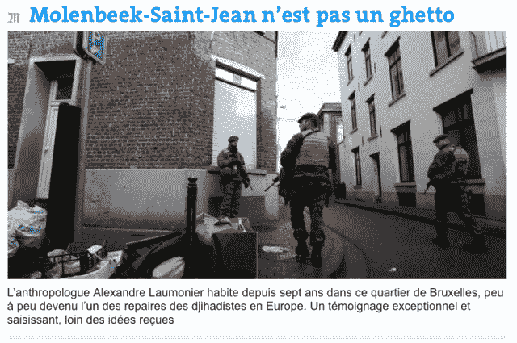

<!--yml
category: 未分类
date: 2024-05-18 14:13:17
-->

# Molenbeek-Saint-Jean n’est pas un ghetto – Sniper In Mahwah & friends

> 来源：[https://sniperinmahwah.wordpress.com/2015/11/24/molenbeek-saint-jean-nest-pas-un-ghetto/#0001-01-01](https://sniperinmahwah.wordpress.com/2015/11/24/molenbeek-saint-jean-nest-pas-un-ghetto/#0001-01-01)

[My op-ed about Molenbeek published by *[Le Monde](http://www.lemonde.fr/idees/article/2015/11/23/molenbeek-saint-jean-n-est-pas-un-ghetto_4815791_3232.html).* English translation coming soon.]

Molenbeek-Saint-Jean est désormais tristement célèbre dans le monde entier. Certains n’auront malheureusement pas été étonné d’apprendre qu’une partie des terroristes ayant semé la mort à Paris habitaient ma commune. La liste des Molenbeekois impliqués dans des affaires terroristes internationales est hélas désormais trop longue – d’Abdessatar Dahmane, impliqué dans l’assassinat du commandant Massoud en 2001, à Salah Abdeslam, considéré aujourd’hui comme l’un des principaux responsables des récents attentats parisiens, en passant par une bonne dizaine d’autres. Vivant et travaillant à Molenbeek-Saint-Jean, au cœur de l’un de ces quartiers considérés comme une « plaque tournante belge du terrorisme islamiste », à quelques dizaines de mètres de l’appartement de l’un des présumés responsables des attentats, il m’est difficile de ne pas écrire ces quelques mots.

D’abord, le contexte. Contrairement à ce qu’affirment certains médias, Molenbeek n’est pas une « banlieue ». « Bruxelles » désigne une des trois régions de Belgique, constituée de 19 communes, dont « Bruxelles ville » et Molenbeek font partie. Bien qu’un canal forme indéniablement une frontière physique, sociale et symbolique entre ces deux communes, le centre de « Bruxelles ville » n’est qu’à 15 minutes à pied de chez moi, ou à 3 arrêts de métro. Le qualificatif de « banlieue » semble bassement utilisé pour renvoyer à l’image des cités franciliennes éloignées du centre de Paris et où vivrait une communauté musulmane de plus en plus rongée par la pauvreté, et donc par le radicalisme religieux. Molenbeek n’est pas une banlieue, et à l’image de la région bruxelloise dans sa globalité, cette commune est un ensemble de micro-quartiers incroyablement disparates. Il existe plusieurs Molenbeek, et il est crucial de tenir compte de cette disparité.

A quoi ressemble l’un de ces quartiers molenbeekois aujourd’hui sous le regard des caméras du monde entier ? Tout simplement à des rues majoritairement constituées de ces maisons en brique typiquement bruxelloises ; il y a bien quelques barres de type « HLM », mais celles-ci sont peu nombreuses et se fondent dans le paysage urbain. Sans revenir sur la longue et passionnante histoire de la commune (qui a accueilli des communards parisiens en exil dans les années 1870, à une époque où son surnom était « Le petit Manchester » en raison de son industrie florissante), Molenbeek a aujourd’hui en son sein quelques micro-quartiers constitués à 80% d’habitants de nationalité belge appartenant à une communauté musulmane ayant principalement des liens historiques avec le Maroc et d’où sont issus un nombre particulièrement important de (parfois très jeunes) hommes ou femmes ayant épousé la cause djihadiste en Syrie. Cela dit, les rares statistiques disponibles montrent que si la moitié des Belges partis en Syrie viennent de la région bruxelloise, l’autre moitié provient de Flandres, et notamment de Vilvoorde et d’Anvers, Anvers où les prosélytes salafistes de Sharia4Belgium ont été considéré par la justice belge comme étant les principaux recruteurs de djihadistes. Le problème de l’islamisme dépasse les frontières de Molenbeek. La ville, ou du moins certains de ses (micro-) quartiers, est qualifiée par la presse de « ghetto ». Bien qu’ayant quelques doutes sur la véritable signification de ce mot (ou alors pris dans le sens de cette « fermeture excluante » dont parlait Max Weber), s’il existe un ghetto alors Uccle, la riche commune bruxelloise où s’entassent les exilés fiscaux français, est bien plus « ghettoïsée » que ma commune, foyer de diversité où plus de 100 nationalités vivent sans qu’il n’y ait jamais aucune tension entre communautés.

Ensuite, le point sensible : la forte densité de population appartenant à la communauté arabo-musulmane dans certains quartiers, dont le mien. Celui que l’on présente habituellement comme étant le plus jeune djihadiste au monde est un gamin de 13 ans ayant grandi à Molenbeek, Younès, qui a laissé derrière lui des parents hagards d’incompréhension. Il a été entraîné là-bas par son grand frère, Abdelhamid Abaaoud, considéré comme l’un des présumés commanditaires des récents attentats parisiens et décédé lors de l’assaut des forces de l’ordre à Saint-Denis. Younès était scolarisé à quelques centaines de mètres de chez moi, et il m’est souvent arrivé de penser que je l’avais croisé un jour. Peut-être était-il ce jeune garçon qui m’avait souri en levant les yeux de sa Playstation portable alors qu’il marchait dans ma rue, trois mètres derrière sa mère couverte de noir de la tête au pieds, mains incluses, elle-même trois mètres derrière un mari perdu dans ses prières. Il serait malhonnête de ne pas écrire que, depuis quelques années, le poids de la religion se fait de plus en plus sentir dans la vie quotidienne du quartier, par petite touche.

Un certain nombre de femmes et de jeunes filles qui travaillent dans les boulangeries et épiceries, qui ne portaient auparavant qu’un simple voile, arborent désormais le hijab. Il n’est plus rare, aujourd’hui, de voir dans les rues des petites filles de 5 ans voilées d’un joli hijab coloré – c’était beaucoup plus rare, voire inexistant, il y a quelques années. Bien qu’il soit interdit dans l’espace publique, le niqab est bel est bien visible à la sortie de l’école la plus proche de chez moi. Il n’était pas rare que, dans l’ancien bureau de poste local, des chants religieux résonnent depuis les téléphones portables (j’ai une fois demandé à une femme de couper le son en lui disant  qu’elle n’avait pas à m’imposer les prières d’une religion qui n’était la mienne ; elle l’a fait immédiatement mais j’ai vu à ses yeux qu’elle trouvait ma demande incongrue). Il n’est pas rare non plus de trouver, sur les comptoirs des boulangeries, des flyers pour telle ou telle manifestation musulmane où s’étalent les visages de prédicateurs étrangers dont on apprend ensuite, en cherchant un peu sur internet, qu’ils appellent dans des vidéos à « brûler des juifs ». Il y a aussi ces barbus prosélytes sinistres qui se déplacent par grappe de trois et font du porte à porte ou alpaguent les jeunes gens qui traînent dans les rues. Début 2015, un photographe de guerre et anthropologue a décidé de quitter Molenbeek et s’en est expliqué : « [Ici] tout y est devenu gris, tout y respire le pessimisme. Le radicalisme et la grisaille de ma rue m’ont rendu dépressif. J’ai trouvé terrible que des personnes tentent dans la rue de me convertir à l’islam. » Bien que personne n’ait un jour tenté de me convertir, je partage malheureusement ce constat quand à la grisaille et le pessimisme (même si la grisaille est plus bruxelloise, voire belge, que molenbeekoise – après tout, Bruxelles n’est pas Marseille). Peut-être le photographe entendait-il également par « grisaille » la saleté de certaines rues, de véritables poubelles à ciel ouvert aux trottoirs défoncés qui, parfois, subsistent pendant des semaines avant que les services communaux ne finissent par nettoyer (ce qui donne parfois lieu à des scènes d’une tristesse infinie, comme lorsque des Roms viennent ramasser le peu de déchets exploitable dont se sont débarrassé les voisins, avant que des ressortissant des pays de l’Est ne viennent à leur tout récupérer ce qu’il reste de métal – il y a les pauvres, puis les plus pauvres, puis les plus pauvres encore).

Qu’il y ait dans certains micro-quartiers des replis idenditaires religieux est indéniable, et ces replis sont de plus en plus visibles. Certains regards se tournent logiquement vers la principale mosquée du quartier, l’une des plus fréquentées de la région bruxelloise, où parfois certains prédicateurs ne parlant que l’arabe sont invités et répandent des propos nauséabonds (un Marocain pratiquant, qui fut mon voisin pendant quelques semaines, s’y était rendu une fois mais en était revenu effaré par le discours violent à l’encontre des femmes). Même si elle s’en défend, cette mosquée a formé plus d’un prédicateur qui ont ensuite endossé la cause salafiste et sont partis en Syrie, en embarquant au passage quelques jeunes du coin. Une femme politique, qui était autrefois dans le conseil communal de Molenbeek, m’avait appris un jour que cette mosquée était sous les radars des services de renseignement depuis des années – mais visiblement aucune action ne semble avoir été efficace puisque très récemment encore des jeunes fréquentant le lieu ont décidé de « faire le djihad ». (On a toutefois apprécié le message clair diffusé depuis vendredi 13 novembre sur la page d’accueil de cette mosquée, condamnant avec force les attaques parisiennes, mais on aurait davantage apprécié que la grande prière du vendredi soit aussi ouverte aux non-musulmans). On pourrait aussi évoquer les mosquées plus ou moins officielles qui ont comme vitrine le statut d’Association sans but lucratif, mais qui organisent en réalité des réunions dans des garages obscurs pour enrôler des jeunes désœuvrés dans une cause répugnante.

Tout cela est su et connu depuis des années. Les débats seront vifs, dans les semaines et mois qui viennent, sur l’état de l’islam en Belgique – pour Rachid Madrane, un ministre bruxellois, « le péché originel, en Belgique, a été de confier les clés de l’islam à l’Arabie saoudite en 1973 ». Un responsable de mosquée m’a raconté, mercredi passé, lors du rassemblement citoyen organisé sur la place communale de Molenbeek en hommage aux victimes de Paris, qu’il avait plus d’une fois demandé à des « représentants » anversois de Sharia4Belgium venus recruter devant sa mosquée de « dégager », et qu’il avait signalé leur présence à la police ; un autre responsable religieux m’a affirmé quand à lui que certains des barbus prosélytes arpentant les rues venaient parfois d’Angleterre pour recruter de la « chair fraîche ». Tout est plus complexe qu’on ne l’imagine, et là encore les problèmes dépassent la seule commune de Molenbeek.

Je ne sais pas ce qui se passe dans la tête d’un jeune Molenbeekois comme Brahim Abdelsam qui, un jour, tient le mur en fumant des joints et en picolant dans un café du coin, et quelques mois plus tard, après un peu d’« entraînement » en Belgique, va se faire exploser sur une terrasse d’un café parisien. Tout cela va bien au-delà de la simple religion, même si certains extrémistes en profitent. Brahim Abdeslam tenait un café qui fut frappé, début novembre, par une fermeture administrative en raison de « trafic de drogue ». N’importe quel habitant sait qu’ici plus d’un café ou d’une épicerie, où deux bouteilles de Coca se battent en duel avec trois paquets de chips, sont en réalité des comptoirs de vente de drogue. Le sympathique vendeur de kebab au coin de ma rue fut malheureusement remplacé, pendant quelques mois, par l’un de ses cafés, ou des jeunes barbus fumaient du cannabis en terrasse alors qu’à l’intérieur Al-Jazzira tournait en boucle à la télévision. Ces activités étant connues de tous, il est toujours surprenant de constater les délais nécessaires aux pouvoirs publics (plusieurs mois, voire davantage) pour faire fermer ces lieux qui participent à l’image dégradée de la commune.

Malgré la grisaille et la crasse, malgré le poids de la religion et les cafés-dealers de drogue, Molenbeek n’est pas une commune beaucoup plus dangereuse qu’une autre. Je n’y ai jamais subi la moindre agression en sept ans. Aucune voiture ne brûle, ici, lors du réveillon ; jamais Molenbeek, ni Bruxelles, n’ont connu des émeutes comme celles de Clichy-Sous-Bois en 2005 ; même dans les quartiers les plus difficiles, la police ne se fait que rarement caillasser, alors que c’est extrêmement fréquent dans certaines cités franciliennes. En terme de « repli communautaire » et de « violence contre l’État », la situation de certaines banlieues françaises est bien pire que celle de Molenbeek.

Il n’y a pas de « Molenbeekistan », comme l’affirment certains médias (même si, et on le sait depuis des années, il y a des poches urbaines où trafics d’armes et discours radicaux vont de pair, comme c’est le cas également à Anderlecht, en France et ailleurs). A Molenbeek, le « sentiment d’insécurité » vient davantage des voitures roulant à contre-sens (une habitude, dans le quartier) ou trop vite (la rue de Bruxelles connaissant le plus d’accidents se situe à Moleenbeek), de ces épiceries cachant à peine des trafics de drogue, de la saleté de certaines rues, etc. C’est en raison de ces diverses formes d’incivilité quotidienne diffuse (et il y en a d’autres) que naît ce fameux « sentiment d’insécurité ». Il y a bien des agents communaux qui sillonnent les rues, dont certains ont été clairement engagés en raison de leur appartenance à la communauté arabo-musulmane (un peu à la manière de la politique des « grands frères » menée dans certains quartiers français), mais que penser de ce que j’ai vu un jour, à savoir trois agents communaux passant dans une rue, serrant la main à des dealers de drogue connus de tout le quartier tout en discutant en arabe avec eux, avant de continuer tranquillement leur chemin ?

99,99% des habitants de Molenbeek ne sont évidemment pas candidats au djihad, ni même n’iront « brûler des juifs » (même si, en raison du problème de la Palestine et de certains prêches, je pense malheureusement que la majorité de mes voisins souffrent d’un antisémitisme crasse). 99,99% des habitants aspirent à vivre tranquillement les uns avec les autres. Si la situation de certains quartiers peut s’expliquer par un certain nombres de facteurs (emprise de la religion, sentiment d’impunité, la facilité pour des terroristes à se cacher dans un territoire dense, etc.), les principales causes de « tous les maux » dont souffrent la commune sont à aller chercher ailleurs. Et elles sont connues de tous depuis bien trop longtemps. Il suffit de regarder les chiffres, en l’occurrence ceux de la Commission communautaire française (Cocof), très détaillés car concernant non seulement la commune dans son ensemble mais aussi et surtout chacun de ses micro-quartiers.

Molenbeek est la seconde commune la plus pauvre de Belgique (le triste record appartenant à une autre – bien plus petite – commune de Bruxelles, Saint-Josse-Ten-Noode, à quelques pas du quartier européen) ; certains des quartiers de la commune sont parmi les plus denses de Bruxelles, les familles nombreuses représentent une part significative des ménages et la population globale des quartiers où habite la communauté musulmane a fortement augmenté depuis les années 2000 (le taux de natalité, en forte hausse depuis quelques années, y est le plus élevée de la région bruxelloise) ; la proportion de jeunes (15-24 ans) rapportée à la population globale y est particulièrement élevé ; le taux de mortalité y est supérieur à la moyenne régionale, de même que la part des habitants se déclarant en mauvaise santé ; le niveau moyen de revenu est inférieur à la moyenne nationale, notamment dans les quartiers à forte densité de population, et le nombre d’aides sociales sont très nettement surreprésentés ; le taux moyen de chômage y est donc logiquement largement supérieur à la moyenne régionale, et un jeune sur deux est au chômage, ce qui peut s’expliquer par le fait que la part d’entre eux suivant la filière scolaire générale est très en-dessous de la moyenne régionale. 51 % des habitants de Molenbeek ne paient pas d’impôts le revenu médian par habitant y est de 1 100 euros par mois, et *57% de la population vit sous le seul de pauvreté*.

Molenbeek est une commune minée par la pauvreté où plus d’un habitant sur deux tente de survivre, notamment parmi la population la plus jeune, sous-éduquée, qui devient une proie facile pour les barbus qui sillonnent les rues. Au-delà de Molenbeek, et parce que malheureusement les journalistes en parlent peu, rappelons que dans la capitale de l’Europe, Bruxelles en tant que région, *un tiers* *des habitants vit sous le seuil de pauvreté*, un chiffre édifiant lorsque l’on sait par ailleurs que Bruxelles produit plus de richesse que les deux autres régions de Belgique (il serait intéressant de savoir si ce chiffre a un lien avec ceux, récemment dévoilés par l’Organisation internationale pour les migrations, révélant que 62% des habitants de la région bruxelloise sont nés à l’étranger ou issus de familles qui ont migrés ici, « ce qui en fait la seconde ville au monde à afficher un taux aussi haut »). Bruxelles est donc une région fort contrastée : à Molenbeek, le revenu moyen par habitant est de 776 euros par mois, soit 4 fois moins que la seule allocation de résidence allouée à un commissaire européen et 26 fois moins que le salaire de celui-ci. (Ajoutons en passant que les agents de l’Union européenne sont exemptés de l’impôt sur les personnes physiques, cet impôt sur le revenu dont n’importe quel Belge imposable doit s’acquitter. Dit autrement, un habitant de Molenbeek à faible revenu mais payant cet impôt finance davantage les infrastructures publiques bruxelloises dont bénéficient les fonctionnaires européens qui, donc, en profitent sans payer cet impôt-là, tout en percevant des salaires bien plus élevés – mais passons.)

Molenbeek est donc rongée par la pauvreté. Il y a peu de journalistes pour rappeler qu’il y a quelques mois, la commune était au bord de la faillite (ce qui a encore une fois offert l’occasion à certains politiques de stigmatiser plus encore la commune) : en raison de la croissance de la population ne payant pas l’impôt mais demandant mécaniquement davantage de moyens publics (revenus sociaux, etc.), combinée à son appauvrissement (le revenu moyen d’un Molenbeekois a diminué de 5% en dix ans), les revenus issus de l’impôt ont logiquement baissé ; parallèlement, d’après un conseiller communal qui s’est publiquement exprimé sur cette quasi-faillite, la classe moyenne (celle qui paie l’impôt) se fait de plus en plus rare : « le manque de propreté, d’enseignement (de qualité), de logements de qualité abordables et d’espaces publics agréables, combiné à un sentiment d’insécurité sont les principaux arguments de leur départ, surtout chez les jeunes familles ». C’est difficile à admettre, mais Molenbeek continue de s’enfoncer – c’est mécanique. Tout concoure donc à ce que, dans certains quartiers, la misère sociale et intellectuelle soit un terrain fertile pour des recruteurs à l’idéologie répugnante. Quelles perspectives d’avenir cette commune, compte tenu de son état de délabrement financier et social, peut proposer à une population en voie de paupérisation ? Comment redresser une situation sociale où presque 55 000 personnes vivent sous le seuil de pauvreté ?

Le vice-Premier ministre et ministre de l’intérieur belge, Jan Jambon, membre du parti nationaliste flamand Nieuw-Vlaamse Alliantie (NVA), avec une tonitruance rappelant celle de Vladimir Poutine lorsque ce dernier voulait « buter les Tchétchènes jusque dans leurs chiottes », a déclaré, suite aux attentats de Paris, vouloir « faire le ménage à Molenbeek ». Monsieur Jambon, vu la saleté de mon quartier, le coup de balai proposé est vraiment le bienvenu (le prochain ramassage est mercredi prochain). Mais n’est-il pas un peu tard pour vous en préoccupez ? Pourquoi la Communauté flamande, où votre parti est majoritaire, a-t-elle *totalement* supprimé les subventions allouées à l’association historique Foyer, dont le travail, depuis 1969, est si fondamental en terme d’aide sociale, d’insertion, de formation, de médiation interculturelle, au cœur de l’un des quartiers les plus difficiles ? Cette association réussit pourtant l’exploit d’accomplir un travail de terrain indispensable à l’aide de bouts de ficelles et de contrats aidés. Le Premier ministre belge, Charles Michel, a affirmé après les attentats parisiens qu’« il y a eu une forme de laxisme, de laisser faire. On paie la facture de ce qui n’a pas été fait par le passé ». Monsieur le Premier, je vous remercie d’avoir avoué publiquement le « laxisme » dont les pouvoirs publics ont fait preuve ces dernières années dans ma commune ; pour autant, cela ne constitue en rien une excuse. Nous payons collectivement, Molenbeekois comme Parisiens, la « facture » (drôle de terme pour désigner des victimes d’attentats) parce que les gouvernements fédéraux successifs ne veulent plus payer les factures de l’éducation, de la prévention, de la police et de la justice, depuis trop longtemps.

Un reportage de la télévision flamande, qui a refait surface sur les réseaux depuis les attentats de Paris, donnait il y a quelques années la parole à des travailleurs sociaux qui, déjà, s’inquiétaient du manque d’attention des politiques envers la jeunesse pauvre d’origine étrangère et y voyaient un terrain favorable à une certaine forme de radicalisation religieuse. Lorsque le journaliste demande à Marcel Piccart, le bourgmestre de l’époque, de quoi il aurait besoin pour faire face aux problèmes de la commune, sa réponse est simple : « de l’argent », mais il ajoute, pessimiste, que les dotations de l’Etat fédéral allouées à Bruxelles sont en baisse constante. Un musulman interviewé affirme que si la situation empire (chômage, isolement, etc.), les gens se tourneront de plus en plus vers Dieu. Johan Leman, le directeur de Foyer, cette association qui ne reçoit plus aucune subvention venant de Flandres, affirme lui que si rien ne se passe, la génération suivante va finir par se révolter. Eh bien nous y sommes, même si le visage de la révolte et sa violence n’est peut-être pas celui auquel on s’attendait. Monsieur Michel, je ne peux vous tenir rigueur de n’avoir rien fait pour répondre à ce constat car vous n’aviez que 12 ans à l’époque : ce reportage où ce constat accablant est fait date de 1987\. C’était il y a presque 30 ans !

Les problèmes sont donc identifiés depuis longtemps. Je sais pertinemment que, compte tenu de la complexité des strates de l’administration belge (communes, Régions, Communautés, l’État fédéral) certaines décisions, ou investissements, nécessitent du temps pour être actés, mais malgré cela je ne suis pas loin de partager l’opinion de bon nombre d’habitants qui pensent que Molenbeek a été abandonnée par l’Etat fédéral à son propre et (de plus en plus triste) sort. Je passe sous silence les propos déplacés de l’avant-dernier bourgmestre de Molenbeek, lui qui a régné pendant 20 ans sur la commune en usant jusqu’à la corde d’un clientélisme communautaire mais ose se aujourd’hui défausser sur l’actuelle législature pour la rendre responsable de la quasi-faillite de la commune et du nombre élevé de terroristes provenant de Molenbeek (Monsieur Mourreaux, le déficit de la commune était en 2006, alors que vous étiez aux manettes, plus important qu’en 2014). Quand à l’actuelle bourgmestre, Françoise Schepmans, élue en 2012, elle est également députée fédérale depuis 2014\. Madame Schepmans, ne pensez-vous pas que Molenbeek, compte tenu de la situation actuelle, mériterait une bourgmestre qui puisse consacrer 100% de son temps à la commune ?

Le travail à faire à Molenbeek est immense, et il est malheureux de constater que, face à cette situation si terrible, les quelques associations qui font du soutien scolaire travaillent avec des moyens financiers littéralement dérisoires. Les renforts policiers seront les bienvenus (comme le vient de l’avouer le chef de zone de police Bruxelles-Ouest, dont fait partie Molenbeek, « la norme financière pour les zones de police n’a pas été revue depuis 12 ans ») ; les programmes de « déradicalisation » également. Mais le principal est l’éducation : comment se fait-il que, par anticipation, compte tenu de la forte hausse de la population constatée depuis bien des années, aucun programme d’envergure de construction de crèches et d’écoles n’ait été mis en œuvre ? Un nouveau musée d’art contemporain va ouvrir bientôt le long du canal séparant Molenbeek de Bruxelles. Nul doute que ce musée participera à la gentrification rampante de la « Zone canal », ce qui n’augure rien de bon, et nul doute que les activités éducatives à destination des groupes scolaires pourront être bénéfiques à certains gamins. Mais nous n’avons pas besoin de musée à Molenbeek ; nous avons besoin d’écoles, et des écoles qui offrent une mixité permettant à la classe moyenne de ne pas fuir la commune (même mon épicier favori, un Turc musulman pratiquant, a décidé de ne pas mettre ses enfants dans l’école la plus proche de chez lui en raison du manque de mixité – c’est dire). Quel est le sens d’un tel musée au sein d’une commune où – et il suffit d’entendre certains jeunes parler dans la rue – l’analphabétisme touche autant d’habitants ? Un musée n’est pas la bonne réponse à la misère sociale et éducative ; c’est mettre la charrue avant les bœufs.

Au-delà de la question de l’éducation, il y a aussi celles de la mobilité et des projets d’urbanisation. Un exemple : l’escalator menant à l’arrêt de métro le plus proche de chez moi, lequel arrêt est situé près d’un terrain vague devenu un dépotoir crasseux, tombe en rade tous les deux jours depuis des années sans que personne ne s’en émeuve, ce qui de facto empêche les mères de famille se déplaçant avec une poussette (et elles sont nombreuses dans le quartier) d’accéder à un transport en commun public. (Ce sont ces typiques problèmes de mobilité qui engendre la « ghettoïsation ».) Il y a également la question évidente de la propreté : il est impensable de tirer vers le haut une commune dont certaines rues ressemblent à des décharges ; on ne construit rien sur des ruines.

Le travail est immense, à tout point de vue, et il faut le commencer à la hauteur du caniveau. Il ne se fera pas en quelques semaines ou en quelques mois, et il va demander des financements conséquents de la part de tous, y compris et surtout de l’Etat fédéral (de toute façon la commune n’a plus un rond). Affirmer que l’argent manque est un mensonge : *le jour même* où, l’année dernière, le gouvernement fédéral annonçait qu’il allait davantage contrôler les consommations d’eau et de gaz des chômeurs, « pour lutter contre la fraude », quelques heures plus tard nous apprenions, stupéfaits, que suite à des accords fiscaux entre la Belgique et le Luxembourg, des centaines de millions d’euros d’impôts dus par des grandes sociétés belges ne rentraient de fait plus dans les caisses de la Belgique. Contrôler ces salauds de pauvres de chômeurs, surreprésentés à Molenbeek, est visiblement plus important que de rapatrier des impôts belges partis enrichir le Luxembourg (qui, c’est bien connu, grâce à Amazon, Apple ou Ikea, mène un train de vie misérable).

Trois derniers points, pour conclure, même s’il y aurait encore beaucoup à dire.

1/ Malgré ce portrait peu flatteur de Molenbeek, ou du moins de certains de ses micro-quartiers (mais les chiffres et les rues sont ce qu’ils/elles sont), la vie ici n’est pas que « grisaille ». Nous avons, à Molenbeek, une sorte de petit Bataclan, le VK, une salle de concert bien connue des Bruxellois, et divers autres lieux (comme le Musée de la Fonderie ou la Maison des cultures et de la cohésion sociale de Molenbeek, gérée par l’administration communale). Molenbeek n’est pas le « désert total » qu’évoquent parfois les médias, mais il est triste de constater que, pour la plupart, ces lieux ne sont que peu fréquentés par les habitants eux-mêmes (ou en tout cas par ceux qui résident dans les quartiers les plus communautarisés). C’est là encore un problème d’éducation : comment veut-on que les infrastructures culturelles molenbeekoises soient fréquentées par la population de la commune alors que la moitié de cette population est en situation de survie et un tiers souffre d’analphabétisme ? Des associations comme Bonnevie, La Rue ou Foyer font également un travail de terrain précieux ; sans Foyer, madame Laanan n’aurait jamais pu prendre des cours d’alphabétisation et sa fille, Fadila, ne serait sans doute jamais devenue ministre de la Culture, de l’Audiovisuel, de la Santé et de l’Égalité des Chances. A l’heure où j’écris ces lignes, malheureusement, Foyer, n’a pas bouclé son budget 2016 ; en clair, aucun des maigres salaires de ses employés n’est pour l’instant garanti l’année prochaine. C’est cauchemardesque.

2/ Je me suis rendu rue Delaunoy, à 150 mètres de chez moi, lundi 16 novembre, où une importante intervention policière a eu lieu. Journalistes et badauds étaient tous regroupés aux deux extrémités de la rue, bloquée par la police. Je suis resté deux heures. Il n’y avait rien à voir mais beaucoup à entendre : des journalistes interviewaient des jeunes gens et des habitants se parlaient entre eux. J’ai parlé avec plusieurs voisins de la stigmatisation rampante de la commune depuis des années du fait du radicalisme, de la saleté du quartier, du fait qu’un voisin parfaitement trilingue (arabe-français-néerlandais) aie fini par décrocher un travail parce qu’il avait enlevé son adresse molenbeekoise de son CV, etc. Aucune tension mais beaucoup de paroles.

Le soir même, lors de son journal de 19h30, La Une, première chaîne de la télévision publique francophone, a rendu compte de cette opération en affirmant que « tout le quartier était bouclé », ce qui était faux : une seule rue et seul un carrefour était immobilisés, et il était tout à fait possible de circuler autour, ce que j’ai fait en me rendant à un rendez-vous avec le correspondant bruxellois du *Financial Times* (le seul journaliste – hélas –m’ayant contacté suite aux messages que j’ai envoyé sur les réseaux sociaux où j’invitais les médias à me contacter s’ils voulaient un point de vue « de l’intérieur »). Le quartier n’avait rien à voir avec cette zone interdite décrite par la télévision. Plus lamentable, la journaliste a évoqué la « forte tension » qui régnait autour du théâtre des opérations. C’est de la pure désinformation : il n’y avait aucune tension, tout le monde échangeait sans que personne n’ait levé le ton, même en cas de désaccord (j’en ai eu un, assez vif, lors d’une discussion avec un jeune homme qui avait bien connu Salah Abdeslam, qu’il qualifiait de simple « bouffon prétentieux », sans que le ton ne monte jamais).

Molenbeek est cloué au pilori dans une grande partie du monde occidental, à tort ou à raison, et donc ce dont nous avons besoin, nous Molenbeekois, est que les journalistes fassent le travail correctement plutôt que nous enfoncer davantage. Un technicien de TF1, qui a couvert les très violentes émeutes de Clichy-Sous-Bois en 2005, m’a avoué qu’il était extrêmement surpris de la gentillesse des Molenbeekois lors des interviews, comparée à l’agressivité de certains « banlieusards parisiens ». Ce qu’il avait appris de la commune, par médias interposés, lui en avait donné une image désastreuse, aussi avait-il l’air heureux de constater que cette image avait été faussée – preuve, s’il en fallait une, de la responsabilité des médias. Mercredi soir, lors du rassemblement citoyen en hommage aux victimes, un journaliste de la BBC clamait face à la caméra « qu’il n’y là que des Blancs », ce qui était bien évidemment faux – en excluant les centaines de journalistes, à vue de nez, une petite moitié des 2 000 habitants rassemblés appartenait à la « communauté musulmane ». Nier au monde sa présence en ce soir de rassemblement est dégueulasse vis-à-vis des musulmans.

3/ Au-delà de la pauvreté endémique et du poids de la religion, mon quartier souffre principalement d’une chose : l’absence presque totale de « commun ». Si, en cinq minutes de vélo, je peux traverser le canal pour rejoindre des amis et boire un verre près de ce canal qui me sépare de la véritable diversité de pensée, il n’y a par exemple, dans mon micro-quartier, aucun café comme le Carillon, Le Petit Cambodge, le Café Bonne Bière, La Belle Équipe ou le Comptoir Voltaire, ces lieux de rencontres et de joie parisiens où des êtres de toutes origines et de toute opinion politique ou religieuse se côtoyaient autour d’un verre avant de mourir sous les balles de mes voisins.

Il est frappant, mais peut-être pas si étonnant, de constater que ces jeunes voisins soient allés répandre la mort dans des lieux de rencontre qui, justement, n’existent pas ici à Molenbeek, ou si peu. C’est très clairement ce manque de « commun » qui enfonce aussi, de plus en plus, les quartiers difficiles de Molenbeek. Nous avons certes le choix entre des salons de thés, quelques brasseries typiquement bruxelloises et des bars tenus souvent par des gens venant des pays de l’Est. Mais se rendre dans un salon de thé veut dire y aller sans compagnie féminine (compagne ou sœur), afin d’éviter les regards mal placés ; fréquenter une brasserie bruxelloise veut dire « se retrouver entre blancs plutôt âgés » ; et se retrouver dans un café où les clients ne parlent que russe ou roumain n’aide pas les échanges. Ici, les gens se croisent dans la rue, se saluent, échangent parfois quelques mots dans les épiceries, mais fondamentalement nous ne nous parlons pas, et rions rarement ensemble. Tout simplement parce les lieux pour le faire n’existent que très peu. Impossible de trouver, ici, dans ces « quartiers à problème », un lieu comme La Belle Equipe, ce café parisien visé par mes voisins et qui était tenu par un *juif* et une *musulmane* – impensable.

Au cœur d’une Europe politique qui se délite de part en part et où les barbelés font leur réapparition, au cœur d’une de cette capitale de l’Europe où un tiers de la population vit dans l’indigence, au cœur d’une commune de la capitale de l’Europe où des dizaines de milliers de gens ne font que survivre, renouer avec le commun, localement, au quotidien, est, au-delà des réponses politiques apportées au désastre actuel, un projet citoyen qu’il reviendra à tous, musulmans, juifs, laïques, ou-je-ne-sais-quoi-d’autre, de construire ensemble. Ici, la balle est aujourd’hui dans le camp de mes voisins musulmans. Peut-être aurai-je un jour, même très lointain, si je reste à Molenbeek, l’occasion de m’asseoir dans un café du quartier tenu par un juif pour partager un moment avec le petit Younès qui, s’il revient de Syrie, ne sera plus si petit, et qui, si son cerveau n’aura pas été complètement lessivé par la barbarie, aura certainement des choses à m’expliquer sur la folie humaine.