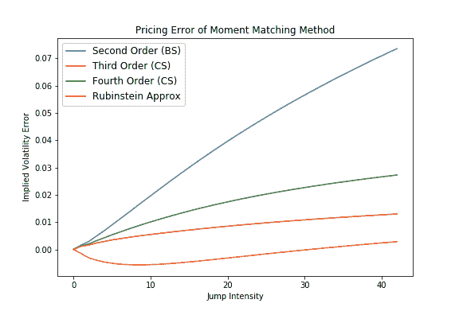

<!--yml
category: 未分类
date: 2024-05-13 00:13:24
-->

# Moment Matching Option Pricing: A Case Study – HPC-QuantLib

> 来源：[https://hpcquantlib.wordpress.com/2019/11/26/moment-matching-option-pricing-a-case-study/#0001-01-01](https://hpcquantlib.wordpress.com/2019/11/26/moment-matching-option-pricing-a-case-study/#0001-01-01)

The moment generating function of a random variable *Z* is

and the *n*-th moment of the probability distribution *Z* is then given by

The moment generating function is known for many financial models. Hence it is natural to derive approximations to exact pricing formulas based on the moment generating function.

The Kluge model [1] with exponential jump size distribution may serve here as a test bed for this approach. It is defined by

where  is a Poisson process with jump intensity  and  is the inverse jump size. To match today’s forward curve  the function  is given by

The moment generating function for the log spot process

is then given by [1]

The pricing approximation formulas are based on the central moments

![\displaystyle \mu_n = E\left[\left(Z-E(Z)\right)^n\right] = \sum_{i=0}^n {n\choose i} m_i (-E(Z))^{n-i}](img/cf5eea80663cdf7c10d1e58b075aa5c2.png)

Mathematica calculates the first four central moments as

![\begin{array}{rcl} \displaystyle \mu_1&=&0 \\ \displaystyle \mu_2 &=& \frac{\sigma^2 \left(1-e^{-2 \alpha t}\right)}{2\alpha }+\frac{\lambda \left(1- e^{-2 \beta t}\right)}{\beta \eta ^2}\\ \mu_3 &=& \frac{\lambda \left(2-2 e^{-3 \beta t}\right)}{\beta \eta ^3} \\ \displaystyle \mu_4 &=& \frac{3 e^{-5 t (\alpha +\beta )} \left(16 \alpha ^2 \beta \lambda e^{5 \alpha t+3 \beta t} \sinh (2 \beta t)+e^{t (\alpha +\beta )} \left(\beta \eta ^2 \sigma^2 \left(e^{2 \alpha t}-1\right) e^{2 \beta t}+2 \alpha \lambda e^{2 \alpha t} \left(e^{2 \beta t}-1\right)\right)^2\right)}{4 \alpha ^2 \beta ^2 \eta ^4}.\end{array}](img/9170a7ae9f54bd9502c6d88dcb7ad4b7.png)

Approximations to Black-Scholes like log-normal models with higher moments are summarized in [2]. These extensions are parameterized in terms of the Fisher parameters for sknewness and kurtosis

Corrado and Su [3] get for an European call option price with third and fourth order corrections

whereas in 1998 Rubinstein [4] derived the following approximation considering a normal Edgeworth series expansion

Two regimes are considered to test the quality of the different approximations for the Kluge model. First a regime with relatively small jumps but changing jump intensity and second a regime with a few jumps but changing jump size. The test parameters are

The reference results for Euopean vanilla calls are generated with the corresponding finite difference pricing engine and Richardson extrapolation. First test case is to vary the number of jumps by increasing  from zero to 40.The Corrado/Su fourth order approximation wins only for very small jump intensities, whereas for larger jump intensities the Corrado/Su approximation up to third order competes head-to-head against the Rubinstein formula. Similar picture can be seen for the second test case, few jumps with increasing jump size. For small jumps the fourth order approximation takes the lead but for most of the time the Rubinstein approximation gives the best results.

Source code for these results can be taken from the [PR #728.](https://github.com/lballabio/QuantLib/pull/728)

[1] Kluge, T. : [Pricing Swing Options and other Electricity Derivatives](https://www.semanticscholar.org/paper/Pricing-Swing-Options-and-other-Electricity-Kluge/9e8be93531ffa8aeb1a9e36181e0537cac99e400)
[2] Jurczenko, E, Maillet, B and Negrea, B: [Multi-moment Approximate Option Pricing](https://papers.ssrn.com/sol3/papers.cfm?abstract_id=300922)
[Models: A General Comparison (Part 1)](https://papers.ssrn.com/sol3/papers.cfm?abstract_id=300922)
[3]  Corrado C. and T. Su: [Implied Volatility Skews and Stock Return](https://www.researchgate.net/publication/24080621_Implied_volatility_skews_and_stock_return_skewness_and_kurtosis_implied_by_stock_option_prices)
[Skewness and Kurtosis Implied by Stock Option Prices](https://www.researchgate.net/publication/24080621_Implied_volatility_skews_and_stock_return_skewness_and_kurtosis_implied_by_stock_option_prices) , European Journal of
Finance 3, 73-85., 1997
[4] Rubinstein M: [Edgeworth Binomial Trees](https://pdfs.semanticscholar.org/f5d2/d0b90dea9a5e2dc298f0ba0aefc2b98387e4.pdf), Journal of Derivatives
5 (3), 20-27., 1998