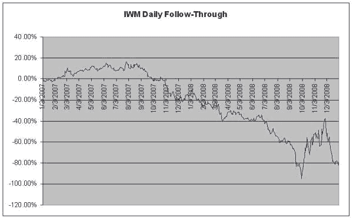

<!--yml
category: 未分类
date: 2024-05-18 13:50:28
-->

# Momentum | Quantivity

> 来源：[https://quantivity.wordpress.com/2009/07/19/momentum/#0001-01-01](https://quantivity.wordpress.com/2009/07/19/momentum/#0001-01-01)

Successful algorithms tend to be elegant: conceptually simple, built upon crisp intuition. Towards this end, summarizing a handful of fundamental phenomena which underlie much of quantitative trading is worthwhile.

Basic trading experience informs us that prices are systemically driven by one of two counteracting forces. The first force is momentum:

> “**Momentum** is the empirically observed tendency for rising asset prices to raise further.” ([Wikipedia](http://en.wikipedia.org/wiki/Momentum_(finance)))

Momentum manifests in many algorithmic and technical guises. For example, *follow through* is a classic measure originating from technical analysis. As illustration, consider the closing prices for an arbitrary heavily-traded ETF ([IWM](http://finance.yahoo.com/q?s=IWM)) during 2007 – 2008:

The corresponding cumulative daily change in close prices, measured in percentage over the same period, is illustrated below.

Way to think of this graph: cumulative profit which would be generated going long 1 share of IWM at each close, then closing the position at the subsequent close.

Compare that with *daily close follow-through*, which can either be calculated classically (*i.e.* non-mean reverting):

`IF(yesterday change > 0) THEN go long; OTHERWISE go short.`

Or, the equivalent mean-reverting daily follow-through:

`IF(yesterday change > 0) THEN go short; OTHERWISE go long.`

Note symmetry in the preceding two graphs: the two flavors of follow-through are horizontal-axis symmetric; equivalently-speaking, they are arithmetic inverses of each other (profit for one is loss for the other).

From this example, a naïve trading strategy is apparent: go short (long) on close, liquidating on the subsequent close, when the preceding close-to-close was positive (negative). IWM (long) and [RWM](http://finance.yahoo.com/q?s=RWM) (synthetic short) could be combined to avoid [shorting](http://en.wikipedia.org/wiki/Short_(finance)). Levering is easy with [RRY](http://finance.yahoo.com/q?s=RRY) (long) and [RRZ](http://finance.yahoo.com/q?s=RRZ) (short), with the following results:

Ten minutes of momentum analysis has uncovered a strategy which generates 75% frictionless annualized returns.

Momentum is particularly thoroughly studied in technical analysis, which has identified dozens of momentum indicators: from RSI to [DV](http://marketsci.wordpress.com/2009/07/15/varadi%E2%80%99s-rsi2-alternative-the-dv2/). Achelis’ [Technical Analysis from A to Z](http://www.amazon.com/Technical-Analysis-2nd-Steven-Achelis/dp/0071363483/ref=sr_1_12?ie=UTF8&s=books&qid=1248030586&sr=8-12) is the standard reference text from this literature.

Not accidentally, this strategy exhibits several attributes which are common across many successful (non-naïve) strategies:

*   No prediction / forecasting: strategy does not intend to “predict the future” or economically forecast in any explicit, meaningful way
*   Dynamic: strategy relies heavily upon feedback (*i.e.* sign of close-to-close daily returns), with as few [data snooped](http://en.wikipedia.org/wiki/Data-snooping_bias) parameters as possible
*   Non-consistency: return is not consistent (positive or negative) across the entire period; instead, mean-reversion is strong from Oct 2007 to Dec 2008; converse is true Jan to Sept 2007
*   Positive expectation: strategy generates positive return 52.38% of days, providing positive expectancy
*   Positive return: strategy generates average daily return of 0.16% (unlevered), providing positive average return

Many algorithms exploit momentum, in one form or another, whether explicitly or implicitly.