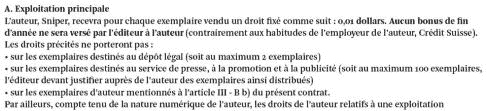

<!--yml
category: 未分类
date: 2024-05-18 14:29:02
-->

# Mon éditeur est un voleur – Sniper In Mahwah & friends

> 来源：[https://sniperinmahwah.wordpress.com/2013/01/31/mon-editeur-est-un-voleur/#0001-01-01](https://sniperinmahwah.wordpress.com/2013/01/31/mon-editeur-est-un-voleur/#0001-01-01)

Je reçois ce matin le contrat de mon éditeur Zones sensibles pour le livre 6 que j’ai écrit pour lui. Ces éditeurs sont des vrais voleurs, en voilà la preuve :

Sous prétexte qu’un algorithme de trading comme moi ne gagne que 0,01 dollar en moyenne (ou perd, c’est selon), je ne toucherai que 0,01 dollar par exemplaire vendu. C’est là une belle démonstration de ce que j’explique dans mon livre : les intermédiaires humains ne sont que de sales voleurs, il faut les remplacer par des machines.

Petite pensée amicale pour Sheldon Maschler…