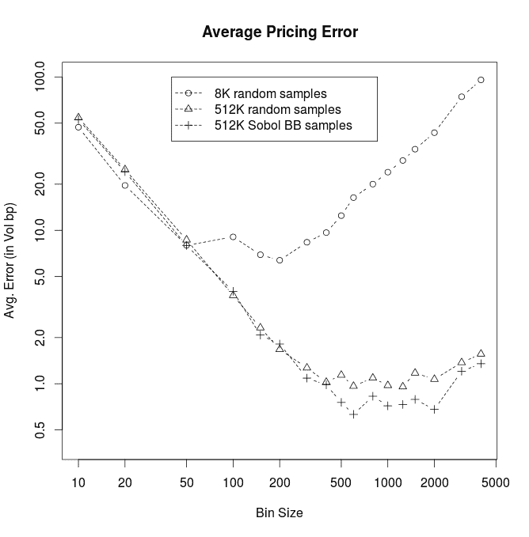
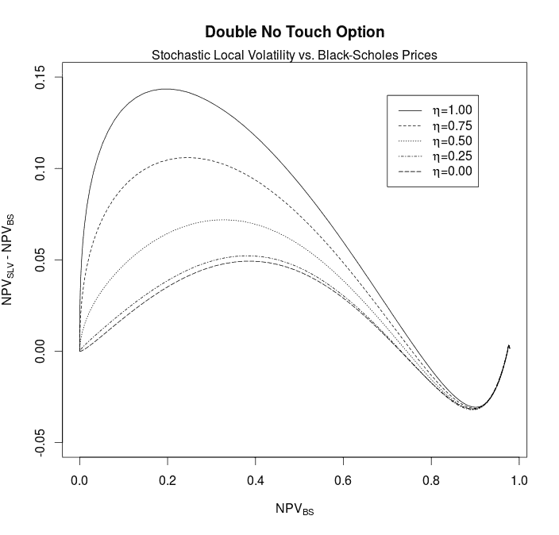

<!--yml
category: 未分类
date: 2024-05-13 00:17:48
-->

# Monte-Carlo Calibration of the Heston Stochastic Local Volatiltiy Model – HPC-QuantLib

> 来源：[https://hpcquantlib.wordpress.com/2016/01/10/monte-carlo-calibration-of-the-heston-stochastic-local-volatiltiy-model/#0001-01-01](https://hpcquantlib.wordpress.com/2016/01/10/monte-carlo-calibration-of-the-heston-stochastic-local-volatiltiy-model/#0001-01-01)

Solving the Fokker-Planck equation via finite difference methods is not the only way to calibrate the Heston stochastic local volatility model

The basic equation to calibrate the leverage function  for a local volatility surface  and a set of Heston parameters  is given by

![L(S_t, t)=\frac{\sigma_{LV}(S_t, t)}{\sqrt{\mathop{\mathbb{E}}[\nu_t|S=S_t]}}= \sigma_{LV}(S_t, t)\sqrt{\frac{\int_{\mathop{\mathbb{R}}^+} p(S_t,\nu, t) d\nu}{\int_{\mathop{\mathbb{R}}^+}\nu p(S_t,\nu,t)d\nu}} ](img/119356653cb0c4aa9dbec471528da261.png)

Key problem here is to calculate the expectation value ![\mathop{\mathbb{E}}[\nu_t|S=S_t]](img/4c2203b6d9d260d8f1b17063c07e1020.png). This can either be done via the Fokker-Planck equation as outlined in [3] and the references in there or via Monte-Carlo simulations as shown in [2].  Getting the solution of the Fokker-Planck equation via finite difference methods is anything but easy if the Feller constraint is violated. In this case the Monte-Carlo approach promises less numerical problems to overcome. Starting point for an efficient Monte-Carlo calibration is a fast and accurate simulation scheme for a stochastic local volatility (SLV) model. The variance part of the SLV can be sampled exactly using the non-central  distribution.

The boost library supports the inverse of the cumulated non-central  distribution but the calculation itself is rather slow. The Heston QE scheme outlined in [1] comes with an fast and accurate sampling scheme for the square root process. In the case  it reads

![\begin{array}{rcl} m &=& \theta+(\nu_t - \theta)e^{-\kappa \Delta t} \\[6pt] \nonumber \psi &=& \frac{\nu_t \frac{\eta^2\sigma^2 e^{-\kappa\Delta t}}{\kappa}\left(1-e^{-\kappa\Delta t} \right) + \frac{\theta\eta^2\sigma^2}{2\kappa}\left(1-e^{-\kappa\Delta t}\right)^2}{m^2}\\[6pt] \nonumber \beta &=& \frac{2}{\psi} - 1 + \sqrt{\frac{2}{\psi}\left(\frac{2}{\psi}-1 \right)} \\[6pt] \nonumber p &=& \frac{\psi-1}{\psi+1} \\[6pt] \nonumber Z_\nu &\sim& \mathcal{N}(0,1) , u \sim \mathcal{U}(0,1) \\[6pt] \nonumber \nu_{t+\Delta t} &=& \begin{cases} \frac{m}{1+\beta}\left(\sqrt{\beta}+Z_\nu\right)^2 & \text{if } \psi < 1.5 \\[6pt] \begin{cases} 0, & \text{if } u \leq p \\[6pt] \ln{\left(\frac{1-p}{1-u}\right)}\frac{m}{1-p} & \text{otherwise} \end{cases} & \text{if } \psi \geq 1.5 \end{cases} \end{array}](img/32c44e6fd57bbc2333a06f04a6003245.png)

The authors in [2] suggesting a sampling scheme for . The scheme below is a bit closer to the original QE scheme and without a rigorous proof it has shown slightly smaller discretisation  errors for the examples.

![\begin{array}{rcl} X_{t+\Delta t} &=& X_t + \left(r_t - q_t - \frac{1}{4}\left(\nu_t+\nu_{t+\Delta t}\right)L(S_t, t)^2 \right)\Delta t \\[6pt] \nonumber &&+ \frac{\rho}{\sigma}L(S_t, t) \left(\nu_{t+\Delta t} -\nu_t - \kappa\theta\Delta t + \frac{1}{2}\left(\nu_t + \nu_{t + \Delta t}\right)\kappa\Delta t\right) \\[6pt] \nonumber &&+\sqrt{\frac{1}{2}\left(1-\rho^2\right)\left(\nu_t + \nu_{t+\Delta t}\right) Z_x \Delta t} \\[6pt] \nonumber Z_x &\sim& \mathcal{N}(0,1) \end{array} ](img/330cdec99edf906da0fed5f46a889b90.png)

To get from the Monte-Carlo paths to the leverage function the authors in [2] using a binning technique in every time step. QuantLib supports two ways to generate the random draws, either based on i.i.d normal variables or based on Sobol quasi Monte-Carlo simulations with brownian bridges.

Test case definition: Feller constraint is violated.

Effectively the leverage function  will remove the skew and term structure introduced by the Heston model and shifts volatility to 30%. In order to measure the calibration quality the price mismatches expressed in volatility basis point differences are calculated for OTM calls and puts with prices above 0.02 and for maturity from one month until two year. The SLV prices are calculated by solving the Feynman-Kac backward equation using finite difference methods.

The diagram above shows the average pricing error for different number of Monte-Carlo calibration paths and for different bin sizes. As expected the optimal bin size depends on the number of Monte-Carlo simulations. Especially deep OTM options benefit from a large number of bins. The usage of Sobol quasi Monte-Carlo simulations with brownian bridges does not give a significant advantage.

The average pricing error is decreasing with the square root of the number of Monte-Carlo calibration paths if one always choses the optimal bin size as shown in the diagram below.  Quasi Mont-Carlo path generation with brownian bridges gives a small advanage.

As expected the leverage function itself exposes some Monte-Carlo noise, see diagram below. The corresponding leverage function based on the finite difference method is smooth but the overall calibration error is of the same size.

The calibration for different mixing factors  is straight forward. The diagram below e.g. shows the prices of a double no touch option for different distances of the (symemtric) lower and upper barriers expressed in terms of the corresponding Black-Scholes prices. This diagram type is derived from figure 8.8 in [4].

The source code is available on [github](https://github.com/lballabio/QuantLib/) as part of the test suite HestonSLVModelTest.

[1] Leif Andersen, [Efficient Simulation of the Heston Stochastic Volatility Model](http://papers.ssrn.com/sol3/papers.cfm?abstract_id=946405)

[2] Anthonie Van der Stoep, Lech Grzelak, Cornelis Oosterlee,
[The Heston Stochastic-Local Volatility Model: Efficient Monte Carlo Simulation](http://papers.ssrn.com/sol3/papers.cfm?abstract_id=2278122)

[3] Johannes Goettker-Schnetmann, Klaus Spanderen, [Calibrating the Heston Stochastic Local Volatility Model using the Fokker-Planck Equation](http://hpc-quantlib.de/src/slv.pdf)

[4] Iain J. Clark, Foreign Exchange Option Pricing: A Practitioner’s Guide